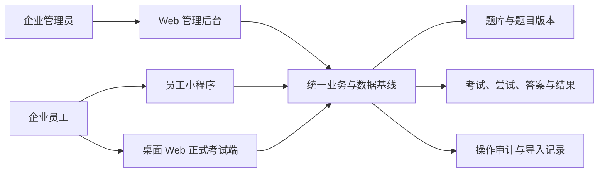
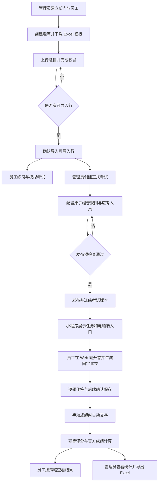
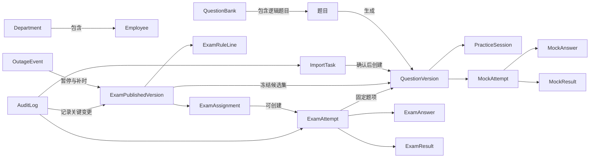
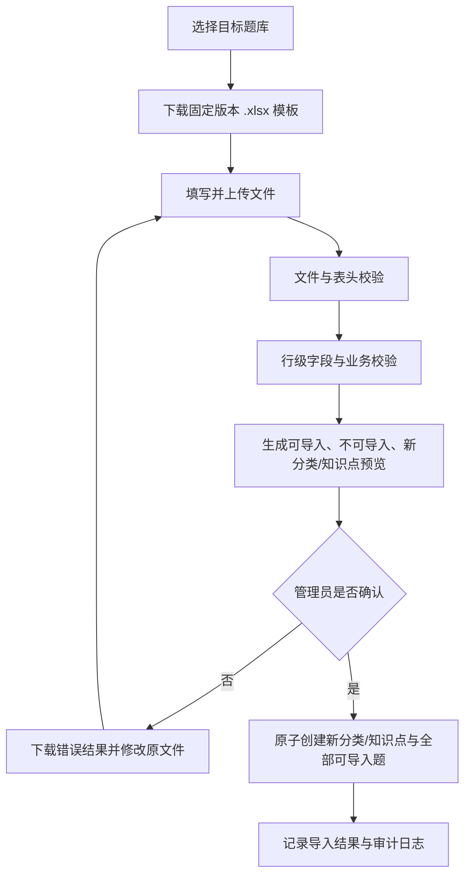
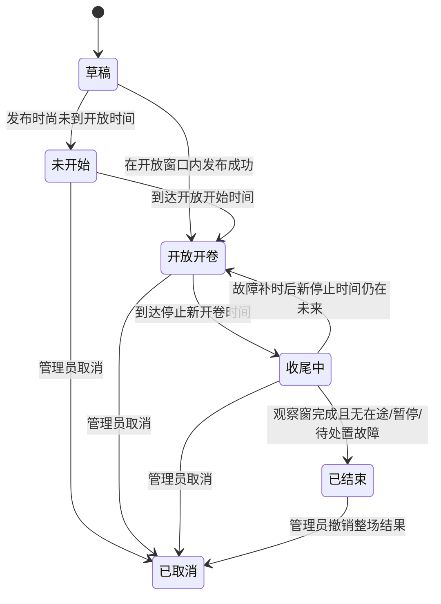
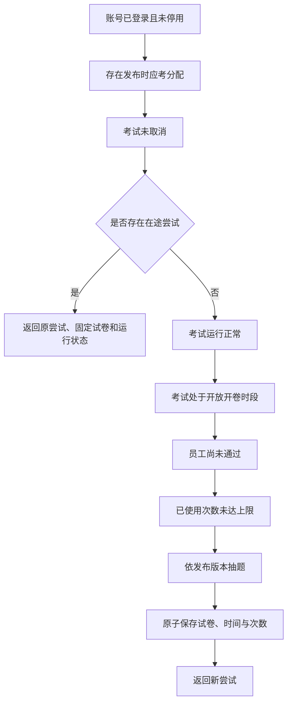
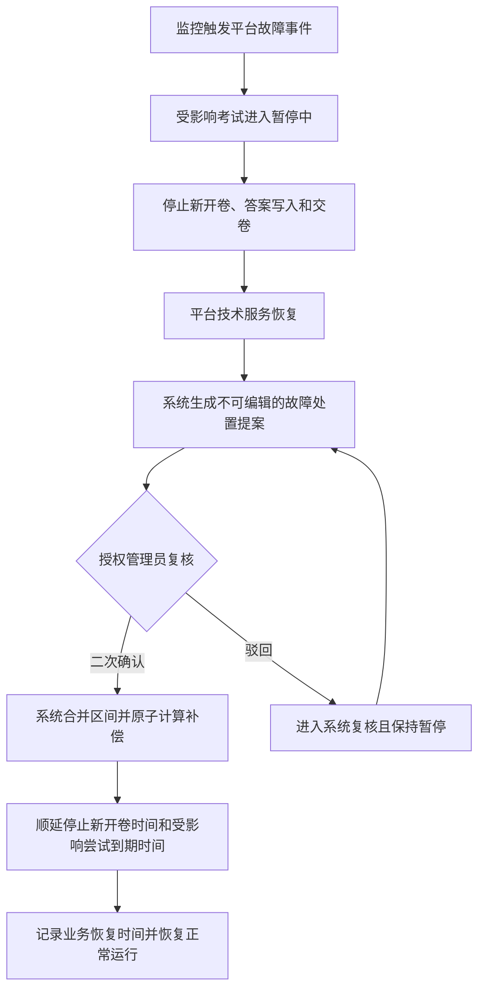

# 企业内部练习与考试系统需求分析文档

| 文档属性 | 内容 |
| --- | --- |
| 文档版本 | V1.1 |
| 文档状态 | 第一阶段需求基线 |
| 编制日期 | 2026-08-11 |
| 产品范围 | 单一企业内部使用 |
| 默认语言 | 简体中文 |
| 目标读者 | 业务负责人、产品、设计、研发、测试、运维及企业管理员 |

**版本记录**

| 版本 | 日期 | 变更摘要 |
| --- | --- | --- |
| V1.0 | 2026-08-11 | 建立第一阶段需求基线，覆盖三端范围、业务规则、状态、不变量与验收标准 |
| V1.1 | 2026-08-11 | 固化页面级 PRD 前置决策：管理员异常处置授权与监控故障提案/复核/补时口径、双 20 秒观察窗、账号凭据交付、部门路径、纯文本题目、连续练习、模拟放弃及员工结果可见边界 |

---

## 1. 文档说明

### 1.1 文档目标

本文档用于建立《企业内部练习与考试系统》第一阶段的业务需求基线，明确：

- 产品解决的业务问题、目标用户与系统边界。
- 员工小程序、桌面 Web 正式考试端和 Web 管理后台的职责分工。
- 角色权限、核心流程、状态机、数据快照和关键业务不变量。
- Excel 导题、练习、模拟考试、正式考试、随机组卷、异常恢复、评分和统计的产品规则。
- 可量化的非功能要求和可执行的第一阶段验收标准。
- 后续信息架构、页面级 PRD、原型、数据库、接口和技术方案应遵循的业务边界。

### 1.2 文档边界

本文档定义产品需求和概念模型，不定义字段级表结构、公开 API、技术栈、服务拆分、部署拓扑或详细页面交互。后续文档不得改变本文档已确认的业务语义；如需改变，必须先进行需求变更评审并更新本基线。

### 1.3 需求约束用语

| 用语 | 含义 |
| --- | --- |
| 必须 | 第一阶段强制要求，缺失即不能验收 |
| 不得 | 明确禁止的行为或系统状态 |
| 可以 | 第一阶段允许但非所有场景必然触发的行为 |
| 后续版本 | 明确不属于本次 MVP 的能力 |

---

## 2. 产品背景与定位

### 2.1 业务背景

企业内部培训和考核通常分散在题库文件、线下练习、临时答题工具和人工统计中。核心问题不是缺少一个普通答题页面，而是缺少一条稳定、可追溯的正式考试闭环：

- 题目大量维护时易出错，且缺少结构化校验和错误反馈。
- 随机组卷在发布前缺少可行性校验，考生进入后才发现题量不足会直接影响考试。
- 考试过程可能因刷新、断网、浏览器退出或平台故障丢失答案或时间语义。
- 题目修改、人员调岗或重复提交可能破坏历史考试的一致性。
- 成绩、参考状态和导出口径不一致时，企业无法将其作为正式考核依据。

### 2.2 产品定位

> 面向单一企业内部员工的学习、练习与正式考核平台。

系统围绕“管理员维护题库 → 员工日常练习 → 模拟考试 → 企业正式考试 → 自动评分 → 成绩统计”建立闭环。产品不面向社会公开用户，不以社交、公开排行、商业题库或付费为目标。

### 2.3 核心价值

1. **可靠**：已确认保存的答案不丢失，断线后可恢复，超时后可自动终结。
2. **可追溯**：已发布考试的人员、题目、答案、分值和规则固定，结果可还原。
3. **高效**：通过 Excel 批量导入、自动校验、随机组卷、自动评分和成绩导出减少人工操作。
4. **一体化**：在同一员工身份下连接练习、模拟和正式考试，同时隔离正式成绩口径。

### 2.4 第一阶段成功标准

- 管理员能从员工建档、题库导入、考试发布一直完成到成绩导出的全链路操作。
- 员工能完成练习、模拟考试和正式考试，且三类模式的反馈、计时和成绩口径不混淆。
- 随机组卷在发布前可验证，个人试卷生成后保持固定，并可在异常后恢复。
- 超时、重复请求、并发开卷、平台故障、尝试作废和整场取消均有唯一、可验收的处理规则。
- 在约定容量下达到本文档第 17 章的性能、可靠性、安全和数据保留指标。

---

## 3. 产品范围与三端职责

### 3.1 系统全景



### 3.2 三端职责

| 端 | 目标用户 | 核心职责 | 明确边界 |
| --- | --- | --- | --- |
| 员工小程序 | 企业员工 | 顺序/随机/专项/错题练习、自助模拟考试、正式考试任务、个人成绩与学习记录 | 不在小程序内完成正式考试；不查看他人数据 |
| 桌面 Web 正式考试端 | 被分配正式考试的员工 | 身份与资格校验、开卷、限时作答、自动保存、异常恢复、交卷和允许范围内的结果查看 | 仅支持桌面 Chrome/Edge 最近两个主版本；不提供题库或管理能力 |
| Web 管理后台 | 企业管理员 | 部门与员工、账号、题库、Excel 导入、考试、组卷、人员、过程、异常、成绩、导出和审计 | 不允许直接改写员工答案或已生成得分 |

### 3.3 核心业务闭环



### 3.4 第一阶段 MVP 范围

**纳入范围：**

- 部门树、员工手工建档和 Excel 批量建档、本地统一账号与短信验证恢复。
- 题库、分类、知识点、单选/多选/判断题、题目版本、启停和练习/模拟开放开关。
- 题目 Excel 模板、上传解析、校验预览、可导入行部分入库、错误下载和幂等确认。
- 顺序、随机、专项、错题练习，以及员工自助模拟考试。
- 正式考试创建、原子组卷规则、人员范围、发布预检查、发布冻结、取消和过程监控。
- 桌面 Web 开卷、固定试卷、答案保存、恢复、服务端计时、平台暂停补时、交卷和客观题评分。
- 多次尝试、尝试作废和返还次数、最高有效分、结果可见策略、统计与成绩 Excel 导出。
- 权限隔离、操作审计、数据保留、故障恢复和量化性能指标。

**第一阶段不纳入：**

- AI 自动出题、AI 阅卷、主观题、人工阅卷。
- 人脸识别、摄像头监考、屏幕录制和浏览器锁定。
- 在线课程、视频培训、学习社区、积分商城和公开排行榜。
- 复杂多租户、企业付费体系、复杂岗位能力模型。
- 企业 SSO、通讯录自动同步、部门管理员、培训管理员和多级数据权限。
- 考试短信、邮件或小程序模板消息提醒；短信仅用于账号验证与恢复。
- 个人加时、管理员改答案、改分或对已发布考试的业务规则进行原地修改。

---

## 4. 角色、组织与身份

### 4.1 角色定义

| 角色 | 定义 | 数据范围 |
| --- | --- | --- |
| 企业员工 | 使用企业开放的题库学习，并参加被分配的正式考试 | 仅本人的任务、试卷、答案、允许公开的结果和学习记录 |
| 企业管理员 | 负责企业内部组织、题库、考试、异常、成绩和审计管理 | 单一企业内全部业务数据，但不得越过业务规则修改已提交答案或得分 |

### 4.2 权限矩阵

| 能力 | 企业员工 | 企业管理员 |
| --- | --- | --- |
| 登录、修改本人密码、短信找回 | 可以 | 可以 |
| 绑定/解绑本人小程序身份 | 可以，需身份复核 | 可协助解绑并留痕 |
| 练习、模拟考试 | 可以 | 不作为管理职责 |
| 参加正式考试 | 仅被分配时 | 仅在同时具有员工资格且被分配时 |
| 查看成绩 | 仅本人且受公开策略限制 | 可查看本企业全部结果 |
| 管理部门、员工、账号和管理员资格 | 不可以 | 可以 |
| 授予或撤销“考试异常处置”权限 | 不可以 | 仅当前具有该权限的管理员可以 |
| 管理题库、题目和 Excel 导入 | 不可以 | 可以 |
| 创建、发布、取消考试 | 不可以 | 可以 |
| 作废个人尝试并返还次数 | 不可以 | 可以，必须记录原因 |
| 确认平台故障与统一补时 | 不可以 | 仅获得“考试异常处置”权限的管理员可以；不能创建或修改监控事件 |
| 修改员工答案或考试得分 | 不可以 | 不可以 |
| 导出成绩、查看审计日志 | 不可以 | 可以 |

### 4.3 部门与员工

1. 部门采用树形结构，一个部门最多有一个直接上级。
2. 一名员工在任一时点只归属一个有效主部门。
3. 部门不得以自身或任一下级部门作为上级，系统必须阻止循环关系。
4. 部门名称去除首尾空白后，在同一直接上级下必须唯一；不同分支可以同名。部门名称不得包含路径分隔符 `/`。
5. 员工 Excel 使用从企业根节点开始、以 `/` 分隔的完整部门路径唯一定位主部门，例如 `总部/研发中心/平台部`；任一路径节点不存在时，该员工行不可导入，员工导入不得自动创建部门。
6. 部门可以改名或移动；移动前必须阻止循环关系。员工当前档案引用稳定部门身份，改名或移动后展示新路径，已发布考试继续使用发布时部门名称与路径快照。
7. 存在有效或停用员工、直接或间接下级部门的部门不得停用。MVP 不提供部门物理删除；停用部门不得接收新员工、调入员工或用于新考试人员选择。
8. 考试人员范围选择部门时，默认包含该部门及所有下级部门的有效员工。
9. “全部员工、指定部门、指定员工”之间按并集取人，同一员工只能进入一次应考名单。
10. 发布考试时将人员范围展开为员工快照；后续调岗、部门改名或组织调整不改变该场考试的应考名单和历史报表。
11. 发布后停用的员工仍保留在应考快照中，但停用账号不得登录；如未参考，考试结束后按缺考统计。

### 4.4 员工建档

- 管理员必须支持单个新增和 Excel 批量导入员工。
- 员工建档的最小业务信息为姓名、全企业唯一工号、主部门、全企业唯一手机号和账号状态。
- 员工 Excel 使用固定 `.xlsx` 模板，至少包含姓名、工号、主部门完整路径和手机号。导入前必须校验必填值、工号/手机号唯一性和部门路径；部门必须已存在且有效，员工导入不自动创建部门。
- 批次内或企业现有档案中工号/手机号重复的行判定为冲突并跳过，不覆盖现有员工；其他可导入行可确认入库。重复确认同一批次不得重复创建账号，错误结果必须保留原行号和原因。
- 员工以工号作为登录账号。新员工由系统生成一次性临时密码，首次成功登录后必须修改密码才能继续使用业务功能；手机号不作为登录账号，仅用于身份验证、密码找回和小程序解绑。
- 单个建档或重置密码成功后，临时密码只向本次操作管理员显示一次；批量建档仅允许发起管理员在导入结果页一次性下载初始凭据文件。批量凭据包自生成起最多保留 24 小时，首次成功下载或到期时立即失效并清理；其他管理员不得下载。系统不再提供原临时密码查询，凭据未及时下载、下载后遗失或已经过期时只能重新重置。管理员必须通过企业既有线下安全渠道向员工传达，不纳入考试通知能力。
- 停用员工账号后立即撤销会话并禁止新登录和继续业务请求，但不删除其历史练习、考试、成绩和审计数据。若当时存在进行中正式考试尝试，该尝试不作废也不终止，到期后按最后服务端确认答案自动交卷；已处于交卷处理中的尝试继续幂等评分至完成，后台终结不得依赖员工账号仍启用。管理员如需排除其效力，必须另行作废并填写原因；已完成尝试不受账号停用影响。

### 4.5 本地统一身份与账号恢复

1. 系统在部署初始化时通过受控流程建立首位企业管理员，并同时授予“考试异常处置”权限，作为后续授权转移的初始持有人。首位管理员也必须建立对应的 `Employee` 主体，使用唯一工号、系统一次性临时密码和首登强制改密，不存在绕过统一身份规则的独立后台账号。
2. 管理员可将有效员工授予或撤销企业管理员资格，此操作必须审计。系统必须保证至少存在一名有效管理员。
3. 员工小程序首次使用时，通过工号、账号凭据和手机验证完成企业身份绑定。一个小程序身份同时只能绑定一名员工，一名员工同时只能有一个有效绑定。
4. 桌面 Web 正式考试端使用同一员工账号登录。小程序中的考试地址或考试码仅用于定位考试，不替代登录和应考资格校验。
5. 员工忘记密码或申请自助解绑时，必须通过员工档案中的唯一手机号完成短信验证。验证码必须限时、限次、一次性使用，发送与验证结果必须记录安全日志。
6. 管理员可重置员工密码、停用账号和解除小程序绑定，但不得查看员工当前密码原文；重置后只按第 4.4 节展示一次新临时密码。
7. 企业管理员可以被单独授予或撤销“考试异常处置”权限。该权限不构成第三种业务角色，只控制第 14 章的故障确认操作；只有当前具有该权限的有效管理员可以向其他有效管理员授予或撤销此权限，授予、撤销和使用均必须审计。
8. 系统必须始终保留至少一名有效且具有“考试异常处置”权限的管理员。停用账号、撤销管理员资格或撤销该权限将导致无人具备处置权限时，必须阻止操作并提示先完成授权转移。

---

## 5. 核心术语与概念模型

### 5.1 核心术语

| 术语 | 业务定义 |
| --- | --- |
| 题目 | 可被启用、停用和修订的逻辑题目身份 |
| 题目版本 | 一次保存后不再修改的题型、题干、选项、答案、解析、分类/知识点归属、难度和默认分值集合 |
| 考试 | 管理员维护的正式考核定义 |
| 已发布考试版本 | 发布时冻结的配置、规则、题池、人员和公开策略基线 |
| 原子组卷规则行 | 以题库、分类、知识点、题型、难度之交集限定候选题，并指定数量和单题分值的最小规则单元 |
| 应考分配 | 已发布考试与某名员工之间的固定资格关系 |
| 考试尝试 | 员工在某场考试中的一次开卷、作答和交卷周期 |
| 个人试卷 | 某次尝试首次开卷时生成并固定的题目版本、顺序和分值集合 |
| 有效尝试 | 未被作废且所属考试未被取消的已创建尝试 |
| 官方成绩 | 某员工在某场考试的所有有效已评分尝试中的最高得分 |
| 在途尝试 | 尚未终结的正式考试尝试，包括进行中和交卷处理中；同一员工同一考试最多一个 |
| 剩余合法作答机会 | 员工已被分配、账号有效、考试仍允许新开卷、尚未通过、有剩余次数且不存在在途尝试时，可新建尝试的资格 |
| 考试发布时间 | 考试发布事务原子成功时记录的服务端 UTC 时间，不是草稿创建时间或开放开始时间 |
| 停止新开卷时间 | 员工可新建考试尝试的最后边界；它不是所有在途尝试的强制结束时间 |
| 收尾中 | 已到当前停止新开卷时间，且仍有合法在途尝试、整场结束观察窗未完成、运行暂停或存在待处置故障事件的考试阶段；停止时间之前的暂停不改变原生命周期 |
| 平台故障事件 | 由平台监控自动生成候选影响开始与受影响范围、在技术恢复后封闭区间，并由具有“考试异常处置”权限的企业管理员确认，用于统一补偿考试时间的受控事件 |
| 故障处置提案 | 技术恢复后由系统根据监控证据生成的不可编辑提案版本，包含封闭影响区间、范围和预计补偿 |
| 系统复核中 | 管理员驳回当前故障处置提案后，系统基于新增或校正监控证据重新计算下一提案版本的事件状态；考试继续暂停 |
| MVP | 本文档定义并必须完成验收的第一阶段最小可行产品范围 |
| P95 | 一组有效请求中 95% 的完成时间不超过的阈值 |
| RPO | 可接受的数据丢失点；`RPO=0` 表示已成功确认的核心考试数据不得丢失 |
| RTO | 从故障影响起点到核心考试能力恢复的目标时长 |
| SLO | 服务级别目标；本文档用于约束核心考试服务月度可用性 |

### 5.2 概念实体

| 概念实体 | 职责 |
| --- | --- |
| `Department` | 部门树节点及历史组织语义 |
| `Employee` | 员工主体、工号、主部门、手机身份、账号状态、管理员资格与异常处置授权 |
| `QuestionBank` | 题目集合、分类与知识点边界，以及练习/模拟开放策略 |
| `QuestionVersion` | 不可变的题型、内容、分类/知识点归属、标准答案、难度与默认分值版本 |
| `PracticeSession` | 一次日常练习固定的题目版本列表、逐题结果与错题处理记录 |
| `MockAttempt` | 一次自助模拟考试的固定试卷、服务端计时和终结状态 |
| `MockAnswer` | 模拟考试中每个固定题项的最新服务端确认答案 |
| `MockResult` | 模拟考试的题项得分、总分与复盘依据，不进入正式成绩 |
| `ImportTask` | Excel 上传、解析、校验、预览、确认和错误结果的完整记录 |
| `ExamPublishedVersion` | 考试发布时的不可变业务基线 |
| `ExamRuleLine` | 原子组卷筛选条件、抽题数和单题分值 |
| `ExamAssignment` | 发布时展开的应考员工与姓名、工号、部门快照 |
| `ExamAttempt` | 一次开卷到终结的尝试、固定试卷、服务端时间与终结原因 |
| `ExamAnswer` | 员工对某个固定试卷题项的最新有效答案及保存版本 |
| `ExamResult` | 一次尝试的题项得分、总分、通过结论与评分依据 |
| `OutageEvent` | 平台故障的监控触发、开放/封闭区间、提案版本、复核状态、授权管理员处置、受影响考试和时间补偿记录 |
| `AuditLog` | 关键管理与安全操作的操作人、时间、对象、前后值、原因和请求标识 |

### 5.3 概念关系



### 5.4 核心不变量

1. 已发布考试必须始终可通过其发布版本重建当时的规则、题池、人员和公开策略。
2. 题目修订必须创建新版本，不得覆盖已被发布考试或历史记录引用的版本。
3. 一名员工在同一场考试中最多存在一个在途尝试；在途包括“进行中”和“交卷处理中”。
4. 尝试创建、抽题、固定试卷、记录开始时间和占用次数必须作为一个原子业务动作完成；失败时不得留下半成品试卷或消耗次数。
5. 个人试卷在尝试内永久固定；刷新、重新登录、换浏览器或断网恢复不得重新抽题。
6. 已返回“保存成功”的答案必须已经完成后端持久化；尝试终结后任何角色均不得再修改答案。
7. 手动交卷、超时交卷和重复请求必须共用同一幂等终结与评分语义，一次尝试最多产生一份结果。
8. 已生成尝试结果不得直接编辑。作废尝试只会使其退出官方成绩计算，不会改写原结果。
9. 正式考试在允许公开之前，员工端的任何响应均不得包含标准答案、解析或他人考试数据。
10. 考试、尝试、结果、题目版本、导入任务和审计记录在保留期内不得通过普通后台操作物理删除。

---

## 6. 题库与题目需求

### 6.1 数据层级

```text
题库
└─ 分类
   ├─ 题目（不关联知识点）
   │  └─ 题目版本
   └─ 知识点（可选）
      └─ 题目
         └─ 题目版本
```

- 题库是导入、开放练习、开放模拟和正式考试引用的业务边界。
- 分类为必填层级；知识点为可选层级。
- 题目只属于一个题库和一个分类，可以不关联知识点。
- 分类名称在同一题库内唯一；知识点名称在同一分类内唯一。

### 6.2 题库状态与开放策略

| 维度 | 可选值 | 影响 |
| --- | --- | --- |
| 题库业务状态 | 启用、停用 | 停用后不能用于新练习、新模拟或新考试发布，不影响历史快照 |
| 允许员工练习 | 开、关 | 决定员工能否在练习入口选择该题库 |
| 允许员工模拟 | 开、关 | 决定员工能否用该题库自助生成模拟考试 |

练习和模拟开关必须相互独立。正式考试可引用未向员工开放练习或模拟的启用题库，以避免考题提前暴露。

### 6.3 题型与内容规则

第一阶段的题干、选项和解析仅支持纯文本与换行。不得上传或嵌入图片、附件、音视频，不解析 HTML 或 Markdown，也不提供公式编辑器或其他富文本能力；Excel 单元格中的文本按纯文本处理。

| 题型 | 选项 | 标准答案 | 评分规则 |
| --- | --- | --- | --- |
| 单选题 | 至少 A、B，最多 A-D，选项不得断档 | 仅一个现有选项字母 | 与标准答案相同得分，否则 0 分 |
| 多选题 | 至少 A、B，最多 A-D，选项不得断档 | 至少两个现有选项字母 | 员工选择集合与标准答案集合完全相等才得分，不部分给分 |
| 判断题 | 选项列必须为空，系统统一展示“正确/错误” | 仅接受“正确”或“错误” | 与标准答案相同得分，否则 0 分 |

题目难度可为“简单、中等、困难”；未填写时默认为“中等”。题目默认分值必须大于 0 且最多保留两位小数，未填写时默认为 1 分；它用于模拟考试计分，不直接决定正式考试分值。

### 6.4 题目状态与版本

1. 逻辑题目状态为“启用”或“停用”。
2. 新练习、新模拟和新考试发布只能选取当前启用题目的最新版本。
3. 修改题型、题干、选项、标准答案、解析、分类、知识点、难度或默认分值时，必须生成新题目版本。
4. 停用题目只影响未来抽题，不影响已发布题池、已生成试卷、历史练习和历史成绩。
5. 题型、分类和知识点归属属于版本内容；修改后，旧版本继续保留原筛选和展示语义。
6. `QuestionVersion` 必须同时保留分类/知识点的稳定标识和该版本生成时的名称快照。分类或知识点改名不改写旧版本；当前目录使用节点当前名称，历史练习、模拟和考试使用各自冻结名称。
7. 逻辑题目的题库归属不得直接迁移；如需移至其他题库，管理员必须在目标题库复制为新题并停用原题。
8. 第一阶段不提供题目物理删除，任何题目均只能停用。Excel 确认导入的新题默认启用。

### 6.5 题目重复与冲突

- 匹配范围为当前目标题库中启用和停用题目的当前版本，以及本次文件内的其他数据行；历史只读版本不单独参与重复判定。
- 完整重复键为“目标题库 + 规范化题型 + 规范化题干 + 规范化后的有序选项”；由于一个文件只能导入一个题库，文件内不设置“题库”列。
- 重复键规范化时，题型转换为系统枚举；题干和选项仅去除首尾空白并统一换行格式，不忽略正文标点、不重排选项。
- 答案比较另行规范化：统一字母大小写，将多选分隔符统一为英文逗号，去除无意义空格并按字母排序去重。答案不属于重复键，只用于区分重复与冲突。
- 系统必须先完成字段与业务校验，仅将通过基础校验的行纳入重复键分组；未通过基础校验的行保留自身错误，不参与压制其他行。
- 同一键的来件行包含多个规范化答案集合时，组内全部来件行均判定为“冲突”，不任意保留一行。
- 同一键只有一个答案集合且题库已有同键题目时：答案与已有题一致则组内全部判定为“重复”，答案不同则组内全部判定为“冲突”。
- 同一键只有一个答案集合且题库没有同键题目时，仅 Excel 行号最小的一行可导入，其余行判定为“重复”。
- 重复和冲突均不通过批量导入，不自动覆盖旧题；管理员如需修改，必须进入单题维护并创建新版本。

---

## 7. Excel 批量导题

### 7.1 范围与原则

- 仅支持固定版本的 `.xlsx` 模板。
- 管理员必须先进入一个已存在的目标题库再下载模板和上传。一个导入任务只能写入一个题库。
- 模板不包含“题库”列，目标题库由上传上下文唯一确定。
- 单个文件最多包含 1,000 个数据行且不得超过 10 MB；超过限制时按文件级错误处理，管理员可拆分为多个导入任务。数据行指“题目导入”工作表中任一模板字段去除首尾空白后非空的行，表头、全空行和仅有单元格格式的空行不计数；原 Excel 行号必须保留，第 1,001 个数据行即拒绝整个文件。含公式的单元格计入数据行但不得执行公式，并按行级非法值处理。
- 上传、解析和校验阶段不得向正式题库写入题目。
- 管理员确认后，可导入行相对于整份文件部分入库，不可导入的字段/业务错误行、重复行和冲突行均跳过。

### 7.2 标准流程



### 7.3 Excel 模板字段

| 字段 | 必填 | 规则 |
| --- | --- | --- |
| 分类 | 是 | 所属一级分类；不存在时在预览中标记为待创建 |
| 知识点 | 否 | 必须归属于本行分类；填写且不存在时在预览中标记为待创建 |
| 题型 | 是 | 仅接受“单选、多选、判断” |
| 题干 | 是 | 题目正文，去除首尾空白后不得为空 |
| 选项A | 按题型 | 单选、多选必填；判断必须为空 |
| 选项B | 按题型 | 单选、多选必填；判断必须为空 |
| 选项C | 否 | 如填写，前置选项必须存在 |
| 选项D | 否 | 如填写，前置选项必须存在 |
| 正确答案 | 是 | 单选为 `A`；多选规范为 `A,C`；判断为“正确/错误” |
| 解析 | 否 | 答案解释，受结果公开策略保护 |
| 难度 | 否 | 简单/中等/困难，为空时默认中等 |
| 分值 | 否 | 大于 0 且最多两位小数，为空时默认 1；仅作为模拟考试的题目默认分值 |

### 7.4 校验规则

**文件级校验：**

- 文件扩展名和实际格式必须为支持的 `.xlsx`。
- 模板版本、工作表和表头名称、顺序必须符合当前模板。
- 文件损坏、加密或无可解析数据时，整个导入任务失败，不进入行级确认。

**行级校验：**

- 分类、题型、题干和正确答案不得为空。
- 题型、难度和正确答案必须符合规范值。
- 单选只能有一个正确答案；多选至少有两个不重复正确答案。
- 单选、多选的答案必须全部对应已填写选项；选项不得从中间断档。
- 判断题的选项 A-D 必须为空，答案只能为“正确”或“错误”。
- 分值填写时必须大于 0 且最多保留两位小数。
- 同一文件内和目标题库内都必须执行重复/冲突校验。

### 7.5 校验结果与错误反馈

校验完成后必须展示：

```text
总数据：1000
可导入数据：972
不可导入数据：28
待新建分类：N
待新建知识点：M
```

每个数据行必须且只能归入“可导入”或“不可导入”之一，满足“总数据 = 可导入数据 + 不可导入数据”。字段/业务错误、重复和冲突均属于不可导入原因；待新建分类/知识点是可导入行上的待确认标记，不另占行数。

每条不可导入数据必须至少包含原 Excel 行号、错误字段、错误类型和可操作的错误说明。错误结果可按行查看并下载为 Excel，不得只返回一条笼统失败信息。

### 7.6 确认导入与幂等性

1. 管理员必须明确确认全部可导入行和待创建分类/知识点后才能导入；第一阶段不提供逐行或逐节点勾选导入。管理员不同意任一待建层级时，必须取消本任务、修改文件后重新上传。
2. 一次确认操作必须原子创建本任务的全部新分类、新知识点和可导入题目。任何写入失败时，本次确认不得保留部分正式数据。
3. 同一导入任务的确认请求重试时，必须返回原结果，不得重复创建题目。
4. 确认事务内必须以题库最新状态重新执行重复/冲突、分类/知识点唯一性和目标题库状态校验。若预览依据已变化，本次确认整体失败并将任务标记为“需重新校验”，不得写入部分数据；管理员重新校验并确认后方可继续。
5. 确认成功时，实际导入数必须等于该次有效预览的可导入数；不可导入行不入库。管理员修改文件后重新上传时，创建新导入任务并重新校验。
6. 导入结果必须记录操作管理员、目标题库、文件标识、模板版本、总数、可导入数、不可导入数、实际导入数和完成时间。

### 7.7 导入任务状态与过期

`ImportTask` 状态必须区分“已上传、校验中、待确认、需重新校验、导入成功、导入失败、已取消、已过期”。导入成功、导入失败、已取消和已过期为终态；终态任务不可再次确认。

- 待确认或需重新校验任务连续 30 天没有上传、校验、下载或确认活动时，自动转为已过期。
- 管理员可在确认前主动取消任务；取消和过期均不得写入题库。
- 导入原文件和错误结果按上传时间或最后活动时间中的较晚者起算 180 天后清理；任务即使未完成也不得无限保留文件。
- 文件清理不删除任务元数据、数量、错误摘要和审计记录。

---

## 8. 员工练习需求

### 8.1 练习入口与题目范围

员工只能选择同时满足以下条件的题目：

- 题库为启用状态且“允许员工练习”开关已开启。
- 题目为启用状态。
- 使用题目开始练习时的最新版本。

一次练习开始时必须固定本次的题目版本列表；后台在练习过程中修订或停用题目，不改变已开始练习的内容和判题依据。

### 8.2 练习模式

| 模式 | 业务规则 |
| --- | --- |
| 顺序练习 | 按题库中稳定题目顺序作答；没有人工排序时按入库顺序，并按“员工 + 题库”保存长期顺序进度 |
| 随机练习 | 员工选择 10、20 或 50 题，系统在当前可用范围内无重复随机抽题 |
| 专项练习 | 员工选择分类或知识点及 10、20 或 50 题，系统仅在对应范围内无重复随机抽题 |
| 错题练习 | 以待练的逻辑题目为范围，展示其最新启用版本；可选 10、20、50 题，待练题不超过 50 时可选择全部；答对一次后移出待练列表 |

当可用题数少于员工选择的题量时，系统必须阻止开始并告知当前可用题数，不得重复题目补足数量。

### 8.3 练习会话与进度

1. 一名员工在所有日常练习模式之间最多存在一个进行中练习会话。重复进入必须恢复该会话；从其他模式发起时，系统必须先提供“继续原练习”或“确认结束原练习”，不得静默覆盖。
2. 开始练习时固定本会话的题目版本列表和题序。恢复时加载已提交结果并定位到首道未提交题，后台修订或停用不改变本会话。
3. 员工可以主动结束进行中练习，操作必须二次确认。已经逐题提交的记录、错题变化和顺序进度继续保留，尚未提交的题不产生作答记录。
4. 顺序练习不预设题量。长期进度指向最后一道已提交题之后的下一道当前可用逻辑题；完成题库全部当前可用题后显示“本轮已完成”，员工确认重新开始后才从首题建立新一轮进度。
5. 随机和专项练习仅提供不超过当前可用题数的 10、20、50 题选项；不足所选题量时按第 8.2 节阻止开始。
6. 错题练习仅提供不超过当前待练题数的 10、20、50 题选项；待练题数不超过 50 时额外提供“全部”选项。选定固定数量时从当前待练范围无重复随机抽取。
7. 练习会话状态至少区分“进行中、已完成、已主动结束”；三种终态均不可继续写入。

### 8.4 练习答题逻辑


- 每道题提交后立即固定本次作答结果，不允许修改该次提交。
- 答错的练习题按“员工 + 逻辑题目”进入待练错题列表，并累计错误次数和最近错误时间；每次错误历史继续引用当时作答的题目版本。
- 处于待练状态的逻辑题目在任一日常练习模式中答对一次后移出待练列表，但错题历史、错误次数和原作答版本继续保留。模拟考试答对不改变待练状态。
- 待练逻辑题目被停用后不再进入错题练习抽题，但仍作为“题目已停用”的历史记录保留。修订不改变逻辑题目状态；只有管理员显式重新启用后，才以届时最新版本继续待练。
- 已提交的练习题和结果进入个人学习记录，但不进入正式考试成绩统计。

---

## 9. 模拟考试需求

### 9.1 定位

模拟考试是员工在正式考试前的自助检测工具，不由管理员创建或分配，不计入正式成绩。

### 9.2 创建与作答

1. 员工只能选择启用且已开启“允许员工模拟”的题库。
2. 员工选择题库、10/20/50 题之一和 10-180 的整数分钟时长；可用题数不足时不得开始。
3. 每名员工同一时点最多有一个进行中的模拟考试；重复开始或重新进入必须恢复原模拟，提交或到期后才可开始下一次。
4. 每次模拟考试生成一份新的无重复随机试卷，并固定题目版本、题序、选项顺序和题目默认分值；选项顺序保持题库顺序。
5. 作答过程中不显示正误、标准答案或解析。每次修改答案都必须立即持久化，只有服务端确认后才显示已保存；旧版本请求不得覆盖较新答案。
6. 模拟考试按服务端时间计时，可在未到期时恢复同一份试卷和服务端已确认答案，超时后自动提交。
7. 手动提交、超时提交和重复请求必须幂等，一次模拟只生成一份结果；模拟考试不限次数，每次都完整保留在个人学习记录中。
8. 员工可主动放弃未到期的进行中模拟考试。放弃必须二次确认，立即锁定已保存答案，将模拟状态记为“已放弃”并释放唯一进行中名额；该记录保留题目、已确认答案和放弃时间，但不评分、不生成 `MockResult`，也不改变日常待练错题。
9. 放弃、手动提交和超时提交必须争夺同一个原子终结权。放弃仅在服务端受理时尚未到期且提交尚未取得处理权时有效；首个合法取得终结权的操作唯一决定“已放弃”或“已完成”，后续请求返回同一终态。终结权取得前已确认答案保留，取得后所有保存均拒绝；不得同时产生已放弃记录和 `MockResult`。

### 9.3 评分与结果

- 模拟考试使用题目版本的默认分值，总分为所有题目默认分值之和。
- 单选、多选和判断题采用与正式考试相同的客观题评分规则。
- 提交或超时后立即显示得分、正确题数、错误题数、标准答案、错题和解析。
- 模拟考试的错题在模拟记录中查看，不自动改变日常练习的待练错题列表。

### 9.4 三种学习/考试模式对比

| 维度 | 练习 | 模拟考试 | 正式考试 |
| --- | --- | --- | --- |
| 启动方式 | 员工自助 | 员工自助 | 管理员发布并分配 |
| 题目反馈 | 逐题立即反馈 | 提交后统一反馈 | 按管理员公开策略 |
| 试卷 | 按练习模式取题 | 每次新随机卷 | 每次尝试新随机卷，尝试内固定 |
| 计时 | 无强制计时 | 员工选择时长 | 管理员配置时长 |
| 次数 | 不限 | 不限 | 管理员配置上限，通过后停止重考 |
| 结果用途 | 学习记录 | 自我检测 | 企业正式考核和统计 |

---

## 10. 正式考试管理

### 10.1 考试配置

管理员创建正式考试时必须配置：

| 配置项 | 业务规则 |
| --- | --- |
| 考试名称 | 用于任务、作答、统计和导出的正式名称 |
| 考试说明 | 展示对象、注意事项、合规声明等文本 |
| 开放开始时间 | 服务端开始允许符合条件员工创建尝试的时间 |
| 停止新开卷时间 | 服务端停止创建新尝试的时间，不截断已开始尝试 |
| 单次考试时长 | 1-480 的整数分钟；每次成功开卷后可获得完整答题时长 |
| 最大考试次数 | 1-10 次；员工可成功创建的有效尝试上限，通过后立即停止重考 |
| 及格分 | 得分大于或等于该值时通过；不得高于系统自动汇总的总分 |
| 成绩公开时机 | “本次提交后”或“整场考试结束后” |
| 成绩展示项 | 分别控制总分、是否通过、正确题数、错误题数 |
| 复盘展示项 | 分别控制标准答案和解析，但必须受本文档的最早公开时机限制 |
| 应考人员范围 | 全部员工、指定部门和指定员工的并集 |
| 组卷规则 | 一组互不重叠的原子规则行 |

考试“总分”不得作为独立可编辑配置。系统必须按每条规则的“抽题数 × 单题分值”自动汇总总题数和总分，并只读展示。

### 10.2 原子随机组卷规则

每条 `ExamRuleLine` 包含以下业务维度：

| 维度 | 规则 |
| --- | --- |
| 题库 | 必选一个当前启用题库 |
| 分类 | 可选；选择后限定在该分类，留空表示该题库全部分类 |
| 知识点 | 可选；只有已选择分类时才可选择，留空表示所选分类下全部知识点及无知识点题目 |
| 题型 | 可选单选、多选或判断；一条规则只选一种，留空表示三种题型 |
| 难度 | 可选简单、中等或困难；一条规则只选一种，留空表示全部难度 |
| 抽题数 | 必须为正整数 |
| 单题分值 | 必须大于 0 且最多两位小数；独立必填，界面初始值为 1，不从候选题默认分值推导 |

同一行的筛选维度按交集解释。不得将题型、知识点和难度保存为三组互相独立的总配额。

第一阶段禁止不同规则行的候选题集重叠。若某道题同时匹配两条规则，发布预检查必须失败并指出重叠规则，不进全局配题求解。

单场考试最多包含 50 条规则行、引用 10 个不同题库，发布时冻结的候选题版本并集最多 50,000 题。

### 10.3 发布预检查

发布前必须一次性检查：

1. 考试名称、开放时间、停止新开卷时间、时长、次数、及格分和展示策略完整且合法。
2. 开放开始时间早于停止新开卷时间，停止新开卷时间晚于发布时的服务端当前时间，考试时长为 1-480 的整数分钟，最大次数在 1-10 次范围内。允许在开放窗口内立即发布，但禁止发布已经停止新开卷的考试。
3. 应考人员展开、去重后至少有一名有效员工。
4. 存在 1-50 条组卷规则，引用题库不超过 10 个，汇总题数不超过 100，总分与及格分相容。
5. 规则行之间没有候选题集重叠。
6. 每条规则在当前启用题目的最新版本中有足够的唯一候选题，候选题版本并集不超过 50,000 题。
7. 各规则行可抽题数与总题数、总分的统计结果可展示给管理员复核。

平台故障“暂停中”时不得执行考试发布，草稿可继续保存；恢复正常后必须重新执行发布预检查。

失败提示必须定位到规则行和不足维度，例如：

```text
无法发布考试。
规则行 3：网络安全 / 多选 / 困难要求 20 题，
当前冻结候选集只有 15 题，还缺 5 题。
```

### 10.4 发布与冻结

发布是一次原子业务动作，必须同时固定：

- 发布事务原子成功时的考试发布时间；该时间由服务端以 UTC 记录并进入发布版本与审计。
- 考试名称、开放时间、停止新开卷时间、时长、最大次数和及格分；同时保留发布时的说明原文。
- 原子规则行、各规则的候选题版本池、抽题数和单题分值。
- 去重后的员工标识、姓名、工号和部门快照。
- 成绩、正确/错误数、标准答案和解析的展示策略。

发布后仅允许修改不影响考试公平性的说明文本。说明修订必须保留发布原文、每次新文本、修改人和修改时间，不覆盖发布版本。考试名称、时间、时长、次数、及格分、规则、题池、人员和展示策略不得原地修改。平台故障统一补时是时间变化的唯一例外，必须由 `OutageEvent` 驱动。

### 10.5 考试取消

- 管理员可在已发布考试的未开始、开放开卷、收尾或已结束阶段取消整场考试。
- 取消必须二次确认，并分别填写“员工可见说明”和“管理员内部原因”。员工可见说明用于任务与记录页解释取消结果；内部原因仅对管理员和审计可见。取消后不可恢复；如需重新考试，必须创建并发布新考试。
- 取消后立即禁止新开卷、答案写入和新的交卷处理。进行中尝试转为“已终止”；已取得交卷处理权的尝试继续幂等收敛为“已完成”，与原有已完成尝试、答案和评分一并保留，但全部失去官方效力。
- 已取消考试不计入参考、缺考、通过率和平均分等正式统计，但管理员可查看完整审计记录。
- 取消后立即停止员工继续访问标准答案和解析。若考试结束后取消，取消前已经按合法策略披露的内容客观上无法撤回，系统必须保留披露时间与取消时间审计，不得声称从未披露。

### 10.6 考试过程查看

管理员必须可按考试分别查看参与维度的应考、未参加、考试中、已交卷、已参加无有效交卷、缺考，以及结果维度的待定、已通过、未通过、无有效成绩和已取消。两个维度可交叉展示但不得混合求和。

“异常尝试”是独立的过程关注标记，不属于参与状态、尝试状态或结果状态，也不参与人数守恒。交卷处理超过规定收敛时限、幂等评分持续失败或一致性监控发现唯一试卷/唯一结果等不变量风险时，尝试进入异常关注列表；恢复或确认处置后清除关注标记，但原状态与审计历史不改写。过程页可刷新状态和查看异常关注列表，但不提供视频监考、屏幕监控或远程操作考生设备。

“结果锁定/异常处理中”同样不是第六个状态域或任一状态域的新枚举，而是第 14.3 节严重一致性故障触发的独立保护标记和员工页面状态。该标记不改写既有生命周期、运行、参与、尝试或结果状态，也不参与人数守恒；它只优先阻断官方结果、统计、导出和员工逐题披露。管理员完成整场取消后，五类状态仍按既有“已取消”值收敛，保护标记作为审计事实保留。

---

## 11. 状态模型

### 11.1 状态拆分原则

系统必须将五个状态域分开建模，不得用一个状态字段同时表达考试开放情况、运行暂停、员工参与进度、尝试处理和通过结论。

| 状态域 | 描述对象 | 解决的问题 |
| --- | --- | --- |
| 考试生命周期 | 一场考试 | 是否已发布、是否可新开卷、是否仍在收尾 |
| 运行状态 | 未终结的已发布考试 | 平台故障期间是否暂停计时与写操作 |
| 考生参与状态 | 一个应考员工 | 未参加、考试中、已交卷、无有效交卷或缺考 |
| 尝试状态 | 一次考试尝试 | 能否继续答题、是否正在交卷、是否已完成或失效 |
| 结果状态 | 一个应考员工 | 官方考核结论是否待定、通过、未通过或无有效成绩 |

### 11.2 考试生命周期

| 状态 | 定义 | 允许的核心行为 |
| --- | --- | --- |
| 草稿 | 尚未发布 | 可修改全部配置、执行发布预检查 |
| 未开始 | 已发布，尚未到开放开始时间 | 员工可查看任务和说明，不可开卷 |
| 开放开卷 | 已到开放开始时间，且尚未到停止新开卷时间 | 合格员工可开始新尝试，在途尝试可继续 |
| 收尾中 | 已到停止新开卷时间，且仍有在途尝试、整场结束观察窗尚未完成、运行暂停中或存在待处置故障事件 | 禁止新开卷；允许在途尝试恢复并继续；观察窗及平台暂停期间不得形成最终缺考或开放逐题内容 |
| 已结束 | 已到停止新开卷时间，20 秒整场结束观察窗已完成，不存在在途尝试，运行状态正常且无待处置故障事件 | 形成当前缺考和官方统计，按策略公开结果；后续仅尝试作废或整场取消可触发重算 |
| 已取消 | 管理员取消整场考试 | 仅保留记录与审计，不得再进行考试业务 |



即使当前已开卷员工全部交卷，只要尚未到停止新开卷时间，考试仍保持“开放开卷”，以便尚未参加或未通过且有剩余次数的员工参加。到达停止新开卷时间后，一律先进入“收尾中”；无在途尝试时也必须完成 20 秒整场结束观察窗，避免平台故障告警尚未到达时提前公开结果。观察窗内监控触发故障时，考试保持收尾且转入“暂停中”，待第 14 章补时落地后重新派生生命周期；未触发故障且无在途尝试时，观察窗结束才进入“已结束”。

### 11.3 运行状态

| 状态 | 定义 | 系统行为 |
| --- | --- | --- |
| 正常 | 平台可正常提供考试服务 | 按生命周期和个人资格处理开卷、保存和交卷 |
| 暂停中 | 监控已触发平台故障事件，等待技术恢复、系统形成处置提案及授权管理员确认 | 暂停新开卷、答案写入、手动/超时交卷和时间推进；只读展示最后确认数据 |

运行状态与生命周期正交。暂停不将个人尝试改为新尝试状态，而是通过 `OutageEvent` 记录暂停区间和补时。

暂停期间必须冻结从“收尾中”到“已结束”的转换、最终缺考结算和任何依赖整场结束的结果/逐题公开。恢复后先原子应用补时，再根据新的停止新开卷时间、在途尝试和观察窗重新派生生命周期。

### 11.4 考生参与状态

| 状态 | 判定条件 |
| --- | --- |
| 考试中 | 存在进行中或交卷处理中的尝试 |
| 已交卷 | 不存在在途尝试，且至少存在一个未作废的已完成尝试 |
| 已参加无有效交卷 | 已创建过尝试，但当前没有在途尝试和有效已完成尝试 |
| 缺考 | 考试已结束，且从未创建过尝试 |
| 未参加 | 考试尚未结束，且从未创建过尝试 |

第二次尝试进行期间，即使已有第一次成绩，参与状态仍为“考试中”。“可重考”是根据考试开放状态、是否通过、剩余次数和是否存在在途尝试实时计算的操作资格，不是参与状态。

### 11.5 尝试状态

| 状态 | 定义 | 是否可修改答案 |
| --- | --- | --- |
| 进行中 | 个人试卷已固定，尚未获得交卷处理权 | 正常运行且未到期时可以 |
| 交卷处理中 | 手动或超时交卷已取得唯一处理权，正在冻结和评分 | 不可以 |
| 已完成 | 评分成功并形成本次尝试结果 | 不可以 |
| 已作废 | 管理员作废，不计次数且不计入官方成绩 | 不可以 |
| 已终止 | 整场考试取消时，仍处于进行中的尝试被终止 | 不可以 |

进行中尝试只能进入交卷处理中、已作废或已终止。交卷处理中只能由系统幂等重试并最终进入已完成；整场取消也不打断已经取得处理权的评分，完成结果仅用于审计且无官方效力。管理员需等待交卷处理完成后才能作废。手动、考试时长到期和其他系统终结原因单独记录，不拆成互相竞争的尝试状态。

### 11.6 结果状态

| 状态 | 判定条件 |
| --- | --- |
| 已取消 | 整场考试已取消，原结果失去官方效力；此状态优先于其他条件 |
| 已通过 | 考试未取消，存在有效已完成尝试，且最高有效分大于或等于及格分 |
| 未通过 | 考试未取消，存在有效已完成尝试，但最高有效分低于及格分 |
| 无有效成绩 | 考试未取消且已结束，但不存在有效已完成尝试 |
| 待定 | 考试未取消、尚未结束，且不存在有效已完成尝试 |

- 官方成绩取未作废已完成尝试的最高分；最高分相同时，以最早达到该分数的尝试作为官方尝试。
- 员工一旦达到“已通过”，即使仍有剩余次数，也不得再创建新尝试。
- 管理员作废官方尝试后，系统必须从剩余有效尝试中立即重算，结果可从通过变为未通过、待定或无有效成绩。
- “缺考”由参与状态表达，不等于“未通过”。

结果状态必须按表中从上到下的优先级唯一判定。考试取消后，参与状态仅作为取消前事实供审计，不再参与官方统计派生。

---

## 12. 开卷与固定个人试卷

### 12.1 任务查看与进入

小程序必须展示员工的正式考试任务、生命周期状态、个人参与状态、开放时间、停止新开卷时间、单次时长、最大次数和电脑端考试地址/考试码。

员工在电脑端打开统一门户、使用同一员工账号登录后，通过任务列表或考试码定位考试。考试码不具有登录或授权效力。

### 12.2 开始考试校验

员工发起开始请求时，服务端必须按以下业务顺序处理：



如存在进行中或交卷处理中尝试，查询原尝试的优先级高于运行状态、开放时间和剩余次数等新建校验。因此，停止新开卷后仍允许恢复一个合法未完成尝试，但不允许生成新尝试；暂停中仅返回最后确认数据和暂停提示，不允许编辑或交卷。

### 12.3 试卷生成

- 每条规则只能从发布时冻结的该规则候选题版本池中随机抽题。
- 一份试卷不得包含重复题目；不同员工或同一员工不同尝试可以抽到部分相同题目。
- 抽中题目汇总后随机排列题目顺序，并在该尝试内固定。
- 第一阶段不随机打乱选项，选项顺序保持题目版本中的 A-D 顺序。
- 个人试卷必须保存题目版本、题序、选项顺序、规则行分值和评分所需快照。
- 并发或重复开始请求必须返回同一在途尝试，不得生成第二份试卷或重复消耗次数。

### 12.4 考试页面业务要素

桌面 Web 正式考试页必须提供：

- 考试名称、当前题号、总题数和剩余时间。
- 题干、选项和与题型相符的单选/多选/判断控件。
- 上一题、下一题和可直接跳转的答题卡。
- 已答、未答和当前题的明确文字/视觉状态，不得只依赖颜色区分。
- 答案保存状态：“保存中、已保存、保存失败”。
- 交卷按钮、未答题数复核和二次确认。

---

## 13. 答案保存、恢复与交卷

### 13.1 逐题自动保存

员工每次修改答案时必须执行：

```text
前端更新当前选择
↓
立即发送带幂等标识和答案版本的保存请求
↓
服务端校验身份、尝试、题项、时间、暂停状态和版本
↓
持久化最新答案
↓
返回保存成功与服务端版本
```

- “已保存”只能在获得服务端持久化确认后展示。
- 一道题的较旧请求不得覆盖较新且已确认的答案。多页面或多设备冲突时，旧版本请求必须被拒绝，并引导冲突端加载服务端最新答案。
- 保存请求失败时前端必须显示“保存失败”并允许幂等重试，不得将未确认的本地答案表示为已保存。
- 仅在尝试为进行中、考试运行正常且服务端受理时间早于尝试到期时间时接受答案。

### 13.2 考试恢复

员工刷新、关闭浏览器、退出登录、更换支持的浏览器或断网后重新进入时，系统必须：

1. 按员工与考试查找唯一在途尝试。
2. 加载原个人试卷、题序、选项顺序和每题分值。
3. 加载每道题最后一个服务端确认答案和已答/未答状态。
4. 使用服务端时间和已经包含故障补时的有效到期时间计算剩余时间：`max(0, expireAt - 服务端当前时间)`；补时时长仅用于审计和用时扣除，不再二次相加。
5. 如已到期，不再进入可编辑作答页，而是触发或查询幂等超时交卷结果。

### 13.3 时间计算

无平台故障时：

```text
尝试到期时间 = 尝试成功创建时间 + 单次考试时长
```

允许创建新尝试的服务端时间区间为：

```text
开放开始时间 <= 服务端当前时间 < 停止新开卷时间
```

因此，当前时间等于开放开始时间时可以开卷，等于停止新开卷时间时不得新开卷。浏览器本地时间、关闭页面、设备休眠和员工个人网络中断均不改变计时。

示例：

```text
停止新开卷时间：11:00
单次时长：60 分钟
员工成功开卷：10:59
该次尝试到期：11:59
```

11:00 后不得创建新尝试，但该员工仍获得完整 60 分钟。

### 13.4 手动交卷与自动交卷

- 手动交卷前必须显示未答题数并进行二次确认。
- 如仍有保存中或保存失败的答案，手动交卷必须先尝试幂等重试；任一答案尚未获得服务端确认时，阻止手动交卷并显示待重试题目。如因到期进入自动交卷，仅以到期前服务端已确认答案评分。
- 服务端当前时间达到或超过尝试到期时间时，立即拒绝答案修改，并启动超时交卷。
- 自动交卷在到期后设置 20 秒故障观察窗：观察窗内尝试仍为“进行中”但不可编辑，自动交卷不得取得处理权。若监控在此期间生成故障事件，且系统提案中的实际影响开始早于该次到期时间，则按第 14 章先确认事件、补时并恢复尝试；未触发故障时，观察窗结束后进入交卷处理。
- 整场考试到达停止新开卷时间时，必须另行设置 20 秒整场结束观察窗并进入“收尾中”。该观察窗不允许新开卷，不截断在途尝试，也不得形成最终缺考、把生命周期标记为“已结束”或开放任何依赖整场结束的汇总/逐题内容。若监控在观察窗内生成故障事件，按第 14 章保持暂停并先补时；未触发故障且没有在途尝试时，观察窗结束后才能进入“已结束”。尝试到期观察窗与整场结束观察窗分别计算，互不替代。
- 后台必须使用到期扫描/调度和任何后续访问时的惰性到期检查双重收敛，以便员工关闭页面后仍能自动交卷。
- 手动交卷、超时交卷和重试只有一个请求可获得交卷处理权。其他请求必须返回同一处理状态或已生成结果。
- 运行正常时，到有效到期时间后 60 秒内必须完成自动交卷和评分；若这 60 秒内进入已确认的平台暂停，则改为在考试实际恢复正常后 60 秒内完成。这是后台处理延迟，不是员工额外作答时间。

### 13.5 竞态规则

| 竞态场景 | 确定性规则 |
| --- | --- |
| 最后一刻保存与到期并发 | 仅服务端受理时间早于到期时间且在交卷锁定前成功持久化的答案有效 |
| 保存与手动交卷并发 | 交卷取得锁定前已确认的答案进入评分；锁定后的保存全部拒绝 |
| 手动与超时交卷并发 | 首个取得处理权的请求确定终结原因，两者返回同一结果 |
| 交卷后评分失败 | 答案继续锁定，尝试保持交卷处理中，系统幂等重试直至产生唯一结果 |

---

## 14. 平台故障暂停与补时

### 14.1 适用边界

只有平台监控发现影响开卷、加载试卷、保存答案或交卷的系统级故障，才能生成 `OutageEvent`。触发时由系统产生事件标识、监控证据版本、候选影响开始时间、尚未封闭的影响区间和受影响考试范围；候选结束时间只能在技术健康检查恢复后由系统产生。任何管理员不得手工创建事件或修改这些事实字段。员工个人网络、设备、浏览器或账号问题不属于平台故障，不产生个人补时。

### 14.2 处理流程



`OutageEvent` 使用独立状态，不属于第 11 章的五类考试状态：

| 事件状态 | 进入条件 | 允许的下一步 |
| --- | --- | --- |
| 已触发 | 监控创建开放影响区间并自动暂停至少一场考试 | 技术恢复后由系统封闭区间并生成提案，转为待确认 |
| 待确认 | 系统健康检查已通过，当前不可编辑提案版本已生成 | 授权管理员二次确认后转已确认，或填写内部原因驳回后转系统复核中 |
| 系统复核中 | 授权管理员驳回当前提案版本 | 系统结合新增/校正证据重新计算；健康检查正常且区间、范围和补偿校验通过后生成新版本并回到待确认 |
| 已确认 | 授权管理员接受提案，补偿与恢复原子完成 | 终态，重复确认返回原结果 |
| 已关闭 | 所有受影响考试均已取消，且技术服务已恢复，无可继续补偿的正式考试 | 系统终态关闭并保留全部暂停、提案和驳回审计；管理员不能手工关闭事件 |

每个提案版本一经生成即不可修改，必须引用其监控证据版本、候选区间、影响范围和预计补偿。系统复核没有可人工强制通过的出口；复核条件未满足时保持暂停并持续告警，管理员只能等待新提案或按第 10.5 节取消受影响考试。除全部受影响考试已经取消外，实际业务暂停时间最终必须在确认时完整补偿。

### 14.3 补时规则

1. 技术服务恢复且健康检查通过后，系统必须根据监控证据封闭影响区间并生成不可编辑的处置提案版本，包含候选实际影响开始时间、候选技术恢复时间、受影响考试及尝试和预计补偿。只有具有“考试异常处置”权限的有效企业管理员可以查看完整提案并执行确认或驳回。
2. 管理员确认前必须查看影响摘要、填写复核意见并进行二次确认。确认操作只表达接受系统提案，不允许调整事件区间、考试范围、补时时长、单名员工或单次尝试。
3. 管理员驳回时必须填写内部原因；驳回不会解除暂停、不会恢复考试，也不能免除已经发生的业务暂停时间，而是将事件转为“系统复核中”。系统按第 14.2 节的确定条件完成复核后生成新的不可编辑提案版本，最终确认时仍须补偿全部实际业务暂停时间。
4. 可补偿开始时间取“监控触发暂停时间”和“系统提案中的实际影响开始时间”中的较早者；可补偿结束时间为补偿原子落地且考试实际恢复“正常”运行的时间。技术服务恢复后的系统复核和管理员确认时间仍处于业务暂停，因此必须计入补偿。
5. 若补偿落地时考试未取消，且可补偿开始时尚未到当前停止新开卷时间，则停止新开卷时间顺延 `实际恢复时间 - max(可补偿开始时间, 开放开始时间, 考试发布时间)`，结果小于 0 时按 0 计。该规则可补偿故障在开放前开始、在开放后恢复或跨越原停止时间的全部实际不可开卷时长，但不补偿考试尚未发布的时间。补时落地后若服务端当前时间仍早于新的停止新开卷时间，原先因旧时间进入“收尾中”的考试必须原子恢复为“开放开卷”；整场结束观察窗从新的停止新开卷时间重新计算。
6. 只有补偿落地时仍处于“进行中”的尝试才修改到期时间。其在可补偿开始时尚未到期，或在监控触发前、该区间内成功创建时，到期时间顺延 `实际恢复时间 - max(可补偿开始时间, 尝试开始时间)`。补偿不截断在原到期时间；即使故障跨越原到期时间，恢复后仍获得完整不可答题时长。
7. 故障发生时考试已处于收尾中的，不重新开放新开卷，只补偿当时仍处于“进行中”的尝试。
8. 已完成、已作废、已终止或补偿落地时已不再进行中的尝试不得改写到期时间。员工在监控暂停前主动提交并已取得处理权的尝试继续收敛，视为其主动结束；交卷处理中的尝试不因补时回到作答状态。若系统违反 15 秒告警与任一 20 秒观察窗，导致实际影响开始后、本应补时的尝试已被自动交卷，或补时重开前已经向员工披露逐题内容，属于严重一致性故障，不得静默保留为官方结果，必须取消并重建受影响考试。
9. 多个重叠故障区间必须先合并再计算，同一事件的重复确认不得重复累加。补偿直接更新当前有效的 `stopOpeningAt` 和 `expireAt`，后续计算不得再次叠加同一补时时长。
10. 暂停生效前已被服务端确认的答案和交卷继续有效；未获得成功确认的本地操作不视为已保存。
11. 用时统计采用有效答题时长，即 `max(0, 实际经过时间 - 该尝试获得的平台故障补时)`；原始时间和补时仍完整保留。
12. 监控触发、技术恢复、提案生成、管理员确认或驳回、系统复核、实际业务恢复、时间调整、影响范围和重复处理均必须写入审计日志。管理员不得删除或修改事件及补时结果。

---

## 15. 自动评分、多次尝试与结果公开

### 15.1 评分规则

- 评分必须使用个人试卷中冻结的题目版本、标准答案和规则行分值，不读取题库当前版本。
- 单选题和判断题按规范化单值精确比较。
- 多选题按选项集合比较，员工选择集合与标准答案集合完全相等才得满分；少选、多选或错选均为 0 分。
- 未作答题目为 0 分，第一阶段不扣负分、不部分给分。
- 尝试总分为所有题项得分之和；得分大于或等于及格分即通过。
- 评分结果必须保留每题得分、标准答案版本和员工答案版本，以支持重现和审计。

### 15.2 多次尝试

1. 每次成功创建新尝试即消耗一次次数；在途恢复不消耗新次数。
2. 上一次尝试必须已完成或已作废，才能在开放窗口内开始下一次尝试。
3. 新尝试必须从已发布候选池重新随机抽题，允许与历史尝试题目部分重合。
4. 官方成绩始终为所有未作废已完成尝试的最高得分。同分时，以最早达到该分数的尝试为官方尝试。
5. 任一有效尝试达到及格分后，员工即通过本场考试，未使用次数失效，不再允许重考。
6. 所有尝试均保留在管理员详情和导出中，不得因官方成绩只取最高分而删除其他尝试。

### 15.3 个人尝试作废

- 管理员可对进行中或已完成尝试执行作废；交卷处理中的尝试必须先等待评分收敛。
- 作废必须二次确认，并分别填写“员工可见说明”和“管理员内部原因”；保留原试卷、答案、得分、操作人、时间及两类原因。员工可见说明用于解释尝试失效，内部原因仅对管理员和审计可见。
- 作废后该尝试不计入次数和官方成绩，并且只返还一次次数。
- 作废后必须从剩余有效尝试重新计算官方成绩和通过结论。
- 返还次数不改变考试开放时间。如已到停止新开卷时间，员工不得因次数返还而再开新尝试。
- 第一阶段不支持管理员改题、改答案、改分或给个人加时。

### 15.4 结果公开

| 内容 | 可配置的公开时机 | 强制下限 |
| --- | --- | --- |
| 总分、是否通过、正确题数、错误题数 | 本次提交后，或整场考试结束后 | 不得早于配置时机 |
| 标准答案 | 整场考试结束后 | 必须整场已结束且员工已无剩余合法作答机会 |
| 题目解析 | 整场考试结束后 | 必须整场已结束且员工已无剩余合法作答机会 |

“整场考试结束”指考试已越过当前有效停止新开卷时间、20 秒整场结束观察窗已完成、所有在途尝试已终结、运行状态正常且不存在待处置故障事件，不是仅到达原配置的停止新开卷时间。如发生平台故障补时，以补时后的时间重新计算观察窗和生命周期。

在标准答案或解析满足公开条件之前，员工结果页只能展示配置允许的汇总项，不得返回或展示逐题题干、本人答案、逐题正误、标准答案或解析。达到“整场考试结束且员工无剩余合法作答机会”的强制下限后，才可按“标准答案”和“解析”开关开放逐题复盘；两项均关闭时不提供逐题复盘入口。

“是否通过”本身受对应展示开关和汇总公开时机约束。系统可以因员工已通过而禁止再次开卷，但在通过结论尚未公开时，员工端只能显示“本场已无后续参加机会”等中性操作状态，不得通过“已通过”标签、禁用原因、按钮文案或跳转结果提前泄露结论。

及格分属于可直接结合员工得分推导通过结论的结构化字段。在“是否通过”展示项未开启或尚未到汇总公开时机时，任何员工端响应不得返回及格分或等价阈值；管理后台在该配置下必须提示管理员不要在始终可见的考试说明中主动写入及格阈值。达到“是否通过”的公开条件后，员工端才可同时展示及格分。

正式考试取消时，结果失去官方效力，员工不得获取标准答案和解析。以上限制必须在服务端数据访问层落实，不得只通过前端隐藏。

---

## 16. 成绩、统计与导出

### 16.1 员工个人记录

员工个人记录必须按业务性质分开展示：

- **练习记录**：练习模式、题库、题目版本、作答结果、时间和错题状态。
- **模拟考试记录**：题库、题量、时长、开始/提交或放弃时间、状态；已评分记录展示得分、正确/错误/未答题数和复盘内容，已放弃记录不展示成绩或复盘。
- **正式考试记录**：任务、参与状态、每次尝试、官方成绩和按公开策略允许查看的内容。

练习和模拟记录不得进入正式成绩、通过率或缺考统计。

### 16.2 后台统计指标

| 指标 | 口径 |
| --- | --- |
| 应考人数 | 考试发布时去重冻结的 `ExamAssignment` 数量 |
| 参加人数 | 至少成功创建过一次尝试的应考员工数，包括后续全部尝试被作废者 |
| 未参加人数 | 考试尚未结束且从未创建尝试的员工数 |
| 缺考人数 | 考试已结束且从未创建尝试的员工数 |
| 考试中人数 | 存在进行中或交卷处理中尝试的员工数 |
| 已交卷人数 | 当前不存在在途尝试，且至少存在一个未作废已完成尝试的员工数 |
| 已参加无有效交卷人数 | 已创建过尝试，但当前没有在途尝试和未作废已完成尝试的员工数 |
| 有效成绩人数 | 至少有一个未作废已完成尝试的员工数 |
| 无有效成绩人数 | 考试已结束且已参加，但所有尝试均未形成有效完成结果的员工数 |
| 通过人数 | 官方成绩大于或等于及格分的员工数 |
| 未通过人数 | 存在有效成绩，但官方成绩低于及格分的员工数 |
| 通过率 | 通过人数 ÷ 应考人数 × 100%；缺考和无有效成绩人员包含在分母中 |
| 平均分 | 所有有效成绩人员的官方成绩算术平均；缺考和无有效成绩不计 0 分也不进分母 |
| 最高分/最低分 | 有效成绩人员官方成绩的最高/最低值 |

考试未取消时，统计必须满足以下守恒关系：

```text
开放或收尾期间的参与状态：
应考人数 = 未参加人数 + 考试中人数 + 已交卷人数 + 已参加无有效交卷人数

考试结束后的参与状态：
应考人数 = 缺考人数 + 已交卷人数 + 已参加无有效交卷人数

考试结束后的累计与结果口径：
应考人数 = 参加人数 + 缺考人数
参加人数 = 通过人数 + 未通过人数 + 无有效成绩人数
有效成绩人数 = 通过人数 + 未通过人数
```

参与状态与结果状态是两个独立维度。例如，已有一次未通过成绩并正在第二次尝试的员工，参与状态为“考试中”，结果状态仍为“未通过”；这两个维度的过程指标可以交叉，不得彼此相加。

考试取消后，以上正式统计不再作为考核口径，后台仅显示取消前的历史数据与“不计入官方统计”标识。

### 16.3 员工成绩主表

后台按考试展示一人一行的主表，至少包含：

| 员工 | 工号 | 部门快照 | 参与状态 | 官方得分 | 是否通过 | 有效/总尝试次数 | 官方尝试用时 |
| --- | --- | --- | --- | ---: | --- | ---: | --- |
| 张三 | E001 | 研发部 | 已交卷 | 92 | 通过 | 2/2 | 45 分钟 |

没有有效成绩时，得分、是否通过和官方尝试用时必须留空并显示明确状态，不得伪造为 0 分或未通过。官方尝试用时为最高分且最早达到该分数的尝试的有效答题时长。

### 16.4 成绩 Excel 导出

成绩导出必须生成一个 Excel 文件，至少包含两个工作表：

**工作表一：官方成绩汇总（一人一行）**

- 员工姓名、工号、发布时部门快照。
- 考试名称、参与状态、官方得分、是否通过。
- 官方尝试序号、开始时间、提交时间、有效答题用时。
- 有效尝试次数、总尝试次数和缺考/无有效成绩标识。

**工作表二：全部尝试明细（一次尝试一行）**

- 员工姓名、工号、部门快照、考试名称和尝试序号。
- 尝试状态、是否有效、是否官方尝试、作废/终止原因。
- 开始时间、到期时间、提交时间、提交原因、平台故障补时和有效答题用时。
- 得分、是否达到及格分、正确题数、错误题数和未答题数。

导出必须使用发布时人员快照和与后台界面相同的官方成绩口径。导出生成、下载人、考试和时间必须记录审计日志。

---

## 17. 非功能需求

### 17.1 容量基线

| 项目 | 第一阶段基线 |
| --- | ---: |
| 企业员工总数 | 5,000 人 |
| 单场正式考试应考人数 | 2,000 人 |
| 单场同时在线答题人数 | 500 人 |
| 单份试卷题量 | 最多 100 题 |
| 单题库当前逻辑题目量 | 10,000 题 |
| 单场组卷规则/题库/冻结候选版本 | 最多 50 行 / 10 个 / 50,000 题 |
| 单名员工单场最大尝试次数 | 10 次 |
| 单次题目 Excel 文件 | 最多 1,000 行且不超过 10 MB |

所有性能验收必须在上述人员、试卷和题库数据量同时成立的环境中完成，不得将各指标分拆到低数据量或低并发环境取最优结果。

### 17.2 性能要求

| 场景 | 验收指标 |
| --- | ---: |
| 核心考试页面达到可操作状态 | P95 <= 2 秒 |
| 答案修改至服务端确认保存 | P95 <= 1 秒 |
| 开始考试并获取固定试卷 | P95 <= 3 秒 |
| 主动交卷并获取提交确认 | P95 <= 3 秒 |
| 尝试到期后完成自动交卷与评分 | 正常运行时 <= 60 秒；跨越已确认暂停时，实际恢复后 <= 60 秒 |
| 1,000 行 `.xlsx` 完成解析与校验 | <= 60 秒，不含文件上传时间 |
| 2,000 人应考范围展开并生成预览 | <= 10 秒 |
| 50 条规则、50,000 个候选版本的发布预检查与冻结 | <= 30 秒 |
| 单场成绩统计查询 | P95 <= 3 秒 |
| 单场 2,000 人、每人 10 次尝试的双工作表成绩导出 | <= 5 分钟 |
| 非业务拒绝请求失败率 | <= 0.1% |

`P95` 指一次完整验收中 95% 的有效请求不超过目标时间。服务端超时、5xx 和未知失败必须计入失败；身份、权限、次数或状态等明确业务拒绝不计为服务失败。

性能验收统一使用 4 核 CPU、8 GB 内存的桌面客户端、受支持浏览器、网络往返时延不高于 50 毫秒且下行/上行带宽不低于 20/5 Mbps。页面可操作指标按首次进入的冷资源缓存测量；接口指标包含网络时间。Excel 夹具为 1,000 行、接近但不超过 10 MB 的当前模板，性能报告必须保留总样本数、P50、P95、P99、最大值和失败明细。

标准压测必须持续至少 30 分钟，500 名员工均持有进行中尝试，平均每人每 20 秒产生一次答案保存。另外执行 500 名员工在 60 秒内集中开卷和集中手动交卷的突发测试，以及 500 个尝试在同一秒到期的自动交卷测试。

### 17.3 可靠性与一致性

- 已返回成功确认的开卷、答案、交卷和成绩数据不得丢失，考试核心事务数据的业务口径为 `RPO=0`。成功响应必须以数据已进入可恢复的持久化边界为前提；仅恢复应用进程或周期备份不能作为零丢失证明。
- 不得出现一名员工同时有两个在途尝试、一次尝试有两份有效试卷或一次提交有两份结果。
- 保存与提交并发时，提交前已确认答案必须纳入评分；提交锁定后的写入必须拒绝。
- 评分必须可由发布版本、个人试卷和已确认答案重现，并得到与原结果相同的结论。
- 考试核心服务自然月可用性不得低于 99.9%。以每分钟核心流程监控和真实请求结果为数据源；任一登录、恢复试卷、保存答案或交卷能力连续不可用超过 30 秒，该分钟计为不可用。可用性 = 可用分钟数 / 纳入统计分钟数。提前至少 24 小时公告且不与任何已发布考试开放/收尾时段重叠的计划维护可排除，其他停机均计入。
- 核心流程不可用后 15 秒内必须触发监控告警，以早于尝试到期和整场结束两个 20 秒故障观察窗。核心考试服务 `RTO <= 1 小时`，起点取首次监控告警时间与系统复核形成的最早影响时间中的较早者，终点为登录、恢复试卷、保存答案和交卷均恢复正常；技术恢复后的管理员确认不得改变 RTO 起点。
- 每季度至少执行一次备份恢复和核心考试服务恢复演练，并保留演练结果和整改记录。

### 17.4 安全要求

**身份与账号安全：**

- 员工与管理员使用本地统一账号，不允许员工自助注册或在前端修改角色。
- 密码长度为 8-64 个字符，至少包含大写字母、小写字母、数字和特殊字符中的三类；不得与工号或手机号相同，必须禁止常见弱口令，且不得以可还原明文形式存储。
- 同一账号 15 分钟内连续登录失败 5 次后锁定 15 分钟。同一来源在滚动 1 分钟内出现 100 次失败登录后，对该来源失败请求增加最长 5 秒的渐进延迟，连续 1 分钟低于阈值后解除；不得仅因共享来源而锁定其他账号或阻止正确凭据登录，以兼容企业共享出口网络（NAT）下 500 人并发。失败、发送和找回提示不得暴露账号或手机号是否存在。
- 员工只能通过档案中已绑定手机号和一次性短信验证完成密码找回或小程序自助解绑。
- 短信验证码有效期 5 分钟，60 秒内不得重复发送，同一手机号每天最多发送 5 次；同一验证码连续验证失败 5 次或成功使用一次后立即失效。验证码和访问令牌不得以明文写入日志。
- 密码重置后原有登录会话必须失效；进行中正式考试数据不受影响，员工重新登录后恢复原尝试。

**授权与数据安全：**

- 所有权限、对象归属、应考资格、答案可写状态和结果可见性必须在服务端校验。
- 员工不得读取他人试卷、答案、成绩或管理员数据。
- 未达到公开条件时，任何员工端或员工身份可访问的响应不得包含标准答案、解析、候选题池或其他可推导答案的信息。企业管理员仅可在授权的题库管理场景查看标准答案，该权限不改变员工端公开规则。
- 成绩、通过状态、用时和考试状态全部由服务端生成，前端上送的同名值不得作为可信数据。
- 登录、考试、后台管理、短信验证和文件下载必须使用加密传输，手机号等个人信息在非必要场景脱敏展示。
- 手机号、标准答案、员工答案、批量初始凭据包、成绩导出和备份等敏感数据必须静态加密；密钥访问与普通业务数据访问分离，普通数据访问凭据不得读取密钥或绕过应用授权解密。初始凭据包不得进入备份、日志、缓存快照或通用文件归档；首次成功下载或到期后必须清理，临时成绩导出到期后也必须清理。
- Excel 上传必须校验扩展名和实际文件类型，不执行宏、外部链接或公式；导出文本必须防止表格公式注入。
- 题目错误报告、成绩汇总和尝试明细下载必须重新校验身份、角色和考试对象，并记录下载审计。

### 17.5 操作审计

审计日志必须追加写入且篡改可检测，在应用内只读，管理员不得修改或删除。每条关键日志至少包含操作人、角色、时间、来源信息、操作类型、目标对象、执行结果、前后值摘要、原因/备注和请求追踪标识；不得记录密码、短信验证码、访问令牌或员工答案原文。

至少记录：

- 登录成功/失败、密码重置、短信验证、小程序绑定/解绑。
- 员工、部门、管理员资格和异常处置权限的新增、修改、移动、授予、撤销与停用，以及一次性初始凭据的生成/下载事实；审计不得记录凭据原文。
- 导入任务上传、校验、确认、重复确认和错误报告下载。
- 题目版本新建、修订、启用和停用。
- 考试创建、发布、说明修改、取消、人员/候选题快照生成。
- 开卷、交卷、自动交卷、评分、尝试作废和官方成绩重算。
- 故障监控触发、处置提案、管理员确认/驳回、系统复核、统一补时和恢复。
- 成绩、尝试明细和错误报告导出/下载。
- 对象级授权拒绝、审计日志查看/导出、到期数据清理和数据恢复。

逐题答案的每次保存由 `ExamAnswer` 保留最新有效版本和确认时间，不要求将每次自动保存复制到管理操作日志。

### 17.6 兼容性、时间与可用性

- 桌面 Web 正式考试端和 Web 管理后台支持 Chrome、Edge 最近两个主版本，最低有效视口为 1280 × 720；第一阶段不承诺手机浏览器、Safari 或 Firefox 的正式考试兼容性。
- 员工小程序支持验收时微信 iOS、Android 各自的最新稳定版及前一稳定版，小程序基础库最低版本为 3.0.0，最窄按 320 CSS 像素可用宽度验收。每次发布必须记录实际验证的客户端、系统与基础库版本清单。
- 答题卡、保存状态和错误状态不得仅依赖颜色表达，必须同时有文字、图标或可感知状态。
- Excel 仅接受系统当前版本的固定 `.xlsx` 模板，不接受 `.xls`、`.csv` 或自行修改表头的文件。
- 所有业务时间按企业时区展示，持久化和服务端比较统一使用协调世界时（UTC）。
- 考试时长按实际经过秒数计算；即使跨越夏令时切换，60 分钟考试仍只提供 60 分钟有效答题时间。

### 17.7 数据保留与恢复

| 数据类别 | 保留期/有效期与起算点 | 到期规则 |
| --- | --- | --- |
| 正式考试发布版本、人员/题池快照、个人试卷、全部尝试、答案、评分、结果、作废/取消与故障事件 | 自考试结束或取消之日起至少 5 年 | 保留期内不得由普通后台物理删除 |
| 操作、安全与下载审计日志 | 自事件发生之日起至少 5 年 | 仅按受控保留策略清理，清理动作自身必须审计 |
| 员工账号与身份主档 | 在职/启用期间持续保留，停用后至少 5 年 | 历史考试继续使用发布时身份快照 |
| 题库、逻辑题目、题目版本与导入任务元数据 | 启用期间持续保留；题库/题目停用或导入任务进入终态后至少 5 年 | 被保留中正式考试引用的数据不得提前清理 |
| 当前待练错题状态 | 员工账号启用且题目仍待练期间持续保留 | 员工答对移出或账号停用后，从最后更新日起至少保留 2 年 |
| 练习、模拟考试与错题历史 | 自最后一次相关记录更新之日起至少 2 年 | 到期清理不得影响当前待练状态、题目版本或正式考试引用 |
| 批量初始凭据包 | 自生成时起最长 24 小时，且仅限发起管理员首次成功下载前 | 首次成功下载或到期立即失效并清理，不进入备份；只保留不含凭据原文的生成、下载或过期审计 |
| 导入原文件与错误结果文件 | 自上传时间或最后活动时间中的较晚者起 180 天 | 到期自动清理文件；非终态任务 30 天无活动先转为已过期，任务元数据与审计继续保留 5 年 |
| 临时生成的成绩导出文件 | 生成后 24 小时 | 到期禁止下载并自动清理，可从源数据重新生成 |
| 恢复备份 | 滚动保留至少 90 天 | 加密保存并按季度执行恢复验证 |

如企业合规冻结期更长，以更长期限为准。保留中的正式考试引用优先于其他数据的较短期限。到期清理必须支持暂停、重试和审计，并通过模拟业务时间或隔离副本验收，不要求实际等待完整保留期。

`RPO=0` 依赖成功确认前的可恢复持久化与故障切换能力，周期备份仅用于灾难恢复，不能替代该确认边界。恢复验收至少覆盖应用实例和当前主持久化节点故障，并逐笔核对事务标识、答案版本、唯一试卷、唯一结果与审计记录。

---

## 18. 第一阶段验收标准

### 18.1 验收原则

- 本章所有“必须”场景均通过，才能判定第一阶段需求达成。
- 验收必须通过实际小程序、桌面 Web 正式考试端和 Web 管理后台完成，不得依赖人工改库、补分、重建试卷或绕过权限。
- 性能、可靠性和恢复验收必须保留原始测试数据、时间统计、失败请求和恢复证据。
- 安全验收必须直接检查服务端响应和对象级权限，不得仅检查前端是否隐藏按钮或字段。

### 18.2 端到端主链路

以下流程必须作为一次连续验收完整执行：

```text
管理员创建树形部门和员工账号
↓
员工修改初始密码并绑定小程序
↓
管理员创建题库并下载无“题库”列的 Excel 模板
↓
上传 1000 行数据，系统识别 972 行可导入数据和 28 行不可导入数据
↓
预览新分类/知识点，下载错误结果，确认导入可导入行
↓
员工完成练习和自助模拟考试
↓
管理员创建正式考试、配置原子组卷规则、指定部门并发布
↓
员工在小程序查看任务，到电脑端登录并开卷
↓
系统生成尝试内固定的个人试卷
↓
员工作答，答案逐题保存，中途退出后恢复
↓
员工主动交卷或到期后系统自动交卷
↓
系统幂等评分并按策略向员工展示结果
↓
管理员查看官方成绩和全部尝试，导出双工作表 Excel
```

### 18.3 账号、题库与导入验收

| ID | 场景/操作 | 通过标准 |
| --- | --- | --- |
| ACC-01 | 手工和 Excel 创建员工 | 工号、手机号唯一，每人只有一个主部门；Excel 以完整有效部门路径定位且不自动建部门，重复导入不产生重复账号 |
| ACC-02 | 初始凭据和首次登录 | 系统生成临时密码且只允许本次操作查看或下载一次；批量凭据仅发起管理员可下载，自生成起 24 小时内首次成功下载或到期即失效并清理，且不进入备份；遗失或过期只能重置，员工在修改临时密码前无法进入业务功能 |
| ACC-03 | 短信找回密码 | 仅档案手机号完成有效一次性验证后可重置；过期、复用、超频和连续失败均按第 17.4 节拒绝；重置后旧会话失效，原考试尝试可恢复 |
| ACC-04 | 小程序绑定、解绑和换绑 | 保持一对一绑定，自助恢复需短信验证，每次变更可审计 |
| ACC-05 | 在未开卷、进行中、交卷处理中和已完成阶段停用员工 | 立即撤销会话并禁止新请求；进行中尝试到期后按最后确认答案自动交卷，交卷处理继续幂等完成，已完成结果不变，可由管理员另行作废 |
| ACC-06 | 管理员资格与异常处置授权 | 仅当前异常处置授权管理员可转授或撤销该权限；普通授权撤销后立即失权，导致没有有效管理员或没有有效异常处置授权管理员的操作必须被阻止并审计 |
| IMP-01 | 下载题目模板 | 模板为固定 `.xlsx`，不包含“题库”列，字段和默认值与第 7 章一致 |
| IMP-02 | 上传包含可导入与不可导入数据的 1000 行题目 | 60 秒内完成校验，972 行可导入且 28 行不可导入，行号、数量和原因一致 |
| IMP-03 | 文件级错误 | 非 `.xlsx`、超过 1,000 行/10 MB、表头错误、加密或损坏文件阻止整个解析，正式题库无写入 |
| IMP-04 | 行级错误 | 不可导入行不阻止其他可导入行，错误报告保留原行和可操作说明 |
| IMP-05 | 未知分类/知识点 | 关联行计入可导入数并标记待确认；未经确认不创建，确认后与全部可导入题原子入库 |
| IMP-06 | 题目重复与答案冲突 | 按固定匹配键识别，两者均跳过并出现在错误结果，不覆盖已有题目 |
| IMP-07 | 同一导入任务重复确认 | 只生成一次正式导入结果，不重复创建题目、分类或知识点 |
| IMP-08 | 两个导入任务基于旧预览并发确认同键题目或同名层级 | 后确认事务发现预览依据变化并整体失败，重新校验后给出最新重复/冲突结果，不产生跨任务重复 |
| IMP-09 | 待确认或需重新校验任务长期无活动 | 连续 30 天后转为已过期且不可确认；文件按 180 天规则清理，元数据和审计仍可查询 |
| QST-01 | 新建、修订或停用已被考试引用的题目 | 题干、选项和解析只接受纯文本与换行；新业务使用新版本/状态，已发布考试和历史记录继续还原原版本 |
| QST-02 | 分类/知识点改名或题目改变层级 | 当前目录显示当前名称；历史记录保持原名称快照，改变题目归属时创建新题目版本 |

### 18.4 练习、模拟与考试发布验收

| ID | 场景/操作 | 通过标准 |
| --- | --- | --- |
| PRA-01 | 顺序、随机、专项和错题练习 | 各入口仅在允许范围内出题；顺序进度长期续做且所有模式最多一场可恢复会话，逐题提交后立即显示结果与解析 |
| PRA-02 | 随机/专项题量或错题选项不足 | 阻止选择超出可用数的固定题量，不重复题目补数；待练错题不超过 50 时可一次练习全部 |
| PRA-03 | 错题再练 | 答错自动进入待练，在任一日常练习中答对一次后移出；错误次数和历史版本仍可查询，停用题不再抽取但保留历史 |
| SIM-01 | 员工自助模拟考试 | 每份试卷内题目不重复且固定，不同模拟之间可部分重复；作答中不显示答案，提交后展示成绩、错题和解析 |
| SIM-02 | 模拟恢复、超时和主动放弃 | 任一时点只有一个进行中模拟；刷新或重登恢复原内容与时间；放弃、手动提交和超时提交只有一个操作取得终结权，最终只能形成一份评分结果或一条不评分的放弃记录 |
| PUB-01 | 发布合法规则 | 规则行互不重叠、候选题充足，总题数/总分自动汇总，一次原子生成发布版本 |
| PUB-02 | 某规则候选题不足 | 发布被阻止，明确显示规则行、要求数、可用数和缺口 |
| PUB-03 | 两条规则候选题范围重叠 | 发布被阻止并定位重叠规则，不在员工开卷时才失败 |
| PUB-04 | 发布后修订题目、停用题目或员工调岗 | 已冻结规则、题目版本池、人员、分值和策略均不变 |
| PUB-05 | 尝试修改已发布业务配置 | 除说明文本外全部拒绝；时间只可由已确认 `OutageEvent` 统一顺延 |

### 18.5 正式考试、评分与结果验收

| ID | 场景/操作 | 通过标准 |
| --- | --- | --- |
| ATT-01 | 同一员工并发点击开始 | 只生成一个在途尝试和一份固定试卷，所有成功响应返回同一尝试，只消耗一次次数 |
| ATT-02 | 未通过员工开始新尝试 | 上次尝试已终结、尚在开放窗口且有剩余次数时才可新建，并从发布题池重新抽题 |
| ATT-03 | 刷新、关闭、重新登录、换浏览器或断网恢复 | 返回原试卷、顺序、已确认答案和按服务端计算的剩余时间 |
| ATT-04 | 多页面或多设备乱序保存 | 较旧版本不覆盖已确认较新答案，冲突端获得服务端最新状态 |
| ATT-05 | 保存失败 | 前端不显示已保存，可幂等重试，恢复后仅加载服务端已确认数据 |
| TIM-01 | 员工在停止新开卷前最后一分钟开始 | 获得完整单次时长，到停止时间后整场进入收尾而不截断该尝试 |
| TIM-02 | 服务端时间等于停止新开卷时间 | 一律拒绝新开卷并进入收尾；有在途尝试时仅恢复原尝试，无在途时完成 20 秒整场结束观察窗后才可结束、结算缺考或公开依赖整场结束的内容 |
| TIM-03 | 尝试到期 | 到期即拒绝新答案；正常运行时 60 秒内完成，若跨越已确认暂停则恢复后 60 秒内完成，员工关闭页面也能收敛 |
| SUB-01 | 保存、手动交卷和自动交卷并发 | 仅锁定前已确认答案进入评分，只生成一次提交和一份结果 |
| SCR-01 | 单选、多选、判断评分 | 单选/判断精确匹配；多选集合完全相等才得分；少选、多选、错选和未答均为 0 分 |
| SCR-02 | 多次有效尝试 | 官方成绩取最高分，同分取最早达到者，达标后即使有剩余次数也不允许新尝试 |
| SCR-03 | 管理员作废个人尝试 | 二次确认并记录员工可见说明和内部原因；原数据不修改，尝试退出次数和官方成绩，返还一次次数并立即重算官方结果 |
| VIS-01 | 成绩配置为提交后显示 | 员工提交后仅可见到达公开时机且已勾选的汇总项，整场结束之前任何接口均不返回答案或解析；“是否通过”未公开时，员工响应不返回及格分，重考资格、按钮、标签和跳转只使用中性状态，不得直接或间接泄露通过结论 |
| VIS-02 | 整场考试结束并允许复盘 | 整场结束观察窗完成、无在途/暂停/待处置故障且员工无剩余合法机会前，只返回配置允许的汇总且不返回题干、本人答案或逐题正误；达到下限后才按开关返回逐题答案/解析 |
| OUT-01 | 分别在尝试到期和停止新开卷前 5 秒制造平台故障，并注入一次告警超过观察窗的失败 | 正常链路在 15 秒内告警并暂停，两个 20 秒观察窗均不提前自动交卷、结束整场或披露逐题内容；监控生成不可编辑提案，仅授权管理员可二次确认或驳回复核，系统统一补时且重复处理不叠加。若超窗已导致本应补时的尝试自动交卷或补时重开前披露逐题内容，系统阻止其继续作为官方结果或继续披露，只允许管理员填写双原因取消并人工新建考试；全部受影响考试取消且技术恢复后，事件只能由系统转为已关闭并完整保留证据、提案和审计 |
| OUT-02 | 员工个人网络或设备异常 | 已确认答案可恢复，计时继续，不产生平台补时或个人加时 |
| CAN-01 | 管理员取消已发布考试 | 二次确认并记录员工可见说明和内部原因；全部尝试和结果留档但失效，不再计入统计且无法恢复，取消后答案/解析停止访问且合法披露可追溯 |
| REP-01 | 考试结束后查看统计 | 人数满足第 16.2 节守恒式，通过率分母为应考人数，平均分仅使用有效官方成绩 |
| REP-02 | 导出成绩 | 一个文件包含官方汇总和全部尝试两个工作表，界面、汇总和明细口径一致 |

### 18.6 安全、性能与恢复验收

| ID | 场景/操作 | 通过标准 |
| --- | --- | --- |
| SEC-01 | 员工伪造对象标识访问他人试卷、成绩或管理接口 | 服务端拒绝且不泄露目标数据，失败请求留下安全日志 |
| SEC-02 | 员工在成绩或答案尚未公开时抓取页面和响应 | 员工身份可访问的响应中不存在标准答案、解析、候选池或可推导答案的数据；管理员题库权限不受误伤 |
| SEC-03 | 上传恶意 Excel 或导出包含公式前缀的文本 | 不执行宏、公式或外部链接，导出文本不会被表格工具当作公式执行 |
| SEC-04 | 管理员或员工直接请求修改已确认答案、得分、通过状态、用时或个人到期时间 | 服务端拒绝并留痕；伪造的前端数值不改变评分和官方结果 |
| SEC-05 | 暴力登录、验证码过期/复用及敏感数据落盘检查 | 账号锁定、来源渐进延迟、短信有效期和次数符合第 17.4 节且不误伤共享 NAT 的正确登录；日志无凭据原文，敏感数据静态加密，普通数据凭据不能取得密钥 |
| PERF-01 | 500 人持续答题 30 分钟 | 页面、保存、失败率达到第 17.2 节指标，全部成功确认答案可核对 |
| PERF-02 | 500 人在 60 秒内集中开卷和集中交卷 | 开卷、交卷 P95 <= 3 秒，不重复生成尝试、试卷或评分 |
| PERF-03 | 运行正常时 500 个进行中尝试在同一秒到期 | 到期即全部拒绝写入，60 秒内每次尝试各形成唯一提交和唯一结果，失败率 <= 0.1% |
| PERF-04 | 容量上限下导出成绩 | 2,000 人、每人 10 次尝试的双工作表导出在 5 分钟内完成，行数与界面口径一致 |
| CAP-01 | 5,000 名员工、10,000 题题库、50 条规则、50,000 个候选版本、2,000 人应考、100 题试卷及 10 次尝试上限 | 人员展开、发布预检查、统计和导出分别达到第 17.2 节指标，组卷结果正确且不突破容量上限 |
| DR-01 | 分别在开卷成功、单题保存成功、交卷确认和评分成功之后、下一业务动作之前立即切换或恢复主持久化节点 | 四个独立故障注入子场景逐笔核对事务标识、答案版本、固定试卷、唯一结果和审计均无丢失，验证各确认点 `RPO=0` |
| DR-02 | 执行核心考试服务恢复演练 | 从首次告警与系统复核的最早影响时间中的较早者起，1 小时内恢复登录、续考、保存和交卷 |
| OPS-01 | 首次交付前注入故障并生成模拟月报 | 故障 15 秒内告警，模拟月报按一分钟粒度和规定排除项正确计算 99.9% SLO；真实自然月复核是上线后的持续运营要求，不作为首次交付前置条件 |
| CMP-01 | 三端、Excel 和时区边界测试 | 小程序、正式考试端和后台均覆盖第 17.6 节支持范围；固定 `.xlsx` 可导入，跨夏令时考试时长不增不减 |
| AUD-01 | 从第 17.5 节每类关键事件抽样 | 日志追加写入、篡改可检测，操作人、时间、对象、前后摘要、原因和请求标识完整，且无凭据或员工答案原文 |
| RET-01 | 通过模拟业务时间或隔离副本检查各类数据到期 | 第 17.7 节各起算点、保留期、引用保护和到期清理均正确，清理动作可审计且不影响正式考试追溯 |

---

## 19. 后续文档与交付边界

### 19.1 产品信息架构

信息架构必须基于本文档的三端职责和权限矩阵，输出菜单、页面、入口、导航与跨端关系。不得把正式考试作答迁回小程序，也不得将管理功能下放给员工。

### 19.2 功能清单与页面级 PRD

功能清单应按“端 → 页面 → Module → 功能 → MVP 必要性”拆解。页面级 PRD 继续明确元素、交互、提示、空状态和表单级校验，但不得改变本文档的状态语义、时间边界、快照原则、评分规则和统计口径。

V1.1 对应的页面级产品需求由以下文档承接：

- [PRD 总览](../02-方案设计/00-企业内部练习与考试系统-PRD总览.md)
- [员工小程序 PRD](../02-方案设计/01-员工小程序-PRD.md)
- [Web 正式考试端 PRD](../02-方案设计/02-Web正式考试端-PRD.md)
- [Web 管理后台 PRD](../02-方案设计/03-Web管理后台-PRD.md)

### 19.3 业务流程图与原型

后续至少细化 Excel 导题、日常练习、模拟考试、正式考试、随机组卷、答案保存/恢复、自动交卷、平台故障暂停和成绩公开流程。原型必须覆盖本文档中的状态与异常，不得只设计理想主路径。

### 19.4 数据库与接口设计

数据库设计应将本文档第 5 章的概念实体和不变量转换为字段、索引、唯一性、版本、事务和保留策略。接口设计必须体现幂等开卷、版本化保存、幂等交卷、服务端时间、对象级权限和结果脱密，不得将标准答案或评分权下放到前端。详见 [docs/04-接口设计/](../04-接口设计/)。

### 19.5 技术方案与上线验收

技术方案需覆盖 500 并发下的答案写入、试卷原子生成、到期交卷、故障事件、`RPO=0`、`RTO <= 1 小时`、五年保留和安全隔离。上线验收必须以第 18 章场景为基线，不得仅以功能页面可打开作为完成标准。

---

## 20. 原始需求覆盖索引

| 原始主题 | 本文档覆盖位置 |
| --- | --- |
| 1. 文档目标 | 1.1-1.3 |
| 2. 产品定位 | 2.1-2.4 |
| 3. 三端系统范围 | 3.1-3.4 |
| 4. 核心用户角色 | 4.1-4.2 |
| 5. 核心业务闭环 | 3.3、18.2 |
| 6. 题库业务需求 | 5、6 |
| 7. Excel 批量导题 | 7.1-7.2 |
| 8. Excel 模板字段 | 7.3 |
| 9. Excel 导入校验 | 7.4 |
| 10. Excel 错误反馈 | 7.5-7.6 |
| 11. 题目状态 | 6.4 |
| 12. 员工小程序练习 | 8.1-8.2 |
| 13. 练习答题逻辑 | 8.3-8.4 |
| 14. 模拟考试 | 9 |
| 15. 正式考试配置 | 10.1 |
| 16. 考试人员范围 | 4.3、10.4 |
| 17. 正式考试生命周期 | 11.1-11.6 |
| 18. 随机组卷 | 10.2 |
| 19. 组卷规则校验 | 10.3 |
| 20. 考试开始逻辑 | 12.1-12.2 |
| 21. 个人试卷固定 | 12.3 |
| 22. 考试答题需求 | 12.4 |
| 23. 答案自动保存 | 13.1 |
| 24. 考试恢复 | 13.2 |
| 25. 考试计时 | 13.3、14 |
| 26. 自动交卷 | 13.4-13.5 |
| 27. 自动评分 | 15.1 |
| 28. 多选题规则 | 6.3、15.1 |
| 29. 成绩展示 | 15.4 |
| 30. 后台成绩管理 | 16.1-16.3 |
| 31. 成绩导出 | 16.4 |
| 32. 第一阶段暂不包含 | 3.4 |
| 33. 非功能需求 | 17 |
| 34. 第一阶段验收标准 | 18 |
| 35. 后续文档拆分 | 19 |

---

## 21. 需求基线结论

第一阶段以“正式考试闭环可靠、可追溯”为首要目标，同时交付员工练习、自助模拟和管理后台的全链路能力。本文档已将 Excel 部分导入、题目版本、发布快照、原子组卷、完整考试时长、收尾状态、平台故障暂停、幂等交卷、最高有效分、通过后停止重考、结果延后公开和全尝试导出纳入同一业务基线。

后续产品与技术交付应以第 5 章不变量、第 11 章状态模型、第 13-15 章考试时序/评分规则、第 16 章统计口径和第 18 章验收矩阵作为不可隐式改变的输入。
