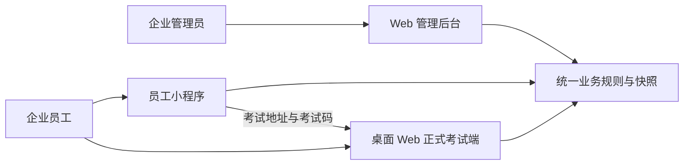
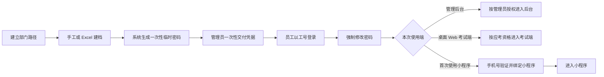
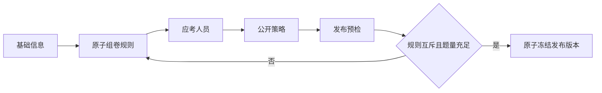
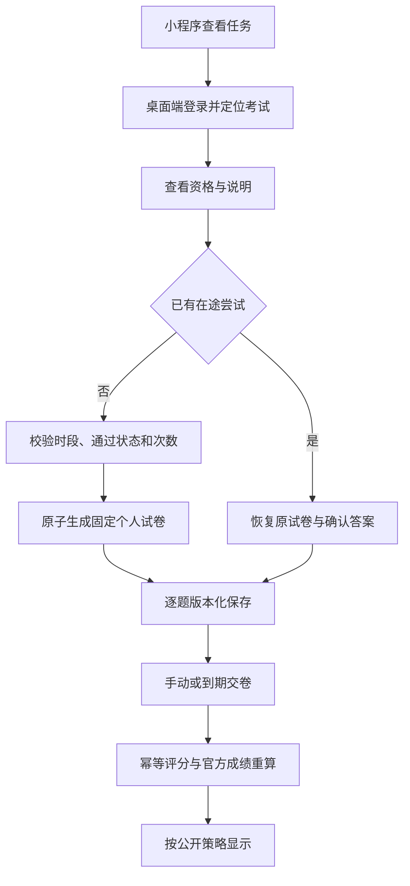

# 企业内部练习与考试系统 PRD 总览

| 文档属性 | 内容 |
| --- | --- |
| 文档版本 | V1.0 |
| 文档状态 | 第一阶段产品需求基线 |
| 编制日期 | 2026-08-11 |
| 需求基线 | [需求分析文档 V1.1](../01-需求调研/企业内部练习与考试系统-需求分析文档.md) |
| 配套文档 | [员工小程序 PRD](./01-员工小程序-PRD.md)、[Web 正式考试端 PRD](./02-Web正式考试端-PRD.md)、[Web 管理后台 PRD](./03-Web管理后台-PRD.md) |
| 目标读者 | 业务负责人、产品、设计、研发、测试、运维及企业管理员 |

---

## 1. 文档目的与使用方式

### 1.1 目的

本文档把需求分析 V1.1 转换为第一阶段可进入页面设计、研发拆解和测试设计的产品需求。需求分析第 3.4 节的 MVP 范围和第 18 章的 62 条验收项作为等价前置输入，不再另建 MVP 文档。

本文档负责定义跨端共享规则、功能编号、状态、端到端流程和验收追踪；三份端级 PRD 负责页面布局、元素、交互、异常和页面验收。出现表述差异时，按“需求分析 V1.1 → 本总览的共享规则 → 端级页面交互”的顺序处理，任何业务语义变更必须先更新需求基线。

### 1.2 本次交付边界

**纳入：** 三端信息架构、页面清单、功能行为、页面状态、业务流程、权限与脱敏、审计与观测、非功能指标和验收映射。

**不纳入：** 字段级数据库、公共 API、技术栈、服务拆分、部署拓扑、视觉稿、可点击原型、增长埋点，以及需求基线第 3.4 节明确排除的功能。

### 1.3 产品目标

1. 管理员能够完成组织建档、题库维护、批量导题、考试发布、过程处置、成绩统计和导出。
2. 员工能够在同一身份下完成练习、模拟考试和正式考试，但三种模式的反馈与成绩口径严格隔离。
3. 正式考试在并发、刷新、断线、重复请求、平台故障和自动交卷下仍保持固定试卷、答案可靠与结果可追溯。
4. 发布前发现题池或规则问题，发布后通过快照和受控异常处置保护考试公平性。

---

## 2. 用户、角色与权限

### 2.1 用户与角色

| 角色 | 主要目标 | 数据范围 |
| --- | --- | --- |
| 企业员工 | 学习、练习、自测并参加被分配的正式考试 | 仅本人任务、学习记录、试卷、答案和允许公开的结果 |
| 企业管理员 | 管理组织、题库、考试、异常、成绩和审计 | 单企业全部管理数据，但不能改员工答案、得分或个人时间 |

“考试异常处置”是企业管理员账号上的附加权限，不是第三种角色。受控初始化建立的首位管理员同时获得该权限，之后只有当前权限持有人可以完成授权转移；系统必须始终保留至少一名有效且具备该权限的管理员。

### 2.2 产品权限矩阵

| 能力 | 员工 | 管理员 | 异常处置授权管理员 |
| --- | --- | --- | --- |
| 练习、模拟、查看本人记录 | 允许 | 仅以员工身份使用 | 仅以员工身份使用 |
| 参加被分配的正式考试 | 允许 | 同时为应考员工时允许 | 同时为应考员工时允许 |
| 管理组织、账号、题库和考试 | 禁止 | 允许 | 允许 |
| 查看企业成绩和审计 | 禁止 | 允许 | 允许 |
| 修改答案、得分、通过状态或个人到期时间 | 禁止 | 禁止 | 禁止 |
| 创建或编辑平台故障事件/影响区间 | 禁止 | 禁止 | 禁止 |
| 确认或驳回监控生成的故障提案 | 禁止 | 未授权时禁止 | 允许，必须二次确认并审计 |

### 2.3 身份与组织决策

- 工号是唯一登录账号。系统生成一次性临时密码，首登必须改密；手机号仅用于验证、找回和解绑。受控初始化的首位管理员也必须对应一个 Employee 主体并遵循同一凭据规则。
- 单个建档或重置只显示一次临时密码；批量建档仅允许发起管理员一次性下载初始凭据，遗失后只能重置。
- 部门为树形结构，同一父节点下名称唯一。员工 Excel 通过 `/` 分隔的完整路径定位主部门。
- 部门可改名和移动但不得成环；存在员工或下级时不得停用；MVP 不物理删除部门。

---

## 3. 三端信息架构

### 3.1 跨端关系

小程序是学习和任务入口，不承载正式考试作答；正式考试端不提供题库管理；管理后台不代替员工答题。

### 3.2 页面注册表

| 页面 ID | 端 | 页面名称 | 核心职责 |
| --- | --- | --- | --- |
| MP-01 | 小程序 | 身份激活与绑定 | 工号凭据、手机验证、首登改密、绑定 |
| MP-02 | 小程序 | 首页 | 学习入口、进行中会话、正式任务提示 |
| MP-03 | 小程序 | 练习中心与配置 | 题库、模式、范围和题量选择 |
| MP-04 | 小程序 | 练习答题 | 逐题提交、即时反馈、恢复与结束 |
| MP-05 | 小程序 | 错题本 | 待练题与错题历史 |
| MP-06 | 小程序 | 模拟配置 | 题库、题量、时长和进行中模拟 |
| MP-07 | 小程序 | 模拟答题 | 固定试卷、保存、计时、提交或放弃 |
| MP-08 | 小程序 | 模拟结果 | 得分、错题和解析；放弃记录不评分 |
| MP-09 | 小程序 | 正式考试任务 | 本人任务与状态筛选 |
| MP-10 | 小程序 | 正式考试任务详情 | 规则摘要、电脑端地址、考试码与受控结果入口；结果正文由 MP-11 承载 |
| MP-11 | 小程序 | 学习记录 | 练习、模拟、正式考试记录分栏 |
| MP-12 | 小程序 | 账号安全 | 改密、找回、解绑和安全状态 |
| EX-01 | 正式考试端 | 登录与账号恢复 | 登录、首登改密、短信找回 |
| EX-02 | 正式考试端 | 任务列表与考试码定位 | 定位本人正式考试 |
| EX-03 | 正式考试端 | 考前说明与资格 | 显示资格、时段、次数和开始/恢复动作 |
| EX-04 | 正式考试端 | 答题工作台 | 固定试卷、答题卡、倒计时、保存和交卷 |
| EX-05 | 正式考试端 | 结果与复盘 | 汇总、尝试记录和受控逐题复盘 |
| AD-01 | 管理后台 | 登录 | 管理员身份与首登安全流程 |
| AD-02 | 管理后台 | 部门管理 | 部门树、路径、移动、改名和停用 |
| AD-03 | 管理后台 | 员工与员工导入 | 建档、导入、状态和初始凭据 |
| AD-04 | 管理后台 | 账号与管理员资格 | 重置、解绑、管理员及异常处置授权 |
| AD-05 | 管理后台 | 题库设置 | 题库启停与练习/模拟开关 |
| AD-06 | 管理后台 | 分类、知识点与题目 | 层级和题目列表维护 |
| AD-07 | 管理后台 | 单题与版本 | 纯文本题目编辑、版本历史和启停 |
| AD-08 | 管理后台 | 导题任务 | 模板、上传、任务状态和文件下载 |
| AD-09 | 管理后台 | 导入校验预览 | 错误、重复、冲突和待建层级确认 |
| AD-10 | 管理后台 | 考试列表 | 草稿、已发布和取消考试入口 |
| AD-11 | 管理后台 | 考试配置向导 | 五步创建和草稿编辑 |
| AD-12 | 管理后台 | 发布预检与冻结 | 规则、题池、人员和策略发布确认 |
| AD-13 | 管理后台 | 过程监控与异常 | 双维度过程状态、取消和故障确认 |
| AD-14 | 管理后台 | 成绩统计与导出 | 官方统计、员工主表和异步导出 |
| AD-15 | 管理后台 | 尝试详情与作废 | 全部尝试、快照、作废与成绩重算 |
| AD-16 | 管理后台 | 审计日志 | 关键操作、下载和安全拒绝查询 |

### 3.3 导航约束

- 小程序底部导航固定为“首页、学习、考试、我的”。进行中的练习或模拟通过首页和对应模块共同提供恢复入口。
- 正式考试端以任务为中心，不设置与考试无关的内容导航；答题期间离开工作台必须提示保存与计时语义。
- 管理后台一级导航为“组织与员工、题库、考试、审计”，不新增泛化仪表盘。

---

## 4. 文档接口与功能目录

### 4.1 编号规则

| 类型 | 格式 | 用途 |
| --- | --- | --- |
| 页面 | `MP/EX/AD-NN` | 原型、页面 PRD 和导航的稳定引用 |
| 功能 | `FR-领域-NN` | 一次定义共享业务行为 |
| 流程 | `FL-名称` | 跨页面业务流 |
| 系统行为 | `SYS-NN` | 无独立页面或跨端的系统责任 |
| 页面状态 | `页面ID-ST-NN` | 加载、空、错误、暂停、过期等页面表现 |
| 页面验收 | `页面ID-AC-NN` | 端级页面检查，不替代源验收 ID |
| 端到端 | `E2E-NN` | 串联页面、系统行为和源验收 |

### 4.2 功能定义

| 功能 ID | 名称 | 权威行为摘要 |
| --- | --- | --- |
| FR-AUTH-01 | 本地统一登录与会话 | 工号登录、账号锁定、停用撤销会话、对象级权限 |
| FR-AUTH-02 | 初始凭据与首登 | 系统临时密码只交付一次，首登强制改密；批量凭据包仅发起管理员可取，最长 24 小时且首次下载即清理 |
| FR-AUTH-03 | 手机验证与小程序绑定 | 验证码限时限次，绑定一对一，找回后旧会话失效 |
| FR-AUTH-04 | 部门与员工主数据 | 树形部门、单一主部门、完整路径、员工建档和停用 |
| FR-AUTH-05 | 管理员与异常处置授权 | 管理员资格和附加权限可审计，保护最后有效授权人 |
| FR-AUTH-06 | 权限与敏感数据隔离 | 服务端校验角色、对象、资格和结果可见性 |
| FR-QST-01 | 题库与开放策略 | 题库启停，练习和模拟开关相互独立 |
| FR-QST-02 | 分类与知识点 | 分类必填、知识点可选，当前名称与历史快照分离 |
| FR-QST-03 | 题目与不可变版本 | 修改内容生成新版本，停用不影响历史快照 |
| FR-QST-04 | 题型与纯文本内容 | 单选、多选、判断；纯文本换行；严格客观题规则 |
| FR-IMP-01 | 单题库模板与上传 | 固定 `.xlsx`、单题库上下文、1,000 行和 10 MB 上限 |
| FR-IMP-02 | 校验与错误反馈 | 文件级、行级、重复、冲突和原行号错误报告 |
| FR-IMP-03 | 预览与待建层级 | 可导入/不可导入守恒，新增分类知识点整体确认 |
| FR-IMP-04 | 原子确认与幂等 | 合法行部分入库，确认事务全成全败，重复请求返回原结果 |
| FR-IMP-05 | 导入任务生命周期 | 重新校验、取消、过期、文件保留和审计 |
| FR-PRA-01 | 练习开放范围 | 仅启用且开放练习的题库及启用题目 |
| FR-PRA-02 | 单一会话与顺序进度 | 全模式最多一场进行中；可恢复/结束；顺序按题库续做 |
| FR-PRA-03 | 随机、专项与错题题量 | 随机/专项 10、20、50；错题在不超过 50 时可全部 |
| FR-PRA-04 | 逐题判定与错题状态 | 提交即锁定并反馈，答错进入待练，日常答对一次移出 |
| FR-PRA-05 | 练习记录 | 保留版本、结果、进度和已停用题历史 |
| FR-SIM-01 | 模拟配置与开卷 | 开放题库、10/20/50 题、10-180 分钟、单一进行中 |
| FR-SIM-02 | 模拟固定与保存 | 固定题目/题序/分值，版本化保存和服务端计时 |
| FR-SIM-03 | 模拟提交与评分 | 幂等提交、客观题评分、提交后完整复盘 |
| FR-SIM-04 | 模拟放弃 | 二次确认，与提交/到期争夺唯一终结权；放弃成功后保留已答记录、不评分并释放名额 |
| FR-EXM-01 | 考试草稿与五步配置 | 基础、规则、人员、公开策略、发布预检 |
| FR-EXM-02 | 原子规则与发布预检 | 不重叠规则、题量充足、总分自动汇总 |
| FR-EXM-03 | 人员与发布快照 | 记录原子发布时间，并冻结去重人员、题池、规则、分值和策略 |
| FR-EXM-04 | 生命周期、冻结与取消 | 停止新开卷、收尾；发布后只改说明；取消不可恢复 |
| FR-EXM-05 | 任务与过程状态 | 生命周期、运行、参与、尝试、结果五域分离 |
| FR-ATT-01 | 开卷资格 | 登录、分配、生命周期、运行、通过和次数校验 |
| FR-ATT-02 | 单一在途尝试与固定试卷 | 并发开始返回原尝试；尝试内题目、顺序、分值固定 |
| FR-ATT-03 | 多次尝试 | 每次新抽卷、恢复不耗次数、通过后停止重考 |
| FR-ANS-01 | 版本化逐题保存 | 服务端确认后才显示已保存，旧版本不能覆盖新版本 |
| FR-ANS-02 | 恢复与服务端计时 | 恢复固定试卷和确认答案，剩余时间以服务端为准 |
| FR-ANS-03 | 手动/自动幂等交卷 | 未确认答案阻止手动交卷，到期锁定，唯一处理权和结果 |
| FR-ANS-04 | 竞态与观察窗 | 保存/交卷确定性规则，以及尝试到期和整场结束两个 20 秒故障观察窗 |
| FR-SCR-01 | 客观题评分 | 多选完全匹配，未答零分，不扣分、不部分得分 |
| FR-SCR-02 | 官方成绩 | 最高有效分，同分取最早达到者，通过后停止重考 |
| FR-SCR-03 | 尝试作废与重算 | 双原因、返还次数、原数据留存、官方结果重算 |
| FR-SCR-04 | 结果公开下限 | 汇总按策略；通过结论未公开时隐藏及格分并使用中性操作文案；逐题内容仅整场结束且无合法机会后开放 |
| FR-REP-01 | 双维度统计 | 参与状态与结果状态分开，人数守恒，统计口径固定 |
| FR-REP-02 | 员工与尝试明细 | 一人一行官方成绩，可下钻全部尝试和失效原因 |
| FR-REP-03 | 异步双表导出 | 官方汇总和全部尝试两个工作表，文件 24 小时有效 |
| FR-OPS-01 | 监控触发暂停 | 监控自动生成事件、证据、候选开始、开放区间和范围并暂停受影响考试 |
| FR-OPS-02 | 授权确认与统一补时 | 技术恢复后系统封闭区间并生成版本化提案；管理员只确认/驳回，系统复核、补时和恢复 |
| FR-OPS-03 | 安全与审计 | 关键动作留痕、追加写入、篡改可检测、敏感信息不入日志 |
| FR-OPS-04 | 性能、恢复与保留 | 量化 P95、RPO/RTO、容量、兼容性和数据保留 |

### 4.3 非页面系统行为

| SYS ID | 系统责任 | 主要功能 |
| --- | --- | --- |
| SYS-01 | 统一身份、对象权限与敏感数据隔离 | FR-AUTH-01 至 06 |
| SYS-02 | 题库与 Excel 校验及幂等导入 | FR-QST-01 至 04、FR-IMP-01 至 05 |
| SYS-03 | 发布预检、快照冻结与固定抽卷 | FR-EXM-01 至 04、FR-ATT-01 至 03 |
| SYS-04 | 答案版本、服务端计时、交卷与幂等评分 | FR-ANS-01 至 04、FR-SCR-01 至 04 |
| SYS-05 | 监控暂停、授权确认与统一补时；观察窗失守时锁定官方效力并强制取消重建 | FR-OPS-01 至 02 |
| SYS-06 | 统计口径与异步导出 | FR-REP-01 至 03 |
| SYS-07 | 审计、留存、监控与恢复 | FR-OPS-03 至 04 |

---

## 5. 全局交互规范

### 5.1 状态反馈

- 页面首次加载、局部刷新、空数据、权限不足、业务不可用、系统失败和重试必须分别表达，不得用同一“操作失败”替代。
- 会改变正式数据或不可恢复的操作必须显示对象、影响和结果，至少包括发布、取消、作废、放弃模拟、结束练习、权限撤销、导入确认和故障确认。
- 保存状态使用“保存中、已保存、保存失败”；“已保存”只能来自服务端持久化确认。
- 长任务使用明确任务状态，可离页后重新查询；不得要求管理员停留页面等待导入或导出。

### 5.2 时间与数字

- 业务时间按企业时区展示并标明时区；服务端统一以 UTC 比较。前端本地时钟不决定资格、剩余时间或提交结果。
- 倒计时以服务端到期时间计算；客户端只负责展示并定期校准。
- 分数最多两位小数；人数为整数；通过率和平均分必须同时展示统计口径或说明入口。
- “停止新开卷时间”不得简称为“考试结束时间”。存在在途尝试时页面必须显示“收尾中”。

### 5.3 表单与确认

- 必填、格式、范围和跨字段规则优先在当前字段附近提示；服务端拒绝后保留用户已填内容。
- 二次确认不得只显示“确定吗”，必须写明对象、不可逆后果及受影响人数或次数。
- 取消考试和作废尝试分别填写员工可见说明与管理员内部原因；两者不得互相替代。员工可见说明必须进入对应任务/记录或尝试失效提示，内部原因不得进入任何员工端响应。
- 故障提案不可编辑；驳回只进入系统复核，不恢复考试或取消应补时间。

### 5.4 权限、脱敏与可访问性

- 所有权限与对象范围由服务端决定。隐藏按钮不能替代授权校验。
- 手机号默认脱敏；临时密码只在受控结果中出现一次；日志不得包含凭据、验证码、令牌或员工答案原文。
- 正式考试逐题内容在公开下限前整体不可访问，包括题干、本人答案、逐题正误、标准答案和解析。
- “是否通过”本身受管理员开关和汇总公开时机控制。服务端可以因已经通过而禁止重考，但在结论未公开时，员工端只能使用“本场已无后续参加机会”等中性文案，不得通过标签、按钮原因或跳转结果提前泄露通过结论。
- 及格分是可结合员工得分推导通过结论的结构化字段；“是否通过”未开启或未到公开时机时，任何员工端响应均不得返回及格分或等价阈值。管理后台必须提醒管理员不要在始终可见的考试说明中主动写入该阈值。
- 颜色不得作为答题卡、错误、保存和状态的唯一表达，必须配合文字、图标或可感知标识。
- 所有操作区域在 1280 × 720 桌面视口或 320 CSS 像素小程序宽度下不得遮挡关键动作。

---

## 6. 五类正式考试状态

| 状态域 | 值 | 产品使用方式 |
| --- | --- | --- |
| 生命周期 | 草稿、未开始、开放开卷、收尾中、已结束、已取消 | 决定发布、开卷、统计和取消 |
| 运行状态 | 正常、暂停中 | 与生命周期正交，决定考试写操作是否冻结 |
| 参与状态 | 未参加、考试中、已交卷、已参加无有效交卷、缺考 | 一名应考员工在过程统计中的唯一位置 |
| 尝试状态 | 进行中、交卷处理中、已完成、已作废、已终止 | 决定答案能否写入以及结果是否有效 |
| 结果状态 | 待定、已通过、未通过、无有效成绩、已取消 | 表示官方考核结论，不与参与状态混算 |

状态派生、优先级和转换严格引用需求分析第 11 章。端级页面不得创造“已提交且考试中”等混合状态；若需展示组合语义，应同时呈现两个独立状态。

“异常尝试”仅是交卷超时、持续评分失败或一致性不变量风险触发的过程关注标记，不是第六种状态，也不进入参与或结果人数守恒；后台可按该标记筛选并查看审计。

“结果锁定/异常处理中”是严重一致性故障触发的独立保护标记和员工页面状态，也不是第六种状态或任何状态域的新值。它不改写五域状态、不参与人数守恒，只优先冻结官方结果、统计、导出和逐题披露；整场取消后仍按既有“已取消”状态收敛，锁定事实进入审计。

到达停止新开卷时间后一律先进入“收尾中”。即使没有在途尝试，也必须完成 20 秒整场结束观察窗；观察期、平台暂停或存在待处置故障事件时，不得进入“已结束”、结算最终缺考或开放依赖整场结束的逐题内容。补时把停止新开卷时间顺延到未来时，生命周期原子恢复为“开放开卷”，并从新的时间边界重新计算观察窗。

### 6.1 关键不变量

1. 同一员工同一考试最多一个在途尝试；重复开始返回原尝试。
2. 每次新尝试重新抽卷，尝试内题目版本、题序、选项顺序和分值永久固定。
3. 发布后规则、候选池、人员、分值和公开策略固定；只有说明文本可改，时间仅由已确认故障事件统一顺延。
4. 已确认答案不丢失；旧保存不能覆盖新保存；提交后答案不可修改。
5. 官方成绩取最高有效分，同分取最早达到者；通过后停止重考。
6. 逐题复盘不早于整场结束且员工无剩余合法机会。
7. 管理员可以作废尝试并返还次数，但不能改答案、改分或个人加时。

---
## 7. 端到端流程

### 7.1 流程注册表

| E2E ID | 流程 ID | 业务链路 | 主要页面/SYS | 成功终点 |
| --- | --- | --- | --- | --- |
| E2E-01 | FL-EMP、FL-AUTH | 员工建档与激活 | AD-01 至 04、MP-01、EX-01、SYS-01 | 员工或管理员完成首登改密并可使用已授权端 |
| E2E-02 | FL-QST、FL-IMP | 题库建档与批量导题 | AD-05 至 09、SYS-02 | 可导入题和待建层级原子入库 |
| E2E-03 | FL-PRA | 日常练习 | MP-02 至 05、MP-11 | 逐题结果、顺序进度和错题状态落定 |
| E2E-04 | FL-SIM | 自助模拟考试 | MP-06 至 08、MP-11、SYS-04 | 唯一模拟结果或无成绩的放弃记录形成 |
| E2E-05 | FL-PUB | 正式考试创建与发布 | AD-10 至 12、SYS-03 | 已发布版本、题池和应考人员原子冻结 |
| E2E-06 | FL-ATT、FL-SAVE、FL-SUB、FL-SCR、FL-VIS | 正式作答与评分 | MP-09 至 11、EX-02 至 05、SYS-03/04 | 唯一结果形成并按策略公开 |
| E2E-07 | FL-OUT | 平台故障暂停与恢复 | MP-09 至 11、EX-04、EX-05、AD-13、SYS-05/07 | 正常故障补时后恢复且不重复叠加；观察窗失守时结果锁定并取消重建 |
| E2E-08 | FL-VOID、FL-REP | 尝试作废与成绩导出 | AD-14 至 16、MP-11、EX-05、SYS-04/06/07 | 官方成绩重算，双工作表导出可下载 |

### 7.2 E2E-01 员工建档与激活

- 批量员工导入遇到重复工号、手机号或无效部门路径时跳过对应行，不覆盖旧档案。
- 批量凭据包只允许发起管理员在生成后 24 小时内成功下载一次，首次成功下载或到期即清理且不进入备份；凭据丢失或过期后只能执行密码重置，任何页面不得再次查询原密码。
- 停用账号立即失去新业务请求能力，但正式考试后台终结仍按需求基线收敛。

### 7.3 E2E-02 题库与批量导题

- 题干、选项、解析均按纯文本处理；公式、宏和外部链接不执行。
- 文件级错误拒绝整个任务；行级错误不阻止其他合法行进入确认。
- 重复确认返回原结果；预览依据变化时整体转为“需重新校验”。

### 7.4 E2E-03 日常练习

1. 员工选择开放练习的题库和模式；若已有进行中会话，先恢复或确认结束。
2. 顺序练习从长期进度续做；随机和专项选择 10/20/50；错题不超过 50 时可以全部练习。
3. 系统固定会话题目版本；员工逐题提交并立即查看正误、答案和解析。
4. 答错进入待练；任一日常练习答对一次即移出待练，但历史继续保留。
5. 完成或主动结束后会话终结；已提交记录保留，未提交题不生成结果。

### 7.5 E2E-04 自助模拟考试

1. 员工选择开放模拟的题库、10/20/50 题和 10-180 分钟。
2. 任一时点只允许一场进行中模拟；重复进入恢复固定试卷和确认答案。
3. 作答中不展示答案，服务端计时并逐题保存；提交或到期后幂等评分。
4. 放弃、手动提交和超时提交争夺唯一终结权；员工可二次确认放弃，成功后已保存答案和放弃时间留档，不评分并释放名额，后续请求返回同一终态。
5. 正常完成后立即展示成绩、正确/错误/未答、错题和解析，不影响日常待练错题。

### 7.6 E2E-05 正式考试创建与发布

- 五步向导允许保存草稿。发布预检必须给出每条规则的要求数、可用数、缺口和重叠定位。
- 发布成功后只允许修订说明文本；业务问题通过取消并重建处理。
- 调岗、题目修订或停用不改变已发布人员和题目版本池。

### 7.7 E2E-06 正式作答与评分

- 同一员工同一考试最多一个在途尝试；停止新开卷后仍可恢复原尝试，但不能新建。
- 到期立即拒绝答案并进入 20 秒观察窗；无平台故障后取得唯一交卷处理权。
- 到达停止新开卷时间后整场先进入 20 秒结束观察窗；观察期、暂停或存在待处置故障时不形成最终缺考，也不公开依赖整场结束的内容。
- 手动交卷遇到保存中或保存失败时先重试，仍未确认则阻止交卷并定位题目。
- 多选完全匹配才得分；官方成绩取最高有效分；通过后不再允许新尝试。

### 7.8 E2E-07 平台故障暂停与恢复

1. 监控在 15 秒内生成事件、证据、候选影响开始、开放区间和影响范围，受影响考试自动进入暂停中。
2. 正式考试页切为只读，停止新开卷、保存和交卷；展示最后确认答案和统一暂停提示。
3. 技术恢复并通过健康检查后，系统封闭区间并生成不可编辑、可版本追踪的提案；只有异常处置授权管理员可复核。
4. 确认需复核意见和二次确认；系统合并区间并原子顺延停止新开卷时间和适用尝试到期时间。
5. 驳回进入系统复核并保持暂停；系统在健康检查正常且区间、范围、补偿重新校验通过后生成新提案，不免除实际暂停补偿。
6. 重复处理不得叠加；恢复后客户端重新取得服务端到期时间和可编辑状态。
7. 若全部受影响考试均已取消，技术恢复后由系统关闭故障事件并保留证据、提案版本与审计；否则只能在提案确认并完成补时后恢复考试。
8. 若告警晚于任一观察窗，已经造成本应补时的尝试自动交卷或补时重开前逐题内容披露，系统立即锁定该场官方结果与后续披露；管理员只能填写双原因取消考试，再从 `AD-10` 人工新建考试，不能保留结果或原地修复。

### 7.9 E2E-08 作废、重算与导出

1. 管理员从员工成绩下钻全部尝试，只能对进行中或已完成尝试作废；交卷处理中需等待收敛。
2. 作废二次确认并填写员工可见说明和内部原因，保留原试卷、答案、得分和审计。
3. 系统返还一次次数并从剩余有效尝试重算官方成绩；开放窗口之外不能因返还次数重新开卷。
4. 成绩页按参与和结果两个维度展示守恒统计，并可创建异步导出任务。
5. 导出文件包含“官方汇总”和“全部尝试”两个工作表，24 小时内可重复下载，过期后重新生成。

---

## 8. 系统级行为与异常边界

### 8.1 发布与抽卷

- 一条原子规则同时限定题库、分类、知识点、题型、难度、数量和单题分值；空筛选表示该维度不限。
- 任意两条规则的候选题版本集合不得相交。每条候选数必须不小于抽取数，总题数最多 100，总分自动汇总。
- 发布将规则、候选题版本池、人员、分值和公开策略作为同一原子结果；任一环节失败不产生发布版本。
- 开卷从每条冻结候选池独立无重复抽取，再统一随机题序；选项保持题库 A-D 顺序。

### 8.2 保存、恢复和交卷

| 场景 | 确定性处理 |
| --- | --- |
| 多页面乱序保存 | 旧答案版本被拒绝并返回服务端最新状态 |
| 保存失败 | 不显示已保存；允许相同幂等标识重试 |
| 刷新、退出或换浏览器 | 加载固定试卷、最后确认答案和服务端剩余时间 |
| 最后一刻保存与到期并发 | 仅到期前且交卷锁定前已确认的答案有效 |
| 保存与手动交卷并发 | 交卷锁定前确认的答案进入评分，锁定后保存被拒绝 |
| 手动与自动交卷并发 | 首个处理权确定原因，所有请求返回同一状态/结果 |
| 评分失败 | 保持交卷处理中并幂等重试，不解锁答案 |

### 8.3 结果公开

| 阶段 | 允许展示 | 禁止展示 |
| --- | --- | --- |
| 作答中或交卷处理中 | 进度、保存和处理状态 | 得分、逐题正误、答案、解析 |
| 提交后且策略允许汇总 | 总分、是否通过、正确题数、错误题数中配置允许的项目 | 题干、本人答案、逐题正误、标准答案、解析 |
| 整场结束但员工仍有合法机会 | 配置允许的汇总 | 全部逐题内容 |
| 整场结束且无合法机会 | 汇总；按答案/解析开关提供逐题复盘 | 未被配置开放的答案或解析 |
| 整场取消 | 取消说明与历史状态 | 标准答案、解析和官方结果效力 |

### 8.4 审计事件

必须审计身份与权限变化、组织和题库修改、文件上传/确认/下载、考试创建/发布/取消、开卷/交卷/评分、尝试作废与重算、故障提案及处置、成绩导出和对象级授权拒绝。逐题保存使用答案版本记录，不在管理审计中复制答案原文。

### 8.5 平台故障事件状态

| 事件状态 | 产品行为 |
| --- | --- |
| 已触发 | 监控生成候选开始和开放区间，受影响考试自动暂停 |
| 待确认 | 技术恢复且健康检查通过，系统封闭区间并生成不可编辑提案版本 |
| 系统复核中 | 管理员驳回当前版本，考试保持暂停；系统基于新增/校正证据生成下一版本 |
| 已确认 | 管理员二次确认，系统原子补时并恢复；重复请求返回原结果 |
| 已关闭 | 所有受影响考试均已取消且技术已恢复，系统关闭无可补偿事件并保留审计 |

管理员不能创建、编辑或手工关闭事件。系统复核仅在健康检查正常且区间、范围、补偿均重新校验通过后回到“待确认”；不能人工强制恢复。除全部受影响考试已取消外，实际业务暂停时间最终必须完整补偿。

任一 20 秒观察窗失守并造成本应补时的尝试已经自动交卷，或在补时重开前已向员工披露逐题内容时，属于严重一致性故障。系统必须立即冻结该场官方结果、统计、导出和逐题披露，`AD-13` 显示不可忽略的严重告警；唯一业务处置是填写员工可见说明和内部原因后取消整场考试，再从 `AD-10` 人工新建考试。管理员不得解锁、改分、回滚单次提交或原地修改已发布考试。

---

## 9. 非功能产品要求

| 维度 | PRD 验收目标 |
| --- | --- |
| 基础容量 | 5,000 名员工、单题库 10,000 题、单场 2,000 人、峰值 500 并发、每卷 100 题、最多 10 次尝试 |
| 页面性能 | 500 并发下页面可操作 P95 <= 2 秒 |
| 答案保存 | P95 <= 1 秒，成功确认答案业务 RPO=0 |
| 开卷/交卷 | P95 <= 3 秒；并发请求不重复生成尝试、试卷或结果 |
| 自动交卷与整场结束 | 尝试到期和停止新开卷均先观察 20 秒；正常运行到期后 60 秒内完成交卷，跨暂停则恢复后 60 秒内完成 |
| 导入 | 1,000 行、接近 10 MB 的固定模板 60 秒内完成校验 |
| 发布预检 | 50 条规则、50,000 个候选版本 30 秒内完成 |
| 统计与导出 | 统计 P95 <= 3 秒；2,000 人 × 10 次尝试双表导出 <= 5 分钟 |
| 服务可靠性 | 核心服务自然月可用性 >= 99.9%，RTO <= 1 小时 |
| 安全 | 身份、对象、应考资格、写状态和结果公开均由服务端校验；敏感数据传输与静态保护 |
| 审计与留存 | 正式考试与审计至少 5 年；练习/模拟至少 2 年；初始凭据包最长 24 小时且首次下载即清理；导入文件 180 天；导出文件 24 小时 |
| 兼容性 | 正式考试端和后台支持桌面 Chrome/Edge 最近两个主版本；小程序支持微信 iOS/Android 当前及前一稳定版 |
| 时间 | 企业时区展示，服务端 UTC 比较，跨夏令时仍按实际秒数计时 |

详细测量环境、失败率、恢复演练和数据清理规则引用需求分析第 17 章，不在端级 PRD 改写。

---

## 10. 需求与验收追踪矩阵

本表是 62 个源验收 ID 的唯一权威映射。端级 PRD 的页面验收用于补充界面表现，不能替代本表中的业务验收。

| 验收 ID | 需求来源 | 功能 ID | 页面/SYS | 流程或状态 | 测试层级 |
| --- | --- | --- | --- | --- | --- |
| ACC-01 | 4.3-4.4、18.3 | FR-AUTH-04 | AD-02、AD-03、SYS-01 | FL-EMP | 规则、集成 |
| ACC-02 | 4.4-4.5、17.4、17.7、18.3 | FR-AUTH-02 | MP-01、EX-01、AD-01、AD-03、SYS-01、SYS-07 | FL-AUTH | 页面、安全、留存 |
| ACC-03 | 4.5、17.4、18.3 | FR-AUTH-03 | MP-12、EX-01、AD-01、AD-04、SYS-01 | FL-AUTH | 安全、集成 |
| ACC-04 | 4.5、18.3 | FR-AUTH-03 | MP-01、MP-12、AD-04、SYS-01 | FL-AUTH | 页面、集成 |
| ACC-05 | 4.4、18.3 | FR-AUTH-01、FR-ANS-03 | AD-03、EX-04、SYS-01、SYS-04 | FL-EMP、FL-SUB | 状态、集成 |
| ACC-06 | 4.5、18.3 | FR-AUTH-05 | AD-04、SYS-01 | FL-AUTH | 权限、审计 |
| IMP-01 | 7.1-7.3、18.3 | FR-IMP-01 | AD-05、AD-08、SYS-02 | FL-IMP | 页面、文件 |
| IMP-02 | 7.4-7.5、17.2、18.3 | FR-IMP-02 | AD-08、AD-09、SYS-02 | FL-IMP | 性能、集成 |
| IMP-03 | 7.1、7.4、18.3 | FR-IMP-01、FR-IMP-02 | AD-08、AD-09、SYS-02 | FL-IMP | 文件、安全 |
| IMP-04 | 7.4-7.5、18.3 | FR-IMP-02 | AD-09、SYS-02 | FL-IMP | 规则、集成 |
| IMP-05 | 7.5-7.6、18.3 | FR-IMP-03、FR-IMP-04 | AD-09、SYS-02 | FL-IMP | 状态、事务 |
| IMP-06 | 6.5、7.4、18.3 | FR-IMP-02 | AD-09、SYS-02 | FL-IMP | 规则、集成 |
| IMP-07 | 7.6、18.3 | FR-IMP-04 | AD-09、SYS-02 | FL-IMP | 幂等、事务 |
| IMP-08 | 7.6、18.3 | FR-IMP-04 | AD-09、SYS-02 | FL-IMP | 并发、事务 |
| IMP-09 | 7.7、18.3 | FR-IMP-05 | AD-08、SYS-02、SYS-07 | 导入任务状态 | 状态、留存 |
| QST-01 | 6.3-6.4、18.3 | FR-QST-03、FR-QST-04 | AD-06、AD-07、SYS-02、SYS-03 | FL-QST | 规则、回归 |
| QST-02 | 6.1、6.4、18.3 | FR-QST-02、FR-QST-03 | AD-06、AD-07、SYS-02 | FL-QST | 版本、回归 |
| PRA-01 | 8.1-8.4、18.4 | FR-QST-01、FR-PRA-01、FR-PRA-02、FR-PRA-04 | MP-03、MP-04、AD-05、SYS-02、SYS-04 | FL-PRA | 页面、E2E |
| PRA-02 | 8.2-8.3、18.4 | FR-PRA-03 | MP-03、MP-05 | FL-PRA | 边界、页面 |
| PRA-03 | 8.4、18.4 | FR-PRA-04、FR-PRA-05 | MP-04、MP-05、MP-11 | FL-PRA | 状态、回归 |
| SIM-01 | 9.1-9.3、18.4 | FR-QST-01、FR-SIM-01、FR-SIM-02、FR-SIM-03 | MP-06、MP-07、MP-08、AD-05、SYS-02、SYS-04 | FL-SIM | E2E、评分 |
| SIM-02 | 9.2、18.4 | FR-SIM-02、FR-SIM-04 | MP-07、MP-08、SYS-04 | FL-SIM | 状态、幂等 |
| PUB-01 | 10.1-10.4、18.4 | FR-EXM-01、FR-EXM-02、FR-EXM-03 | AD-10、AD-11、AD-12、SYS-03 | FL-PUB | 规则、事务 |
| PUB-02 | 10.3、18.4 | FR-EXM-02 | AD-12、SYS-03 | FL-PUB | 边界、页面 |
| PUB-03 | 10.3、18.4 | FR-EXM-02 | AD-12、SYS-03 | FL-PUB | 规则、页面 |
| PUB-04 | 10.4、18.4 | FR-EXM-03 | AD-02、AD-05、AD-07、AD-12、AD-13、SYS-03 | 已发布只读 | 快照、回归 |
| PUB-05 | 10.4、18.4 | FR-EXM-04 | AD-13、SYS-03、SYS-05 | 已发布只读 | 权限、回归 |
| ATT-01 | 12.1-12.3、18.5 | FR-ATT-01、FR-ATT-02 | EX-02、EX-03、EX-04、SYS-03 | FL-ATT | 并发、事务 |
| ATT-02 | 15.2、18.5 | FR-ATT-03 | EX-03、EX-04、SYS-03 | FL-ATT | 状态、抽卷 |
| ATT-03 | 13.2、18.5 | FR-ANS-02 | EX-04、SYS-04 | FL-SAVE | 恢复、E2E |
| ATT-04 | 13.1、18.5 | FR-ANS-01 | EX-04、SYS-04 | FL-SAVE | 并发、版本 |
| ATT-05 | 13.1、18.5 | FR-ANS-01 | EX-04、SYS-04 | FL-SAVE | 失败、恢复 |
| TIM-01 | 13.3、18.5 | FR-ANS-02、FR-EXM-05 | EX-03、EX-04、SYS-04 | 开放开卷→收尾中 | 时间边界 |
| TIM-02 | 11.2、13.3-13.4、18.5 | FR-EXM-04、FR-EXM-05、FR-ATT-01、FR-ANS-02、FR-ANS-04、FR-SCR-04 | MP-09、MP-10、MP-11、EX-03、EX-05、AD-13、AD-14、SYS-03、SYS-04、SYS-05 | FL-ATT、FL-VIS | 时间边界 |
| TIM-03 | 13.4、18.5 | FR-ANS-03、FR-ANS-04 | EX-04、SYS-04 | FL-SUB | 调度、性能 |
| SUB-01 | 13.4-13.5、18.5 | FR-ANS-03、FR-ANS-04 | EX-04、SYS-04 | FL-SUB | 并发、幂等 |
| SCR-01 | 6.3、15.1、18.5 | FR-SCR-01 | EX-05、AD-15、SYS-04 | FL-SCR | 规则、评分 |
| SCR-02 | 15.2、18.5 | FR-SCR-02 | MP-11、EX-03、EX-05、AD-14、SYS-04 | FL-SCR | 规则、状态 |
| SCR-03 | 15.3、18.5 | FR-SCR-03 | AD-15、MP-11、EX-05、SYS-04 | FL-VOID | 事务、审计 |
| VIS-01 | 15.4、18.5 | FR-SCR-04 | MP-11、EX-05、AD-11、SYS-04 | FL-VIS | 权限、页面 |
| VIS-02 | 11.2-11.3、15.4、18.5 | FR-ANS-04、FR-SCR-04、FR-OPS-01、FR-OPS-02 | MP-11、EX-05、AD-11、AD-13、SYS-04、SYS-05 | FL-VIS、FL-OUT | 安全、权限 |
| OUT-01 | 11.2、13.4、14、18.5 | FR-EXM-04、FR-EXM-05、FR-ANS-04、FR-SCR-04、FR-OPS-01、FR-OPS-02 | MP-09、MP-10、MP-11、EX-04、EX-05、AD-13、AD-14、AD-16、SYS-03、SYS-04、SYS-05、SYS-07 | FL-OUT、暂停中、结果锁定 | 故障、E2E |
| OUT-02 | 14.1、18.5 | FR-ANS-02、FR-OPS-02 | EX-04、SYS-04、SYS-05 | FL-SAVE | 边界、恢复 |
| CAN-01 | 10.5、18.5 | FR-EXM-04、FR-SCR-04 | MP-10、MP-11、EX-05、AD-10、AD-13、SYS-03、SYS-04 | 已取消 | 状态、审计 |
| REP-01 | 16.2、18.5 | FR-REP-01 | AD-13、AD-14、SYS-06 | FL-REP | 规则、统计 |
| REP-02 | 16.4、18.5 | FR-REP-02、FR-REP-03 | AD-14、AD-15、SYS-06 | FL-REP | 文件、口径 |
| SEC-01 | 17.4、18.6 | FR-AUTH-06、FR-OPS-03 | 全部页面、SYS-01、SYS-07 | 授权拒绝 | 安全 |
| SEC-02 | 15.4、17.4、18.6 | FR-SCR-04、FR-AUTH-06 | MP-11、EX-05、SYS-01、SYS-04 | FL-VIS | 安全、响应检查 |
| SEC-03 | 7、16.4、17.4、18.6 | FR-IMP-01、FR-REP-03、FR-OPS-03 | AD-08、AD-14、SYS-02、SYS-06 | FL-IMP、FL-REP | 文件、安全 |
| SEC-04 | 13-15、17.4、18.6 | FR-AUTH-06、FR-ANS-01、FR-SCR-01 | EX-04、AD-15、SYS-01、SYS-04 | 授权拒绝 | 安全、篡改 |
| SEC-05 | 4.5、17.4、18.6 | FR-AUTH-01、FR-AUTH-03、FR-OPS-03 | MP-01、MP-12、EX-01、AD-01、SYS-01、SYS-07 | FL-AUTH | 安全、压力 |
| PERF-01 | 17.2、18.6 | FR-ANS-01、FR-OPS-04 | EX-04、SYS-04、SYS-07 | FL-SAVE | 性能、耐久 |
| PERF-02 | 17.2、18.6 | FR-ATT-02、FR-ANS-03、FR-OPS-04 | EX-04、SYS-03、SYS-04 | FL-ATT、FL-SUB | 性能、并发 |
| PERF-03 | 13.4、17.2、18.6 | FR-ANS-03、FR-OPS-04 | SYS-04、SYS-07 | FL-SUB | 性能、调度 |
| PERF-04 | 16.4、17.2、18.6 | FR-REP-03、FR-OPS-04 | AD-14、SYS-06、SYS-07 | FL-REP | 性能、文件 |
| CAP-01 | 17.1-17.2、18.6 | FR-EXM-02、FR-REP-03、FR-OPS-04 | AD-11、AD-12、AD-14、SYS-03、SYS-06、SYS-07 | FL-PUB、FL-REP | 容量、性能 |
| DR-01 | 17.3、17.7、18.6 | FR-ATT-02、FR-ANS-01、FR-ANS-03、FR-OPS-04 | SYS-03、SYS-04、SYS-07 | FL-ATT、FL-SAVE、FL-SUB | 故障注入、恢复 |
| DR-02 | 17.3、18.6 | FR-OPS-04 | SYS-05、SYS-07 | FL-OUT | 恢复演练 |
| OPS-01 | 17.3、18.6 | FR-OPS-01、FR-OPS-04 | AD-13、SYS-05、SYS-07 | FL-OUT | 监控、SLO |
| CMP-01 | 17.6、18.6 | FR-OPS-04 | 全部页面、SYS-07 | 兼容与时间边界 | 兼容、E2E |
| AUD-01 | 17.5、18.6 | FR-OPS-03 | AD-16、SYS-07 | 审计事件 | 审计、安全 |
| RET-01 | 17.7、18.6 | FR-IMP-05、FR-REP-03、FR-OPS-04 | AD-08、AD-14、AD-16、SYS-07 | 数据生命周期 | 留存、恢复 |

---

## 11. 端级页面 PRD 写作与评审规则

每个页面必须包含以下内容，端级文档不得省略适用项：

1. 页面 ID、目标、角色、入口、退出和前置条件。
2. 页面布局与 Module 清单，以及元素的显示条件、默认值、操作、校验和禁用条件。
3. 主流程、分支流程、跳转目标和返回后的状态保持。
4. 加载、空、失败、权限不足、暂停、取消、过期和只读状态。
5. 与五类考试状态或练习/模拟/导入任务状态的映射。
6. 服务端确认、时间、敏感数据、答案公开和对象权限语义。
7. 需要记录的审计、运行观测或安全拒绝。
8. 来源章节、共享 FR/SYS、流程 ID 和页面级验收。

### 11.1 评审门禁

- 页面清单与第 3.2 节一致，不新增未进入 MVP 的页面能力。
- 一个共享 FR 只在本总览定义；端级 PRD 引用并只补充页面表现。
- 正式考试页面完整覆盖保存中、失败、冲突、离线、暂停、到期观察和交卷处理中。
- 后台完整覆盖导入部分合法、规则不足/重叠、发布只读、故障复核、无有效成绩和导出过期。
- 员工端完整覆盖进行中练习恢复、模拟放弃、正式任务取消和结果未公开。

---

## 12. 文档验收清单

- [x] 四份 PRD 的页面 ID、功能 ID、SYS ID 和流程 ID 引用一致。
- [x] 本文第 10 章与需求分析第 18 章的验收 ID 集合均为 62 项且完全相同。
- [x] 八条 E2E 链路均可从入口走到唯一成功或受控终态。
- [x] 五个正式考试状态域没有合并、重名或相互替代。
- [x] 停止新开卷、收尾、发布冻结、固定试卷、服务端时间和结果公开下限无语义漂移。
- [x] 故障事件只能由监控生成，授权管理员不能编辑事实字段，驳回不免除实际暂停补偿。
- [x] 文档不存在未解释术语、悬空引用、占位内容或超出 MVP 的功能承诺。
- [x] Markdown 表格、相对链接和 Mermaid 代码块通过静态检查。

---

## 13. 后续交付边界

后续产品信息架构和原型沿用页面 ID；研发拆解沿用 FR 与 SYS ID；测试用例沿用需求基线验收 ID和页面验收 ID。数据库、接口和技术方案需要实现本 PRD 的不变量，但应在独立文档中定义字段、请求、事务、索引和部署细节。
