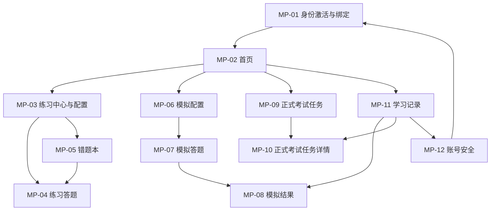
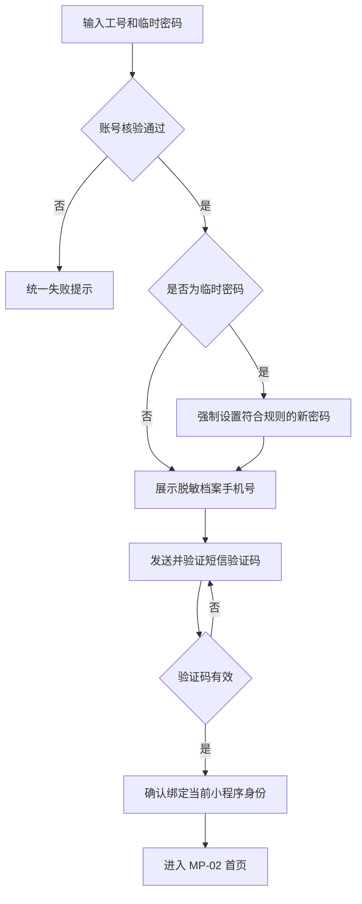
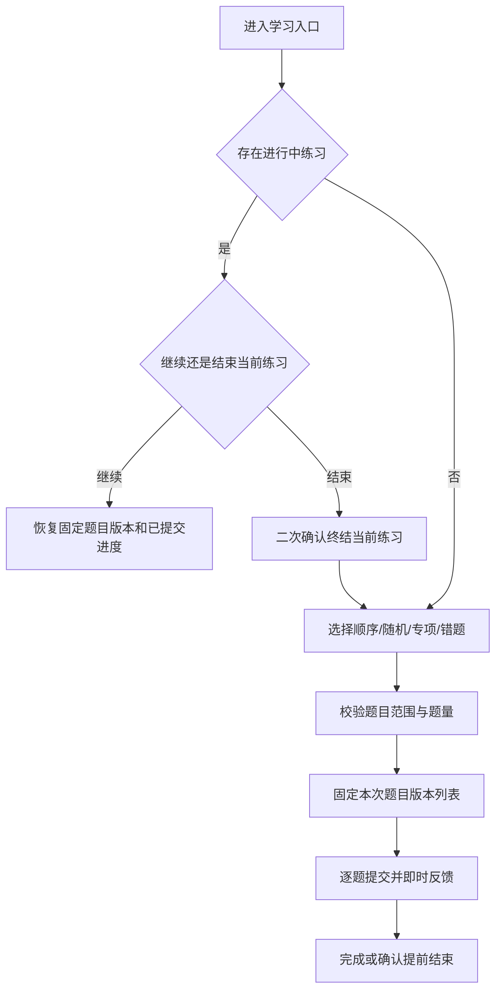
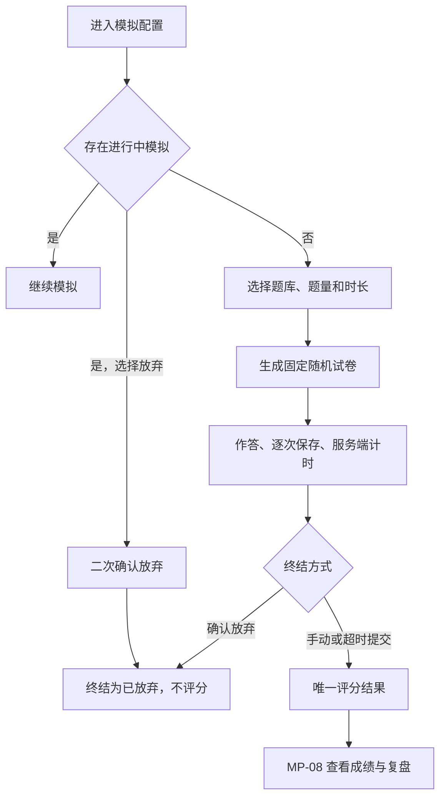
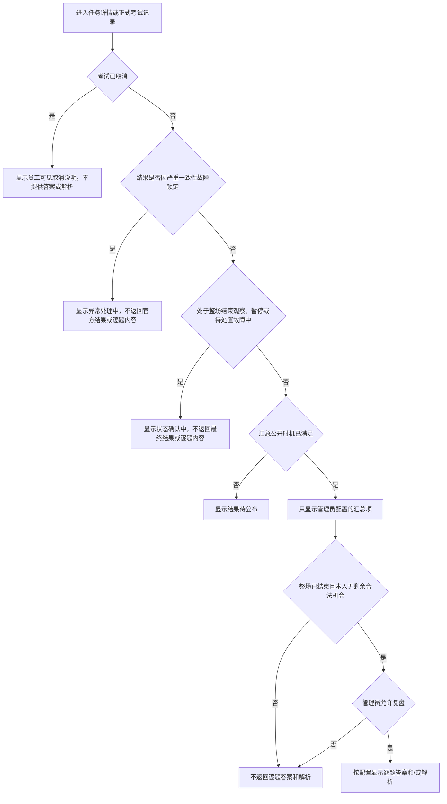

# 企业内部练习与考试系统 - 员工小程序 PRD

| 文档属性 | 内容 |
| --- | --- |
| 文档版本 | V1.0 |
| 文档状态 | 第一阶段页面级需求基线 |
| 编制日期 | 2026-08-11 |
| 适用端 | 员工微信小程序 |
| 适用角色 | 企业员工 |
| 关联总览 | [企业内部练习与考试系统 PRD 总览](./00-企业内部练习与考试系统-PRD总览.md) |
| 需求来源 | [企业内部练习与考试系统需求分析文档](../01-需求调研/企业内部练习与考试系统-需求分析文档.md) |

---

## 1. 文档目标与边界

### 1.1 文档目标

本文档将员工小程序的 MVP 需求细化到页面、模块、元素、交互、状态和验收层级，供产品、设计、研发和测试共同使用。本文档必须与 PRD 总览中的共享规则以及需求分析基线保持一致。

### 1.2 小程序职责

员工小程序负责：

- 企业员工首次激活、身份绑定、账号恢复和账号安全操作。
- 顺序、随机、专项和错题练习。
- 员工自助模拟考试及模拟结果复盘。
- 正式考试任务查看、电脑端考试地址/考试码获取和允许范围内的成绩查看。
- 练习、模拟考试和正式考试个人记录查看。

员工小程序不得：

- 承载正式考试答题、正式考试开卷或正式考试答案保存。
- 创建考试、维护题目、管理员工或执行任何后台管理操作。
- 查看其他员工的任务、试卷、答案、成绩或个人资料。
- 在正式考试公开条件满足前返回标准答案、解析或可推导答案的信息。

### 1.3 MVP 页面清单

| 页面 ID | 页面名称 | 页面类型 | 底部导航归属 |
| --- | --- | --- | --- |
| MP-01 | 身份激活与绑定 | 前置流程页 | 无 |
| MP-02 | 首页 | 一级页面 | 首页 |
| MP-03 | 练习中心与配置 | 一级页面 | 学习 |
| MP-04 | 练习答题 | 沉浸式任务页 | 学习 |
| MP-05 | 错题本 | 二级页面 | 学习 |
| MP-06 | 模拟配置 | 二级页面 | 学习 |
| MP-07 | 模拟答题 | 沉浸式任务页 | 学习 |
| MP-08 | 模拟结果 | 结果页 | 学习 |
| MP-09 | 正式考试任务 | 一级页面 | 考试 |
| MP-10 | 正式考试任务详情 | 二级页面 | 考试 |
| MP-11 | 学习记录 | 一级页面 | 我的 |
| MP-12 | 账号安全 | 二级页面 | 我的 |

---

## 2. 信息架构与导航

### 2.1 底部导航

底部导航固定为四项，顺序不得调整：

| 导航项 | 默认页面 | 核心内容 |
| --- | --- | --- |
| 首页 | MP-02 | 待办任务、进行中学习、快捷入口 |
| 学习 | MP-03 | 日常练习、错题本、模拟考试 |
| 考试 | MP-09 | 正式考试任务及状态 |
| 我的 | MP-11 | 三类记录、账号信息及安全入口 |

MP-04 与 MP-07 为沉浸式作答页，不展示底部导航。离开前必须按各自规则处理当前进度。MP-01 在完成身份绑定前是唯一可访问的业务入口。

### 2.2 页面关系

### 2.3 全局访问守卫

1. 未绑定小程序身份时，只允许进入 MP-01。
2. 已绑定但仍使用临时密码时，只允许完成密码修改和绑定流程，不允许进入业务页面。
3. 账号被停用、密码被重置或绑定被解除后，现有小程序会话立即失效；下一次页面操作统一回到 MP-01。
4. 会话失效不删除已保存的练习、模拟或正式考试数据。
5. 页面恢复时必须先重新核验当前员工身份和对象归属，再加载本人数据。

---

## 3. 共享功能与规则编号

### 3.1 共享系统规则引用

| 规则 ID | 本端适用内容 |
| --- | --- |
| SYS-01 | 统一身份、对象权限与敏感数据隔离 |
| SYS-03 | 发布预检、快照冻结与固定抽卷；小程序展示发布时冻结的任务与规则摘要 |
| SYS-04 | 答案版本、服务端计时、交卷与幂等评分；模拟考试遵循其中适用规则 |
| SYS-05 | 监控暂停、授权确认与统一补时；小程序展示有效时间、暂停和整场结束观察状态 |
| SYS-07 | 审计、留存、监控与恢复 |

### 3.2 适用功能引用

下表名称与范围直接引用 PRD 总览的“功能定义”表；本端仅补充主要落点，不改变全局功能语义。

| 功能 ID | 功能定义 | 主要页面 |
| --- | --- | --- |
| FR-AUTH-01 | 本地统一登录与会话 | MP-01、MP-12、全局 |
| FR-AUTH-02 | 初始凭据与首登 | MP-01 |
| FR-AUTH-03 | 手机验证与小程序绑定 | MP-01、MP-12 |
| FR-AUTH-06 | 对象权限与敏感数据隔离 | 全部页面 |
| FR-PRA-01 | 练习开放范围 | MP-03、MP-05 |
| FR-PRA-02 | 单一会话与顺序进度 | MP-02、MP-03、MP-04、MP-05 |
| FR-PRA-03 | 随机、专项与错题题量 | MP-03、MP-05 |
| FR-PRA-04 | 逐题判定与错题状态 | MP-04、MP-05 |
| FR-PRA-05 | 练习记录 | MP-04、MP-05、MP-11 |
| FR-SIM-01 | 模拟配置与开卷 | MP-02、MP-06 |
| FR-SIM-02 | 模拟固定与保存 | MP-07 |
| FR-SIM-03 | 模拟提交与评分 | MP-07、MP-08、MP-11 |
| FR-SIM-04 | 模拟放弃 | MP-06、MP-07、MP-11 |
| FR-EXM-04 | 生命周期、冻结与取消 | MP-09、MP-10 |
| FR-EXM-05 | 任务与过程状态 | MP-02、MP-09、MP-10、MP-11 |
| FR-SCR-01 | 客观题评分 | MP-07、MP-08 |
| FR-SCR-02 | 官方成绩 | MP-11 |
| FR-SCR-03 | 尝试作废与重算 | MP-11 |
| FR-SCR-04 | 结果公开下限 | MP-11 |

### 3.3 共用显示规则

- 所有业务时间按企业时区显示，并在页面首次出现时间的位置标明企业时区；跨日时不得只显示时分。
- 正式考试的生命周期、运行状态、本人参与状态、尝试状态和结果状态必须独立维护，不得混用。页面只按本页职责和结果公开策略展示相关状态；未获准公开的结果状态不展示，也不通过操作文案泄露。
- 服务端时间到达停止新开卷时间后，考试先进入“收尾中”并启动 20 秒整场结束/披露观察窗，即使当时没有在途尝试也不得直接显示“已结束”。该观察窗与单次尝试到期观察窗分开计算；只有观察通过、运行正常、不存在在途尝试且不存在待处置故障事件时，才由服务端确认“已结束”。
- 状态不能只依赖颜色表达，必须同时使用文字和可感知图标。
- 题干、选项和解析按纯文本及原始换行展示，不解析富文本标记，不执行其中的链接或指令。
- 手机号仅显示前三位和后四位；标准答案、员工答案和成绩仅在对应业务场景及权限条件满足时显示。
- 任何列表刷新后都以服务端最新状态为准；本地缓存不得覆盖新状态。
- 加载超过 1 秒时展示明确加载状态；失败时保留页面结构并提供“重新加载”。
- 重复点击开始、提交、放弃、发送验证码等操作时，首次请求处理期间按钮进入不可重复触发状态。

---

## 4. 跨页面流程

### 4.1 FL-AUTH 首次激活与绑定

### 4.2 FL-PRA 练习创建与恢复

### 4.3 FL-SIM 模拟创建、提交与放弃

### 4.4 FL-VIS 正式考试结果展示

---

## 5. 全局状态与异常规范

### 5.1 统一页面状态

| 状态 | 展示与操作要求 |
| --- | --- |
| 首次加载 | 展示结构化占位，不显示旧员工的缓存内容 |
| 刷新中 | 保留当前可见内容并标记刷新，不允许重复触发同一提交操作 |
| 空状态 | 说明为空原因，并只提供当前可执行的入口 |
| 网络失败 | 明确说明未完成的动作，提供重试；不得把未确认操作显示为成功 |
| 身份失效 | 清理当前页面的敏感显示，跳转 MP-01，并说明需重新登录 |
| 账号停用 | 不暴露账号存在性之外的信息；结束当前会话并禁止业务操作 |
| 对象无权限 | 返回通用无权限或记录不可用提示，不显示对象摘要 |
| 数据已变化 | 重新加载服务端最新状态，并说明原操作未生效 |

### 5.2 学习任务并发约束

- 每名员工全局最多存在一场进行中日常练习。
- 每名员工全局最多存在一场进行中模拟考试。
- 一场进行中练习与一场进行中模拟可以同时存在，首页分别提供恢复入口。
- 创建新的同类任务前必须先恢复或按规则终结原任务。
- 练习提前结束保留已提交题目的学习记录；未提交题目不产生作答结果。
- 模拟考试放弃后不评分，不展示标准答案或解析，不能通过放弃规避作答后再获取答案的规则。

### 5.3 审计与观测边界

- 登录、验证码、密码重置、绑定、解绑和权限拒绝必须进入安全或操作审计，遵循 SYS-01、SYS-07。
- 练习题逐题提交、模拟答案保存不复制到管理操作审计；它们必须保留业务结果、确认状态和必要的恢复依据。
- 页面需观测加载成功率、失败类型、恢复成功率、重复操作拦截、模拟自动提交成功率和正式结果越权拒绝。
- 观测数据不得记录密码、验证码、访问凭据、完整手机号、题目标准答案或员工答案原文。

---

## 6. 页面级需求

### MP-01 身份激活与绑定

#### 目标、角色与入口

| 项目 | 内容 |
| --- | --- |
| 页面目标 | 核验企业员工身份，完成首次密码修改、手机验证和小程序一对一绑定 |
| 角色 | 未绑定或绑定已失效的企业员工 |
| 入口 | 首次打开小程序、会话失效、退出登录、解除绑定后自动进入 |
| 成功出口 | MP-02 首页 |
| 功能 ID | FR-AUTH-01、FR-AUTH-02、FR-AUTH-03、FR-AUTH-06 |

#### 前置条件

- 员工已由管理员建档，账号为启用状态。
- 员工持有工号和管理员提供的临时密码，或持有本人已经设置的有效密码。
- 员工可以接收档案手机号的短信验证码。

#### 模块与元素

| Module | 元素 | 展示/操作规则 |
| --- | --- | --- |
| 身份登录 | 工号、密码、登录按钮 | 去除工号首尾空白；密码不回显；提交中禁止重复点击 |
| 首次改密 | 新密码、确认密码、密码规则、确认按钮 | 仅临时密码账号展示；两次输入一致且符合规则才可提交 |
| 手机验证 | 脱敏手机号、发送验证码、验证码输入、验证按钮 | 临时密码账号改密成功后展示；手机号显示为 `138****1234`；验证码为 6 位数字 |
| 绑定确认 | 员工姓名、工号、部门、绑定按钮 | 姓名与部门只用于本人确认；不得允许编辑 |
| 账号恢复 | 忘记密码、解除已有绑定 | 进入短信验证恢复分支；不提示手机号是否存在 |
| 帮助信息 | 联系企业管理员 | 仅提供企业配置的内部支持说明，不提供自助注册 |

#### 交互与校验

1. 员工输入工号和临时密码完成账号核验；失败统一提示“工号或密码错误，或账号当前不可用”。
2. 临时密码账号核验通过后只能先设置新密码，未改密前不展示手机验证或业务入口。新密码为 8-64 个字符，至少包含大写字母、小写字母、数字和特殊字符中的三类，不得与工号或手机号相同，也不得为常见弱口令。
3. 改密成功后展示档案手机号脱敏值，员工发送并输入验证码；已持有有效非临时密码的未绑定员工在凭据核验后直接进入此步。
4. 验证码 5 分钟有效，60 秒内不可重复发送；同一手机号每日最多发送 5 次，同一验证码连续失败 5 次或成功一次后失效。
5. 员工确认姓名、工号和部门无误后绑定当前小程序身份。
6. 一个小程序身份只能绑定一名员工，一名员工只能有一个有效绑定。任一侧已有其他有效绑定时不得直接覆盖，必须先通过短信验证解除原绑定。
7. 忘记密码分支只允许使用档案手机号验证；重置成功后所有旧会话失效，返回登录步骤。

#### 状态与异常

| 场景 | 页面处理 |
| --- | --- |
| 账号锁定 | 显示稍后重试，不暴露锁定判断细节；锁定期结束后可重新登录 |
| 账号停用 | 使用统一失败提示，不进入手机验证 |
| 验证码发送失败 | 保留工号核验状态，允许在频控范围内重试 |
| 验证码过期/错误 | 明确验证码无效，不清空工号核验结果；达到失败上限后要求重新发送 |
| 员工已绑定其他小程序 | 提供“短信验证后解除原绑定”入口，不自动覆盖 |
| 当前小程序已绑定其他员工 | 必须先验证原员工档案手机号并解除；无法验证时联系管理员 |
| 绑定请求重复 | 返回首次成功结果；不得建立第二条有效绑定 |
| 网络中断 | 未收到成功确认前不得显示绑定成功 |

#### 权限与脱敏

- 仅在工号和密码核验成功后展示档案手机号脱敏值、姓名和部门。
- 登录、找回和验证码提示不得用于判断某个工号或手机号是否存在。
- 页面不得记录、回显或上报密码、验证码和完整手机号。

#### 审计与观测

- 审计登录成功/失败、验证码发送/验证、密码修改/重置、绑定、解绑和绑定拒绝。
- 观测登录失败类型分布、短信发送成功率、验证成功率和绑定成功率；不记录凭据原文。

#### 来源规则

- 需求基线：4.4、4.5、17.4、17.5；验收 ACC-02、ACC-03、ACC-04、SEC-05、AUD-01。
- 共享规则：SYS-01、SYS-07；流程：FL-AUTH。

#### 页面验收

- `MP-01-AC-01`：临时密码员工必须按“凭据登录 → 强制改密 → 手机验证 → 绑定”顺序完成激活，然后才能进入首页。
- `MP-01-AC-02`：同一员工或同一小程序身份不能同时存在两条有效绑定。
- `MP-01-AC-03`：验证码过期、复用、超频和连续失败均被拒绝且提示不泄露账号存在性。
- `MP-01-AC-04`：密码重置后旧会话失效，重新绑定后历史学习和考试记录仍属于原员工。

### MP-02 首页

#### 目标、角色与入口

| 项目 | 内容 |
| --- | --- |
| 页面目标 | 聚合员工当前最需要继续或处理的学习与正式考试事项 |
| 角色 | 已绑定且账号启用的企业员工 |
| 入口 | 登录成功、底部“首页”、其他页面返回 |
| 主要出口 | MP-03、MP-04、MP-06、MP-07、MP-09、MP-10、MP-11 |
| 功能 ID | FR-PRA-02、FR-SIM-01、FR-EXM-05、FR-SCR-04 |

#### 前置条件

- 员工已完成小程序身份绑定和首次密码修改。
- 页面加载时重新核验账号状态和本人数据范围。

#### 模块与元素

| Module | 元素 | 展示/操作规则 |
| --- | --- | --- |
| 员工摘要 | 姓名、部门、问候文本 | 仅显示本人当前档案摘要 |
| 正式考试待办 | 最近一项可行动任务、状态、关键时间、查看详情 | 优先级：存在在途尝试 > 开放且可新开卷 > 即将开始 > 待公布结果 |
| 继续学习 | 进行中练习卡、进行中模拟卡 | 两者独立展示；分别进入 MP-04、MP-07 |
| 学习快捷入口 | 顺序练习、随机练习、专项练习、错题本、模拟考试 | 跳转时带入入口类型，不直接生成练习或模拟 |
| 数据摘要 | 待练错题数、最近模拟得分、正式任务数 | 无数据时显示 `--` 或 0，不伪造成绩 |
| 更新控制 | 下拉刷新、最后更新时间 | 刷新所有摘要并以最新服务端状态覆盖本地状态 |

#### 交互与校验

- 点击继续练习或继续模拟时，必须恢复原固定内容，不创建新任务。
- 正式考试卡只能进入 MP-10；即使考试开放，也不在首页提供小程序“开始考试”。
- 快捷入口进入配置页后仍执行题库开放、题量和进行中任务校验。
- 同时有多场正式考试时，只展示最高优先级的一项并提供“查看全部任务”。同优先级按停止新开卷时间升序排列。

#### 状态与异常

| 场景 | 页面处理 |
| --- | --- |
| 无练习/模拟/考试数据 | 展示学习快捷入口和“暂无正式考试任务” |
| 进行中学习已在其他页面终结 | 刷新后移除恢复卡，不保留失效入口 |
| 正式考试被取消 | 卡片显示“已取消”，只可查看详情 |
| 汇总数据部分失败 | 成功模块正常展示；失败模块说明无法加载并允许单独重试 |
| 会话失效 | 清除员工摘要和业务数据，进入 MP-01 |

#### 权限与脱敏

- 只读取当前绑定员工的任务和学习摘要。
- 正式考试成绩未公开时不得通过首页摘要提前显示分数、通过结论、答案或解析。

#### 审计与观测

- 首页浏览不进入操作审计。
- 观测首页可用率、各模块加载失败率、继续学习入口成功率和正式任务状态刷新延迟。

#### 来源规则

- 需求基线：3.2、8、9、12.1、15.4、16.1、17.6；验收 PRA-01、SIM-02、VIS-01、SEC-02。
- 共享规则：SYS-01、SYS-07；流程：FL-PRA、FL-SIM、FL-VIS。

#### 页面验收

- `MP-02-AC-01`：同时存在进行中练习和模拟时，首页分别展示且恢复到各自原任务。
- `MP-02-AC-02`：正式考试待办按既定优先级和停止新开卷时间排序。
- `MP-02-AC-03`：结果未公开时，首页不出现任何受限成绩或逐题信息。
- `MP-02-AC-04`：局部加载失败不清空其他已成功模块，且失败模块可重试。

### MP-03 练习中心与配置

#### 目标、角色与入口

| 项目 | 内容 |
| --- | --- |
| 页面目标 | 选择并校验顺序、随机或专项练习，处理全局进行中练习 |
| 角色 | 已绑定且账号启用的企业员工 |
| 入口 | 底部“学习”、首页练习快捷入口、MP-04 返回 |
| 主要出口 | MP-04、MP-05、MP-06 |
| 功能 ID | FR-PRA-01、FR-PRA-02、FR-PRA-03 |

#### 前置条件

- 至少存在一个启用且允许员工练习的题库，才能创建新练习。
- 如果已经存在进行中练习，页面优先展示该练习的恢复信息。

#### 模块与元素

| Module | 元素 | 展示/操作规则 |
| --- | --- | --- |
| 进行中练习 | 模式、题库、已完成/总题数、继续练习、结束练习 | 全局存在一场时置顶；新配置不覆盖原练习 |
| 模式选择 | 顺序、随机、专项 | 采用单选分段控件；从快捷入口进入时预选对应模式 |
| 题库选择 | 可练习题库列表、可用题数 | 只展示启用且练习开关开启的题库 |
| 顺序配置 | 长期进度、当前轮次、继续位置 | 不选择题量；按稳定顺序覆盖本轮固定题目列表 |
| 随机配置 | 10/20/50 题 | 单选题量；当前范围不足时禁用对应数量 |
| 专项配置 | 分类、知识点、10/20/50 题 | 先选题库，再选分类；知识点可选且从属于分类 |
| 其他入口 | 错题本、模拟考试 | 分别进入 MP-05、MP-06 |
| 主操作 | 开始练习/继续练习 | 校验通过后创建或恢复唯一进行中练习 |

#### 交互与校验

1. 顺序练习按“员工 + 题库”保存长期进度。首次开始时，从当前启用题目的稳定顺序第一题开始。
2. 一轮顺序练习开始时固定当轮题目版本列表；后台新增、修订或停用不改变该轮内容。完成本轮后显示“本轮已完成”，只有员工明确确认“重新开始一轮”时，才使用届时可用的最新题目版本从头建立新一轮。
3. 顺序进度仅在当前题成功提交后推进。退出、网络中断或切换页面不跳过未提交题目。
4. 随机练习从整个题库范围无重复抽取 10、20 或 50 题。
5. 专项练习从选定分类或知识点范围无重复抽取 10、20 或 50 题；选择知识点前必须已选择所属分类。
6. 当前可用题数小于选择题量时阻止开始，显示“当前可用 N 题”，不得重复题目补足。
7. 若已有进行中练习，点击新的配置时弹出选择：“继续当前练习”或“结束当前练习并按新配置开始”。结束操作需二次确认，保留已提交记录，未提交题目不产生结果。
8. 创建成功后固定题目版本列表并进入 MP-04；重复点击不得生成第二场练习。

#### 状态与异常

| 场景 | 页面处理 |
| --- | --- |
| 无可练习题库 | 展示空状态，不显示不可用题库名称，保留模拟和记录入口 |
| 题库在配置期间停用/关闭练习 | 开始时重新校验并阻止创建，刷新列表 |
| 分类或知识点已变化 | 清除失效选择，提示重新选择 |
| 题量不足 | 禁用对应题量并显示可用数；服务端复核失败时不创建练习 |
| 创建结果不确定 | 查询当前唯一进行中练习；存在则恢复，不重复创建 |
| 结束当前练习失败 | 保留原进行中练习，不启动新练习 |

#### 权限与脱敏

- 只展示面向员工开放练习的题库、分类和知识点。
- 不返回停用题、未开放题库或题库管理信息。
- 配置阶段不展示标准答案或解析。

#### 审计与观测

- 练习创建、恢复、完成和提前结束进入学习业务记录，不进入管理操作审计。
- 观测各模式创建成功率、题量不足率、唯一进行中约束冲突和恢复成功率。

#### 来源规则

- 需求基线：6.2、6.4、8.1、8.2、8.3、17.7；验收 QST-01、PRA-01、PRA-02。
- 共享规则：SYS-01、SYS-07；流程：FL-PRA。

#### 页面验收

- `MP-03-AC-01`：一名员工并发开始不同练习时只形成一场进行中练习。
- `MP-03-AC-02`：顺序练习退出后从最后未提交题恢复，完成一轮后下一轮使用最新可用版本。
- `MP-03-AC-03`：随机和专项仅允许 10/20/50 题，题量不足时阻止开始并显示可用数。
- `MP-03-AC-04`：结束旧练习并创建新练习时，旧练习已提交记录保留且两者不会同时进行。

### MP-04 练习答题

#### 目标、角色与入口

| 项目 | 内容 |
| --- | --- |
| 页面目标 | 完成唯一进行中练习，逐题获得即时反馈并更新学习与错题记录 |
| 角色 | 拥有进行中练习的企业员工 |
| 入口 | MP-02 继续练习、MP-03 开始/继续、MP-05 开始错题练习 |
| 主要出口 | MP-03、MP-05、MP-11 |
| 功能 ID | FR-PRA-02、FR-PRA-04、FR-PRA-05 |

#### 前置条件

- 当前员工存在唯一进行中练习。
- 本次练习的题目版本列表已固定。

#### 模块与元素

| Module | 元素 | 展示/操作规则 |
| --- | --- | --- |
| 顶部进度 | 模式、题库、当前题号/总题数、关闭 | 顺序进度与本轮题号同时展示 |
| 题目内容 | 题型、题干、选项 | 单选/判断使用单选控件，多选使用复选控件 |
| 作答操作 | 提交当前题 | 未选择答案时禁用；提交中不可重复操作 |
| 即时反馈 | 正确/错误、本人答案、正确答案、解析 | 仅成功提交后显示；结果同时使用文字和图标 |
| 进度操作 | 下一题、完成练习 | 当前题提交后才可进入下一题；末题显示完成 |
| 完成摘要 | 已答、正确、错误、本次错题数 | 在同页终态展示，提供返回学习和查看错题本 |

#### 交互与校验

1. 每道题必须选择符合题型的答案后才能提交；多选至少选择一个选项，但是否得分按完全匹配规则判断。
2. 提交成功后固定该次答案和结果，不允许修改或再次提交。
3. 单选/判断精确匹配；多选选择集合与标准答案集合完全一致才正确，少选、多选或错选均错误。
4. 提交后立即展示正确答案和解析；解析为空时显示“暂无解析”。
5. 答错时将逻辑题目加入待练错题并累计错误次数；已在待练时再次答错只更新次数和最近错误时间。
6. 待练题在任一日常练习模式中答对一次后移出待练，历史错误记录继续保留。模拟考试答对不触发此规则。
7. 页面退出后保留已提交题目和当前未提交题的题号；未提交的本地选择不作为已完成答案，恢复时需重新选择。
8. 点击关闭时提供“暂时离开”和“结束本次练习”。暂时离开保留进行中状态；结束需二次确认并保留已提交记录。

#### 状态与异常

| 场景 | 页面处理 |
| --- | --- |
| 提交失败 | 保留当前选择，显示未提交并允许重试，不展示答案和解析 |
| 重复提交 | 返回原提交结果，不累计第二次练习结果或错误次数 |
| 题目后台修订/停用 | 当前练习继续使用固定版本；不切换内容或判题依据 |
| 恢复时原题未提交 | 加载固定题目，不恢复未确认本地选择 |
| 当前练习已在其他端结束 | 进入完成摘要或返回练习中心，不允许继续提交 |
| 账号失效 | 终止当前会话；练习保持可恢复，待重新获得有效身份后继续 |

#### 权限与脱敏

- 只允许当前员工访问本人进行中练习。
- 正确答案和解析仅在当前题成功提交后返回；不得在题目初始内容中预载。

#### 审计与观测

- 保存题目版本、员工答案、正误、提交时间和错题状态变更作为学习记录。
- 观测逐题提交成功率、重复提交率、答题恢复成功率；不在通用日志记录答案原文。

#### 来源规则

- 需求基线：6.3、6.4、8.1-8.4、16.1、17.6-17.7；验收 PRA-01、PRA-03、QST-01。
- 共享规则：SYS-01、SYS-07；流程：FL-PRA。

#### 页面验收

- `MP-04-AC-01`：提交成功前不显示正确答案或解析，提交成功后结果固定且不能修改。
- `MP-04-AC-02`：多选少选、多选和错选均判错；重复提交不重复累计记录。
- `MP-04-AC-03`：答错进入待练，随后在任一日常练习答对一次即移出待练但保留历史。
- `MP-04-AC-04`：后台修订或停用题目不改变进行中练习的展示和判题版本。

### MP-05 错题本

#### 目标、角色与入口

| 项目 | 内容 |
| --- | --- |
| 页面目标 | 查看待练错题范围并按可用数量创建错题练习 |
| 角色 | 已绑定且账号启用的企业员工 |
| 入口 | MP-02、MP-03、MP-04 完成摘要、MP-11 |
| 主要出口 | MP-04、MP-11 |
| 功能 ID | FR-PRA-02、FR-PRA-03、FR-PRA-04、FR-PRA-05 |

#### 前置条件

- 待练列表来源于员工日常练习中的逻辑题目错误状态。
- 只有当前启用且其题库允许练习的待练题可进入新的错题练习。

#### 模块与元素

| Module | 元素 | 展示/操作规则 |
| --- | --- | --- |
| 待练概览 | 可练数、已停用历史数 | 两类数量分开，停用题不计入可练数 |
| 筛选 | 题库、分类、知识点 | 只显示当前待练范围内有数据的选项 |
| 待练列表 | 题干摘要、题库/分类、错误次数、最近错误时间 | 使用逻辑题目当前最新启用版本摘要 |
| 题量选择 | 全部或 10/20/50 | 可练数不超过 50 时提供“全部”；超过 50 时只提供不大于可练数的固定题量 |
| 主操作 | 开始错题练习 | 无重复固定题目列表，进入 MP-04 |
| 历史入口 | 已移出/已停用错题记录 | 进入 MP-11 的练习记录筛选结果 |

#### 交互与校验

1. 当筛选后的可练错题数为 1-50 时，“全部练习”抽取全部题目；同时可选择不大于可练数的 10/20/50。
2. 当可练错题数大于 50 时，不提供“全部”，员工选择 10、20 或 50 题。
3. 错题练习创建时使用逻辑题目当时的最新启用版本，并固定本次版本列表。
4. 若已有其他进行中练习，按 MP-03 的继续或二次确认结束规则处理，不创建第二场。
5. 在 MP-04 答对后，返回错题本必须刷新待练状态；已移出题目不再出现在可练列表。
6. 模拟考试中的错题不进入本页，也不改变本页待练状态。

#### 状态与异常

| 场景 | 页面处理 |
| --- | --- |
| 无待练错题 | 展示“当前没有待练错题”和进入练习中心按钮 |
| 全部待练题均停用 | 可练数为 0，说明历史仍保留但当前不可练 |
| 列表加载后题目停用 | 开始时重新校验并排除；若题量不足则阻止并显示最新可练数 |
| 筛选结果不足固定题量 | 禁用超过可用数的题量；仍可在不超过 50 时选择全部 |
| 开始请求重复 | 返回同一进行中练习，不重复生成题目列表 |

#### 权限与脱敏

- 仅显示本人的待练错题状态和历史摘要。
- 列表不预先返回标准答案和解析；进入练习并提交后才展示。

#### 审计与观测

- 待练加入、移出、错误次数和停用状态作为学习记录保存。
- 观测待练列表一致性、错题练习创建成功率和答对移出后的刷新延迟。

#### 来源规则

- 需求基线：6.4、8.2-8.4、16.1、17.7；验收 PRA-03、QST-01。
- 共享规则：SYS-01、SYS-07；流程：FL-PRA。

#### 页面验收

- `MP-05-AC-01`：筛选后不超过 50 道可练错题时可一次练习全部题目。
- `MP-05-AC-02`：超过 50 道时仅可选择 10/20/50，不允许生成超过 50 道的错题练习。
- `MP-05-AC-03`：停用题不参与抽取但仍可在历史记录中查看停用标识。
- `MP-05-AC-04`：模拟考试错误或答对均不改变待练错题列表。

### MP-06 模拟配置

#### 目标、角色与入口

| 项目 | 内容 |
| --- | --- |
| 页面目标 | 配置并开始自助模拟考试，或恢复/放弃全局唯一进行中模拟 |
| 角色 | 已绑定且账号启用的企业员工 |
| 入口 | MP-02、MP-03、MP-08、MP-11 |
| 主要出口 | MP-07、MP-11 |
| 功能 ID | FR-SIM-01、FR-SIM-04 |

#### 前置条件

- 创建新模拟时至少存在一个启用且允许员工模拟的题库。
- 如果已经存在进行中模拟，页面优先展示恢复和放弃操作。

#### 模块与元素

| Module | 元素 | 展示/操作规则 |
| --- | --- | --- |
| 进行中模拟 | 题库、已答/总题数、剩余时间、继续、放弃 | 全局存在一场时置顶并阻止直接创建新模拟 |
| 题库选择 | 可模拟题库、可用题数 | 只展示启用且模拟开关开启的题库 |
| 题量选择 | 10/20/50 | 单选；超过当前可用题数的选项禁用 |
| 时长设置 | 10-180 分钟整数 | 数字输入配合步进控件，默认 60 分钟 |
| 规则说明 | 计时、反馈、评分说明 | 明确作答中不显示答案，提交后统一评分 |
| 主操作 | 开始模拟 | 校验成功后生成固定随机试卷并进入 MP-07 |

#### 交互与校验

1. 题库、题量和时长均为必填；时长只能为 10-180 的整数分钟。
2. 模拟试卷从当前可用最新题目版本中无重复随机抽取，题序随机后固定，选项顺序保持题库版本顺序。
3. 可用题数不足所选题量时阻止开始并显示当前可用数。
4. 存在进行中模拟时，“开始模拟”不可用；员工只能继续或放弃。
5. 点击放弃先展示首次说明，再次确认“放弃后不评分，也不能查看本次标准答案和解析”。确认后终结为已放弃，方可创建新模拟。
6. 放弃请求重复时返回同一已放弃结果，不产生评分。
7. 创建结果不确定时先查询全局进行中模拟，存在则恢复，不重新抽卷。

#### 状态与异常

| 场景 | 页面处理 |
| --- | --- |
| 无可模拟题库 | 展示空状态，保留练习和记录入口 |
| 题库在开始前停用/关闭模拟 | 重新校验并阻止创建，刷新列表 |
| 放弃失败 | 保留原模拟进行中状态，不允许开始新模拟 |
| 模拟已在其他页面提交 | 刷新后进入 MP-08，不再显示继续/放弃 |
| 模拟已超时但结果处理中 | 显示“正在生成结果”，轮询完成后进入 MP-08 |
| 重复开始 | 返回同一模拟，不生成第二份试卷 |

#### 权限与脱敏

- 只展示向员工开放模拟的题库，不展示题库答案、解析或管理设置。
- 放弃模拟不得返回标准答案、解析或逐题正确性。

#### 审计与观测

- 模拟创建、恢复、提交、超时和放弃作为学习业务记录保存。
- 观测模拟创建成功率、唯一进行中冲突、放弃确认转化和结果生成时延。

#### 来源规则

- 需求基线：6.2、6.4、9.1-9.4、16.1、17.7；验收 SIM-01、SIM-02。
- 共享规则：SYS-01、SYS-04、SYS-07；流程：FL-SIM。

#### 页面验收

- `MP-06-AC-01`：只允许选择 10/20/50 题和 10-180 分钟整数时长。
- `MP-06-AC-02`：一名员工并发开始模拟时只形成一场进行中模拟和一份固定试卷。
- `MP-06-AC-03`：放弃必须二次确认，成功后不评分且不允许查看本次答案或解析。
- `MP-06-AC-04`：题量不足或题库状态变化时不创建模拟并显示可操作原因。

### MP-07 模拟答题

#### 目标、角色与入口

| 项目 | 内容 |
| --- | --- |
| 页面目标 | 在服务端计时下完成固定模拟试卷，可靠保存答案并唯一终结 |
| 角色 | 拥有进行中模拟考试的企业员工 |
| 入口 | MP-02 继续模拟、MP-06 开始/继续、刷新或重进恢复 |
| 主要出口 | MP-08、MP-06、MP-11 |
| 功能 ID | FR-SIM-02、FR-SIM-03、FR-SIM-04、FR-SCR-01 |

#### 前置条件

- 当前员工存在唯一进行中模拟，试卷、题序、选项顺序和默认分值已经固定。
- 页面使用服务端当前时间和模拟到期时间计算剩余时间。

#### 模块与元素

| Module | 元素 | 展示/操作规则 |
| --- | --- | --- |
| 顶部状态 | 题库、当前题号/总题数、剩余时间 | 小程序切后台后计时继续，返回时重新同步 |
| 题目内容 | 题型、题干、选项 | 作答中不包含标准答案、解析或正误 |
| 保存状态 | 保存中、已保存、保存失败、重试 | 只有服务端确认后显示“已保存” |
| 题目导航 | 上一题、下一题、答题卡 | 答题卡区分已答、未答、当前题，并带文字/图标 |
| 终结操作 | 提交模拟、放弃模拟 | 两者均需二次确认；含义和结果必须区分 |
| 到期状态 | 自动提交中 | 到期后立即禁止修改，等待唯一结果 |

#### 交互与校验

1. 每次修改答案立即保存；较旧保存不得覆盖较新且已确认的答案。
2. 保存失败时保留当前本地选择并标记失败，允许重试；重新进入时只恢复服务端最后确认答案。
3. 手动提交前显示未答题数并二次确认。有保存中或保存失败答案时先重试，仍未确认则阻止手动提交。
4. 服务端当前时间达到到期时间后立即禁止修改并自动提交，仅使用到期前已确认答案评分。
5. 手动提交、到期自动提交和放弃共享同一个服务端原子终结权；首个被服务端合法受理的操作唯一决定本次模拟为“已放弃”或“已完成”，其他并发或重复请求只返回同一终态。
6. 点击放弃时二次确认。放弃只能在服务端受理时尚未到期，且手动或自动提交尚未取得终结权时成功。放弃取得终结权后禁止继续保存或提交；固定题目、已确认答案和放弃时间继续保留用于记录与追溯，但不评分、不生成 `MockResult` 且不进入 MP-08。
7. 手动或自动提交先取得终结权时，放弃请求失败并返回同一提交处理或已完成状态；评分幂等收敛为唯一 `MockResult`。任何终态生效后，后续答案保存都必须拒绝，同一模拟不得同时存在已放弃记录和 `MockResult`。
8. 模拟运行期间不展示单题正误、正确答案或解析。
9. 小程序关闭、切后台、重新登录或网络中断不暂停计时；重新进入恢复原试卷、确认答案和服务端剩余时间。

#### 状态与异常

| 场景 | 页面处理 |
| --- | --- |
| 网络断开 | 明确显示未连接和未确认题目，计时继续；恢复后按答案版本重试 |
| 保存版本冲突 | 使用服务端最新答案刷新当前题并提示“答案已在其他页面更新” |
| 到期与保存并发 | 仅到期前已确认答案有效；到期后的保存被拒绝 |
| 放弃与手动提交并发 | 首个合法取得原子终结权的操作决定终态；所有入口收敛为同一已放弃或已完成结果 |
| 放弃与到期自动提交并发 | 服务端受理放弃时已到期则放弃失败，由自动提交收敛为唯一已完成结果 |
| 提交处理中 | 全页只读，禁止返回继续作答；重复提交返回同一状态 |
| 评分暂时失败 | 保持结果处理中并自动重试，不生成第二份结果 |
| 模拟已放弃 | 跳转 MP-11 对应记录，不显示答案或解析 |
| 账号会话失效 | 重新登录后恢复原模拟；计时不暂停 |

#### 权限与脱敏

- 只允许当前员工读取和修改本人进行中模拟。
- 作答页面及其加载数据不得包含标准答案、解析或可推导答案字段。
- 员工答案不得写入通用页面日志或错误日志。

#### 审计与观测

- 保留每题最新确认答案、确认时间、模拟终结方式和唯一结果依据。
- 观测保存 P95、失败重试率、恢复一致性、自动提交时延和重复结果异常。

#### 来源规则

- 需求基线：9.2、9.3、13.1-13.5 中适用的答案与幂等语义、15.1、17.3、17.6；验收 SIM-01、SIM-02、SCR-01。
- 共享规则：SYS-01、SYS-04、SYS-07；流程：FL-SIM。

#### 页面验收

- `MP-07-AC-01`：刷新、切后台、重新登录和断网恢复后，试卷、已确认答案和剩余时间一致。
- `MP-07-AC-02`：保存失败不显示已保存，乱序请求不能覆盖较新确认答案。
- `MP-07-AC-03`：手动提交、到期自动提交和放弃并发时，首个合法操作唯一取得原子终结权，所有重复或并发请求返回同一终态。
- `MP-07-AC-04`：放弃仅在服务端受理时未到期且提交未取得终结权时成功；成功后不评分、不生成 `MockResult`、不展示答案或解析，并可开始下一次模拟。
- `MP-07-AC-05`：任何终态生效后答案保存均被拒绝；同一模拟不得同时保留已放弃终态和 `MockResult`。

### MP-08 模拟结果

#### 目标、角色与入口

| 项目 | 内容 |
| --- | --- |
| 页面目标 | 展示已完成模拟的统一评分结果和逐题复盘 |
| 角色 | 拥有该已完成模拟记录的企业员工 |
| 入口 | MP-07 提交/自动提交完成、MP-11 模拟记录 |
| 主要出口 | MP-06、MP-11 |
| 功能 ID | FR-SIM-03、FR-SCR-01 |

#### 前置条件

- 模拟状态为已完成且唯一评分结果已生成。
- 已放弃模拟不进入本页。

#### 模块与元素

| Module | 元素 | 展示/操作规则 |
| --- | --- | --- |
| 成绩摘要 | 得分/总分、正确、错误、未答、有效用时 | 模拟结果不展示企业正式“通过/未通过”结论 |
| 题目筛选 | 全部、错误、未答、正确 | 默认显示全部；数量与成绩摘要守恒 |
| 逐题复盘 | 题干、本人答案、正确答案、得分、解析 | 使用模拟固定题目版本和默认分值 |
| 再次练习 | 再来一次 | 进入 MP-06，不直接复用原试卷 |
| 返回记录 | 查看全部模拟记录 | 进入 MP-11 模拟记录页签 |

#### 交互与校验

- 单选/判断精确匹配；多选完全匹配才得分；未答、少选、多选或错选均为 0 分。
- 得分等于所有题项得分之和，总分等于固定题目默认分值之和。
- 逐题结果固定引用本次模拟版本，不因后台修订题目而变化。
- 点击“再来一次”只进入配置页；必须重新选择或确认配置并生成新随机试卷。
- 模拟错题只在本次结果中复盘，不自动加入或移出日常练习错题本。

#### 状态与异常

| 场景 | 页面处理 |
| --- | --- |
| 结果生成中 | 显示处理中并自动刷新，不展示临时分数 |
| 结果加载失败 | 不展示缓存分数，提供重新加载 |
| 题目后来停用/修订 | 仍展示本次固定版本及当时解析 |
| 结果对象不属于当前员工 | 展示记录不可用，不泄露摘要 |
| 模拟为已放弃 | 跳转 MP-11 的已放弃记录，不进入复盘 |

#### 权限与脱敏

- 仅本人可查看本次模拟的答案和解析。
- 模拟结果不得写入正式考试成绩或通过率，也不得被其他员工访问。

#### 审计与观测

- 模拟结果查看不进入管理操作审计。
- 观测结果生成时延、摘要与逐题分数一致性、复盘加载失败率。

#### 来源规则

- 需求基线：9.3、9.4、15.1、16.1、17.7；验收 SIM-01、SCR-01。
- 共享规则：SYS-01、SYS-04、SYS-07；流程：FL-SIM。

#### 页面验收

- `MP-08-AC-01`：摘要分数、题目分类数量和逐题得分可相互核对且一致。
- `MP-08-AC-02`：逐题复盘显示固定版本的本人答案、正确答案和解析。
- `MP-08-AC-03`：模拟错题不改变日常错题本待练状态。
- `MP-08-AC-04`：已放弃模拟无分数且不能进入逐题复盘。

### MP-09 正式考试任务

#### 目标、角色与入口

| 项目 | 内容 |
| --- | --- |
| 页面目标 | 展示当前员工全部正式考试任务和可行动状态，并进入任务详情或正式结果记录 |
| 角色 | 被发布考试分配的企业员工 |
| 入口 | 底部“考试”、MP-02 正式考试卡 |
| 主要出口 | MP-10、MP-11 |
| 功能 ID | FR-EXM-04、FR-EXM-05 |

#### 前置条件

- 当前员工身份有效。
- 任务只来自考试发布时冻结的本人应考分配；后续调岗不移除原任务。

#### 模块与元素

| Module | 元素 | 展示/操作规则 |
| --- | --- | --- |
| 任务分组 | 待参加、进行中、已完成/已结束 | 分组依据生命周期和本人参与状态，不改变原始状态值 |
| 筛选 | 全部、待参加、考试中、已交卷、缺考、已取消 | 个人任务复合业务视图，可组合生命周期与参与状态；“已取消”不得冒充参与状态，底层五类状态值保持独立 |
| 任务卡 | 考试名称、生命周期、参与状态、关键时间、时长、次数 | 生命周期、参与状态分开展示 |
| 详情入口 | 查看详情 | 进入 MP-10；不提供小程序开始考试按钮 |
| 结果入口 | 查看结果/结果待公布/异常处理中 | 已有正式记录时进入 MP-11 对应考试；结果锁定时只显示中性处理中状态，本页不展示成绩值 |
| 刷新 | 下拉刷新、最后更新时间 | 同步故障补时、作废、取消和结果重算后的最新状态 |

#### 交互与校验

1. 默认排序：存在在途尝试的任务最前；其次为开放且有合法新开卷机会；再次为未开始；其后为收尾/结果待公布；最后为已结束和已取消。组内按最新有效停止新开卷时间升序。
2. 任务卡展示开放开始时间、停止新开卷时间、单次时长、已使用/最大次数。
3. “停止新开卷时间”必须使用该术语，不得显示为容易误解的“考试结束时间”。
4. 在途尝试任务显示“请到电脑端继续考试”；小程序不加载题目或答案。
5. 本页不展示官方得分、通过结论、正确/错误数或逐题内容；结果已到公开时机时只将入口改为“查看结果”。
6. 正式考试取消后显示已取消；取消前结果不再作为官方结果入口展示。
7. 服务端时间到达停止新开卷时间后，任务立即显示“收尾中”，并显示“正在确认整场结束状态”。即使当时没有在途尝试，也必须等待 20 秒整场结束/披露观察窗和服务端确认，不得由小程序自行改为“已结束”。
8. 严重一致性故障锁定结果时，结果入口改为“异常处理中”，不返回此前已公开的汇总或逐题内容；管理员取消整场后改为已取消状态和员工可见说明。

#### 状态与异常

| 场景 | 页面处理 |
| --- | --- |
| 无正式考试任务 | 展示“暂无考试任务”，不显示考试码输入入口 |
| 未开始 | 显示开放时间和“查看说明”，不提示可开卷 |
| 开放开卷 | 显示可到电脑端开始/继续，但按钮仍为查看详情 |
| 收尾中 | 到达停止新开卷时间后立即进入；前 20 秒为整场结束/披露观察窗，即使无在途尝试也不得显示已结束或最终结果。有本人在途尝试时仍提示电脑端继续 |
| 运行暂停中 | 显示平台暂停和等待恢复；不展示最终结果或逐题内容 |
| 结果锁定/异常处理中 | 结果入口仅显示中性处理中状态；不返回此前结果或逐题内容，最终取消后显示员工可见取消说明 |
| 已结束 | 仅在观察通过、运行正常、全部在途尝试终结且无待处置故障事件后由服务端确认；再显示参与状态以及“查看结果”或“结果待公布”入口 |
| 已取消 | 显示取消状态，不显示答案、解析和继续考试入口 |
| 状态刷新失败 | 保留最后成功数据并标记可能已变化，禁止基于旧状态给出“可参加”确定结论 |

#### 权限与脱敏

- 只返回本人 `ExamAssignment` 对应任务，不支持搜索或访问他人考试记录。
- 本页在任何状态下均不返回分数、通过结论、正确/错误数或逐题信息；正式结果由 MP-11 统一承载。

#### 审计与观测

- 任务列表浏览不进入管理操作审计；对象级越权请求必须记录安全日志。
- 观测任务状态同步延迟、错误状态组合和未公开结果字段泄露检查。

#### 来源规则

- 需求基线：4.3、10.4、11、12.1、14、15.2、15.4；验收 PUB-04、TIM-01、TIM-02、OUT-01、CAN-01、SEC-02。
- 共享规则：SYS-01、SYS-03、SYS-05、SYS-07；流程：FL-ATT，FL-VIS 仅用于进入结果记录。

#### 页面验收

- `MP-09-AC-01`：员工调岗后仍可见发布时分配的考试任务和部门快照语义。
- `MP-09-AC-02`：生命周期和参与状态分别显示，正式结果只提供前往 MP-11 的可用性入口。
- `MP-09-AC-03`：小程序任务列表不出现正式开卷或答题入口。
- `MP-09-AC-04`：无论是否已经公开，本任务列表均不直接展示分数、答案或解析。
- `MP-09-AC-05`：服务端时间到达停止新开卷时间时，无论有无在途尝试都先显示收尾中；20 秒观察期或暂停中不显示已结束或最终结果。
- `MP-09-AC-06`（`OUT-01`）：结果因严重一致性故障锁定时，入口只显示“异常处理中”，不返回此前汇总或逐题内容；整场取消后显示员工可见取消说明。

### MP-10 正式考试任务详情

#### 目标、角色与入口

| 项目 | 内容 |
| --- | --- |
| 页面目标 | 说明正式考试规则与当前任务状态，提供电脑端定位信息和正式结果记录入口 |
| 角色 | 拥有该考试应考分配的企业员工 |
| 入口 | MP-02、MP-09、MP-11 正式考试记录 |
| 主要出口 | MP-09、MP-11 |
| 功能 ID | FR-EXM-04、FR-EXM-05 |

#### 前置条件

- 当前员工拥有该已发布考试的应考分配。
- 页面加载时分别计算考试生命周期、运行状态和本人参与状态；正式结果内容由 MP-11 承载。

#### 模块与元素

| Module | 元素 | 展示/操作规则 |
| --- | --- | --- |
| 考试概要 | 名称、当前说明、生命周期、运行状态 | 说明展示管理员当前有效修订文本；两个状态分开展示 |
| 时间与规则 | 开放开始、停止新开卷、单次时长、最大次数、总题数、总分、及格分 | 使用发布快照和已确认故障补时后的有效时间；结构化及格分只在“是否通过”展示项已开启且到达汇总公开时机后返回，此前不返回 |
| 本人任务状态 | 参与状态、已使用/最大次数、当前操作说明 | 不展示官方得分、通过结论或逐题结果 |
| 电脑端入口 | Web 地址、复制地址、考试码、复制考试码 | 只提供文本和复制；不在小程序内打开正式考试作答 |
| 结果入口 | 查看正式考试记录/结果待公布/异常处理中 | 进入 MP-11 并定位当前考试；结果锁定时只显示中性处理中状态，本页不加载正式结果字段 |
| 整场结束观察 | 收尾中、状态确认中 | 停止新开卷后至少经过 20 秒观察并等待服务端确认；本模块不显示最终结果 |
| 取消信息 | 已取消、取消时间、员工可见取消说明 | 已取消后隐藏电脑端定位操作，仅保留员工可见说明和记录入口；不返回管理员内部原因 |

#### 交互与校验

1. 地址和考试码仅用于员工在受支持桌面浏览器中定位考试，不替代登录或应考资格。
2. “复制地址”和“复制考试码”分别给出成功/失败反馈；不得使用小程序 WebView 打开正式考试页面。
3. 存在在途尝试时提示“请在电脑端恢复原考试”，不得使用会重新开卷或重新抽题的表述。
4. 本页不展示总分、通过结论、正确/错误数、尝试得分或逐题内容。已有可查看记录时，“查看正式考试记录”进入 MP-11 对应考试；未到公开时机时入口文案为“结果待公布”。
5. 已使用次数来自当前有效尝试口径。管理员作废尝试并返还次数后，刷新页面显示最新次数，但不在本页解释或展示具体作废尝试。
6. 任务已经通过但结论尚未公开时，不通过按钮或文案提前泄露通过状态；电脑端是否允许新尝试仍由桌面 Web 端重新校验。
7. 平台故障统一补时后展示最新停止新开卷时间，不在旧时间上重复显示或叠加同一补时。
8. 服务端时间到达停止新开卷时间后，本页立即显示“收尾中”和 20 秒整场结束/披露观察状态。观察期或运行暂停中不显示最终结果；只在服务端确认观察通过、运行正常、无在途尝试且无待处置故障事件后显示“已结束”。
9. 严重一致性故障锁定结果时，本页结果入口改为“异常处理中”，不返回此前已公开汇总或逐题内容；整场取消后改显员工可见取消说明。

#### 状态与异常

| 场景 | 页面处理 |
| --- | --- |
| 未开始 | 显示开放时间和说明，电脑端信息可复制，但提示尚未开放 |
| 开放开卷 | 显示“请到电脑端开始或继续考试”及定位信息 |
| 收尾中 | 到达停止新开卷时间后立即显示；前 20 秒明确标识“正在确认整场结束状态”。有本人在途尝试时提示电脑端恢复；无本人在途也不得跳过观察窗 |
| 运行暂停中 | 显示平台暂停和等待恢复说明，定位信息可复制但不承诺当前可开卷；不显示最终结果或逐题内容 |
| 交卷处理中 | 参与状态显示考试中，结果入口显示处理中，不展示临时成绩 |
| 结果待公布 | 结果入口显示待公布，进入 MP-11 后仍执行公开判定 |
| 结果锁定/异常处理中 | 结果入口仅显示中性处理中状态；不加载此前结果或逐题内容，最终取消后显示员工可见取消说明 |
| 已参加无有效交卷 | 明确显示参与状态；是否还能开始由桌面 Web 端按资格校验 |
| 已取消 | 隐藏电脑端定位操作，显示考试已取消、结果无官方效力和员工可见取消说明 |
| 对象不存在或非本人 | 显示记录不可用，不返回考试摘要 |

#### 权限与脱敏

- 必须同时校验当前员工和考试分配关系；考试码不能作为授权凭据。
- 本页不获取正式成绩、尝试答案、标准答案、解析或候选题池。
- “是否通过”展示项未开启或未到汇总公开时机时，不返回结构化及格分，避免与其他已公开汇总值组合推导通过结论。
- 取消时只展示员工可见说明，不返回管理员内部原因。
- 不展示其他员工、其他试卷或可推导答案的信息。

#### 审计与观测

- 对象级越权请求进入安全日志；普通查看和复制不进入管理操作审计。
- 观测状态组合一致性、补时后时间刷新、复制入口失败率和结果入口路由正确率。

#### 来源规则

- 需求基线：10.1、10.4-10.5、11、12.1、14、15.2-15.4、17.4；验收 TIM-01、TIM-02、OUT-01、CAN-01、SEC-01、SEC-02。
- 共享规则：SYS-01、SYS-03、SYS-05、SYS-07；流程：FL-ATT，FL-VIS 仅用于结果入口。

#### 页面验收

- `MP-10-AC-01`：页面只提供可复制的桌面 Web 地址和考试码，不在小程序内开卷、作答或打开正式考试页面。
- `MP-10-AC-02`：页面在任何状态下均不返回正式得分、通过结论、尝试答案或逐题内容。
- `MP-10-AC-03`：运行暂停、收尾、交卷处理中和已取消均有独立提示，不与生命周期或参与状态混用。
- `MP-10-AC-04`：平台补时或尝试作废后，停止新开卷时间和已使用次数刷新为最新值。
- `MP-10-AC-05`：结果入口只负责定位 MP-11，MP-11 仍独立执行汇总及逐题公开判定。
- `MP-10-AC-06`：已取消时显示员工可见取消说明；不展示管理员内部原因。
- `MP-10-AC-07`：停止新开卷后至少等待 20 秒整场结束/披露观察和服务端确认；观察或暂停中不显示最终结果。
- `MP-10-AC-08`：“是否通过”未开启或未到汇总公开时机时，页面内容与可访问数据均不包含结构化及格分。
- `MP-10-AC-09`（`OUT-01`）：结果锁定时入口只显示“异常处理中”且不返回此前汇总或逐题内容；整场取消后显示员工可见取消说明。

### MP-11 学习记录

#### 目标、角色与入口

| 项目 | 内容 |
| --- | --- |
| 页面目标 | 按练习、模拟和正式考试三类业务分别查看本人历史记录 |
| 角色 | 已绑定且账号启用的企业员工 |
| 入口 | 底部“我的”、MP-02、各学习结果页 |
| 主要出口 | MP-04、MP-05、MP-08、MP-10、MP-12 |
| 功能 ID | FR-PRA-05、FR-SIM-03、FR-SIM-04、FR-EXM-05、FR-SCR-02、FR-SCR-03、FR-SCR-04 |

#### 前置条件

- 当前员工身份有效。
- 三类记录独立查询和展示，不得混合为正式成绩。

#### 模块与元素

| Module | 元素 | 展示/操作规则 |
| --- | --- | --- |
| 类型页签 | 练习、模拟、正式考试 | 默认展示最近访问的页签；三类口径明确区分 |
| 练习记录 | 模式、题库、已答/正确/错误、开始/结束时间、状态 | 进行中可恢复；提前结束仅统计已提交题 |
| 练习详情 | 历史题目版本、本人答案、正确答案、解析、错题状态 | 日常练习已提交题可直接复盘 |
| 模拟记录 | 题库、题量、时长、状态、得分摘要 | 已完成可进入 MP-08；已放弃显示无评分 |
| 正式记录 | 考试、参与状态、结果可见状态、官方成绩摘要、尝试数 | 任务说明进入 MP-10；结果在本页展开并受公开策略限制 |
| 正式汇总 | 总分、是否通过、正确/错误数 | 只显示已到公开时机且管理员勾选的项目 |
| 正式尝试 | 序号、尝试状态、开始/提交时间、有效用时、得分、官方标识、作废时的员工可见说明 | 公开前只显示序号、状态和时间，按尝试序号排序；得分及官方标识只在官方总分已获准公开且到达公开时机后显示，不得由标识或排序推导最高分；不返回作废的管理员内部原因 |
| 正式取消说明 | 取消时间、员工可见取消说明 | 已取消考试在记录中保留说明；管理员内部原因不返回员工端 |
| 整场结束观察 | 收尾中、状态确认中、暂停中 | 观察期或暂停中仅展示提交事实与等待说明，不加载最终汇总值或逐题内容 |
| 结果锁定 | 异常处理中、中性等待说明 | 观察窗严重一致性异常后只显示“结果锁定，异常处理中，请等待企业通知”和已提交事实；不返回官方结果、逐题内容或内部原因，整场取消后改显员工可见取消说明 |
| 正式逐题复盘 | 题干、本人答案、单题正误/得分、标准答案、解析 | 只在公开下限和管理员配置同时满足时展示 |
| 账号摘要 | 姓名、工号、部门、账号安全 | 账号安全进入 MP-12 |
| 列表控制 | 时间范围、状态筛选、加载更多 | 默认按开始或发布时间倒序，不跨类型混排 |

#### 交互与校验

1. 练习详情使用提交时固定题目版本；已答题可以查看当时答案和解析，未提交题不生成详情。
2. 进行中练习点击后进入 MP-04；已经完成或提前结束的练习只读。
3. 模拟已完成记录进入 MP-08；已放弃记录显示开始时间、放弃时间、已答题数和“未评分”，不展示逐题答案、标准答案或解析。
4. 点击正式记录的“任务详情”进入 MP-10；点击“查看结果”在本页展开该考试的正式汇总、尝试与允许的逐题内容。
5. 正式汇总按“本次提交后”或“整场考试结束后”的配置时机展示，并且只显示管理员勾选的总分、是否通过、正确题数和错误题数。“是否通过”未勾选或尚未到汇总公开时机时，任何文案都不显示“已通过”；如果内部结论已终止重考，只显示中性“本场已无后续参加机会”。
6. 在逐题公开下限满足前，即使正式汇总已经公开，本页也不得返回题干、本人答案、逐题正误/得分、标准答案或解析。
7. 正式逐题复盘必须同时满足：考试已结束、员工无剩余合法作答机会、考试未取消，以及管理员允许对应标准答案和/或解析。未允许的逐题字段不显示。
8. 正式尝试列表保留全部尝试。官方成绩取未作废已完成尝试的最高分，同分取最早达到者；通过后停止重考。
9. 管理员作废尝试后，原尝试仍显示“已作废”和员工可见作废说明，服务端立即重算次数、官方尝试、官方得分和结果结论；本页仍按各项公开策略展示，官方尝试标识与得分不得在官方总分获准公开前返回。不改写原尝试数据，不返回管理员内部原因。
10. 正式考试取消后，本页展示员工可见取消说明，不返回管理员内部原因。
11. 停止新开卷后的 20 秒整场结束/披露观察期，或考试处于暂停中时，本页只展示状态确认中、暂停说明和已提交事实，不返回最终官方结果或任何逐题内容。观察通过、无在途尝试且无待处置故障事件后仍必须等待服务端确认“已结束”，客户端不以本地计时自行披露。
12. 如观察窗严重一致性异常触发结果锁定，本页只显示“结果锁定，异常处理中，请等待企业通知”和已提交事实，不返回官方结果、逐题内容或内部故障原因。处置完成并取消整场后，改显员工可见取消说明。
13. 无有效成绩时分数留空并显示明确状态，不以 0 分或未通过替代。
14. 练习和模拟结果不计入正式考试通过结论、官方成绩或缺考状态。
15. 记录删除不属于 MVP；员工不可删除或修改历史学习和考试结果。

#### 状态与异常

| 场景 | 页面处理 |
| --- | --- |
| 某类型无记录 | 在对应页签显示独立空状态，不影响其他页签 |
| 历史题目已停用/修订 | 显示当时版本并标记当前已停用时的历史语义 |
| 模拟已放弃 | 仅显示未评分摘要，不提供复盘入口 |
| 正式结果尚未公开 | 显示待公布，不加载汇总值、尝试得分或逐题字段 |
| 整场结束观察中 | 显示“收尾中，正在确认结果公开状态”；不加载最终汇总值、尝试得分或逐题内容 |
| 正式考试暂停中 | 显示暂停与等待恢复；不展示最终结果或逐题内容 |
| 正式结果锁定/异常处理中 | 只显示中性等待说明和已提交事实，不返回官方结果或逐题内容；整场取消后改显员工可见取消说明 |
| 正式汇总已公开但逐题未开放 | 只显示管理员允许的汇总项和尝试级摘要，不加载任何逐题内容 |
| 正式尝试交卷处理中 | 尝试显示处理中，不展示临时得分，结果生成后刷新同一记录 |
| 正式尝试已作废 | 保留原行、已作废标识和员工可见作废说明，官方结果按其余有效尝试重算 |
| 正式考试已取消 | 标记已取消、结果无官方效力并显示员工可见取消说明，立即停止答案和解析访问 |
| 加载下一页失败 | 保留已加载数据并提供重试，不重复记录 |

#### 权限与脱敏

- 所有记录按当前员工隔离；更换绑定员工后不得残留上一员工缓存。
- 正式考试记录按最小可见字段加载；汇总、尝试得分和逐题内容分别遵循服务端公开判定。
- 取消和作废只返回各自的员工可见说明；管理员内部原因不得进入员工身份可访问内容、缓存或观测数据。
- 结果锁定时不返回已冻结官方结果、任何逐题字段或可推导内部故障的信息。
- 页面不得提供记录导出、分享或公开排行。

#### 审计与观测

- 普通记录浏览不进入管理操作审计；越权访问拒绝必须记录。
- 正式结果合法披露、披露时间、作废重算和取消后访问拒绝必须可追溯；对象级越权请求进入安全日志。
- 观测三类记录数量与业务源一致性、分页重复/遗漏、正式汇总/逐题字段泄露、结果重算刷新时延和历史版本可还原性。

#### 来源规则

- 需求基线：8.3-8.4、9.2-9.4、15.2-15.4、16.1、17.7；验收 PRA-03、SIM-01、SIM-02、SCR-02、SCR-03、VIS-01、VIS-02、OUT-01、CAN-01、RET-01。
- 共享规则：SYS-01、SYS-04、SYS-05、SYS-07；流程：FL-PRA、FL-SIM、FL-VIS。

#### 页面验收

- `MP-11-AC-01`：练习、模拟和正式考试记录分开展示，练习/模拟不产生正式成绩。
- `MP-11-AC-02`：已放弃模拟显示未评分且没有逐题复盘入口。
- `MP-11-AC-03`：正式结果未公开或仅汇总公开时，记录页不返回任何逐题题干、本人答案、正误、得分、标准答案或解析。
- `MP-11-AC-04`：题目修订或停用后，历史练习和模拟仍可还原当时固定版本。
- `MP-11-AC-05`：逐题公开下限满足后，仍只按管理员配置显示标准答案和/或解析。
- `MP-11-AC-06`：尝试作废后原行保留，官方尝试、次数、得分和结论按剩余有效尝试重算；公开前仅显示序号、状态和时间，不显示官方标识且不按得分排序。
- `MP-11-AC-07`：作废尝试和取消考试分别显示各自的员工可见说明，任何员工端内容都不包含管理员内部原因。
- `MP-11-AC-08`：停止新开卷后的 20 秒整场结束/披露观察期或暂停中，只显示等待状态和提交事实，不返回最终结果或逐题内容。
- `MP-11-AC-09`（`OUT-01`）：观察窗严重一致性故障时显示“结果锁定/异常处理中”中性状态，不返回官方结果或逐题内容；整场取消后改显员工可见取消说明。

### MP-12 账号安全

#### 目标、角色与入口

| 项目 | 内容 |
| --- | --- |
| 页面目标 | 查看本人账号摘要，完成修改密码、解除绑定和退出登录 |
| 角色 | 已绑定且账号启用的企业员工 |
| 入口 | MP-11 账号安全、首页员工摘要入口 |
| 主要出口 | MP-11、MP-01 |
| 功能 ID | FR-AUTH-01、FR-AUTH-03、FR-AUTH-06 |

#### 前置条件

- 当前小程序身份已绑定有效员工。
- 涉及短信的操作使用员工档案中当前唯一手机号。

#### 模块与元素

| Module | 元素 | 展示/操作规则 |
| --- | --- | --- |
| 账号摘要 | 姓名、工号、部门、脱敏手机号、绑定状态 | 只读，不允许员工自行修改档案 |
| 修改密码 | 当前密码、新密码、确认密码 | 校验当前密码及统一密码复杂度规则 |
| 解除绑定 | 发送验证码、验证码输入、解除绑定 | 必须短信验证并二次确认 |
| 会话操作 | 退出登录 | 清除当前会话后进入 MP-01，不解除绑定 |
| 支持说明 | 联系管理员 | 手机号或部门错误、无法接收短信时使用 |

#### 交互与校验

1. 修改密码需输入当前密码、新密码和确认密码；新密码遵循 8-64 字符、四类中至少三类、不得与工号/手机号相同及弱口令限制。
2. 修改密码成功后所有原会话失效，当前页面返回 MP-01；已保存学习记录和进行中任务不删除。
3. 解除绑定前发送并验证档案手机号验证码，随后再次确认。成功后当前绑定失效并进入 MP-01。
4. 解除绑定不删除账号，不修改密码，也不终结进行中练习、模拟或正式考试尝试；重新绑定本人后按原业务规则恢复。
5. 退出登录只结束当前会话，不解除一对一绑定；下次通过账号凭据登录后继续使用。
6. 姓名、工号、部门和手机号不可在小程序修改，员工需联系管理员维护。

#### 状态与异常

| 场景 | 页面处理 |
| --- | --- |
| 当前密码错误 | 统一提示验证失败，不清空新密码规则说明 |
| 新密码不符合规则 | 定位具体未满足规则，不提交修改 |
| 验证码频控/过期 | 按统一短信规则拒绝并显示可重试条件 |
| 解绑失败 | 保持原绑定有效，不退出当前会话 |
| 修改密码结果不确定 | 视当前会话是否已失效重新登录核验，不重复修改 |
| 账号在操作中被停用 | 立即结束会话并进入 MP-01，禁止继续操作 |

#### 权限与脱敏

- 仅本人可查看账号摘要和执行安全操作。
- 手机号始终脱敏；密码和验证码不得回显、记录或写入观测数据。
- 解除绑定、密码修改和退出不能改变员工角色、部门或考试资格。

#### 审计与观测

- 审计修改密码成功/失败、验证码发送/验证、解绑成功/失败、退出登录和账号状态拒绝。
- 观测安全操作成功率和异常频率，不记录敏感原文。

#### 来源规则

- 需求基线：4.2、4.5、17.4、17.5；验收 ACC-03、ACC-04、ACC-05、SEC-05、AUD-01。
- 共享规则：SYS-01、SYS-07；流程：FL-AUTH。

#### 页面验收

- `MP-12-AC-01`：密码修改符合统一复杂度规则，成功后旧会话全部失效且业务记录不丢失。
- `MP-12-AC-02`：解除绑定必须通过档案手机号验证并二次确认，失败时原绑定保持有效。
- `MP-12-AC-03`：退出登录不解除绑定，重新登录后仍为同一员工身份。
- `MP-12-AC-04`：员工不能在小程序修改工号、部门、手机号或角色。

---

## 7. 状态覆盖矩阵

### 7.1 学习状态覆盖

| 业务状态 | MP-02 | MP-03/MP-05 | MP-04 | MP-06 | MP-07 | MP-08/MP-11 |
| --- | --- | --- | --- | --- | --- | --- |
| 无可用题库/题目 | 空状态 | 阻止创建 | 不适用 | 阻止创建 | 不适用 | 保留历史 |
| 存在进行中练习 | 恢复卡 | 继续/结束 | 恢复固定内容 | 不影响 | 不影响 | 可恢复 |
| 练习已完成/提前结束 | 移除恢复卡 | 可新建 | 完成摘要 | 不影响 | 不影响 | 只读记录 |
| 存在进行中模拟 | 恢复卡 | 不影响 | 不影响 | 继续/放弃 | 恢复固定试卷 | 进行中记录 |
| 模拟提交处理中 | 处理中 | 不影响 | 不影响 | 处理中 | 全页只读 | 等待结果 |
| 模拟已完成 | 最近结果 | 不影响 | 不影响 | 可新建 | 跳转结果 | 成绩与复盘 |
| 模拟已放弃 | 移除恢复卡 | 不影响 | 不影响 | 可新建 | 不可继续 | 未评分且无复盘 |

### 7.2 正式考试状态覆盖

| 状态域 | 可见值 | MP-09/MP-10 任务表现 | MP-11 记录与结果表现 |
| --- | --- | --- | --- |
| 生命周期 | 未开始 | 展示开放时间和说明 | 尚无尝试时只显示任务记录 |
| 生命周期 | 开放开卷 | 展示电脑端参加提示和定位信息 | 显示已有尝试；结果按公开策略处理 |
| 生命周期 | 收尾中 | 停止新开卷后无论有无在途尝试都先显示收尾；前 20 秒显示整场结束/披露观察 | 观察期不展示最终结果或逐题内容；观察通过后若仍有在途尝试，继续等待收尾 |
| 生命周期 | 已结束 | 仅在观察通过、运行正常且无在途尝试后由服务端确认，再展示参与状态和结果入口 | 按公开策略和强制下限展示结果 |
| 生命周期 | 已取消 | 显示已取消并隐藏电脑端操作 | 结果无官方效力，停止逐题复盘 |
| 运行状态 | 暂停中 | 显示暂停标记，不承诺当前可开卷 | 保留最后确认记录，不显示最终结果或逐题内容，等待服务端恢复并重新判定 |
| 参与状态 | 未参加/考试中/已交卷/已参加无有效交卷/缺考 | 独立状态标签 | 与结果状态并列显示 |
| 尝试状态 | 进行中/交卷处理中/已完成/已作废/已终止 | 只显示任务级操作提示 | 尝试行逐条显示，未公开得分留空 |
| 结果状态 | 待定/已通过/未通过/无有效成绩/已取消 | 只显示“查看结果/待公布”入口 | 受公开策略和强制下限控制 |

---

## 8. 需求追踪与整体验收

### 8.1 页面追踪矩阵

| 页面 | 功能 ID | 流程 | 共享规则 | 需求基线验收 |
| --- | --- | --- | --- | --- |
| MP-01 | FR-AUTH-01~03、FR-AUTH-06 | FL-AUTH | SYS-01、SYS-07 | ACC-02~04、SEC-05 |
| MP-02 | FR-PRA-02、FR-SIM-01、FR-EXM-05 | FL-PRA、FL-SIM | SYS-01、SYS-07 | PRA-01、SIM-02 |
| MP-03 | FR-PRA-01~03 | FL-PRA | SYS-01、SYS-07 | PRA-01~02、QST-01 |
| MP-04 | FR-PRA-02、FR-PRA-04~05 | FL-PRA | SYS-01、SYS-07 | PRA-01、PRA-03、QST-01 |
| MP-05 | FR-PRA-02~05 | FL-PRA | SYS-01、SYS-07 | PRA-03、QST-01 |
| MP-06 | FR-SIM-01、FR-SIM-04 | FL-SIM | SYS-01、SYS-04、SYS-07 | SIM-01~02 |
| MP-07 | FR-SIM-02~04、FR-SCR-01 | FL-SIM | SYS-01、SYS-04、SYS-07 | SIM-01~02、SCR-01 |
| MP-08 | FR-SIM-03、FR-SCR-01 | FL-SIM | SYS-01、SYS-04、SYS-07 | SIM-01、SCR-01 |
| MP-09 | FR-EXM-04~05 | FL-ATT；FL-VIS 仅用于结果入口 | SYS-01、SYS-03、SYS-05、SYS-07 | TIM-01~02、CAN-01 |
| MP-10 | FR-EXM-04~05 | FL-ATT；FL-VIS 仅用于结果入口 | SYS-01、SYS-03、SYS-05、SYS-07 | TIM-01~02、OUT-01、CAN-01 |
| MP-11 | FR-PRA-05、FR-SIM-03~04、FR-EXM-05、FR-SCR-02~04 | FL-PRA、FL-SIM、FL-VIS | SYS-01、SYS-04、SYS-05、SYS-07 | PRA-03、SIM-01~02、SCR-02~03、VIS-01~02、CAN-01、RET-01 |
| MP-12 | FR-AUTH-01、FR-AUTH-03、FR-AUTH-06 | FL-AUTH | SYS-01、SYS-07 | ACC-03~05、SEC-05 |

### 8.2 员工小程序端到端验收

1. 管理员创建员工后，员工使用工号与临时密码进入 MP-01，按“凭据登录 → 强制改密 → 档案手机号短信验证 → 绑定”顺序进入首页。
2. 员工分别完成顺序、随机、专项和错题练习；验证顺序长期进度、全局一场恢复、题量不足阻止、逐题即时反馈和错题答对移出。
3. 待练错题不超过 50 题时一次全部生成错题练习；超过 50 题时仅生成 10/20/50 题批次。
4. 员工创建模拟考试，验证固定试卷、逐次确认保存、服务端计时、断线恢复、手动提交/超时提交/放弃共享唯一原子终结权，且提交成功时只生成一份 `MockResult` 并可立即复盘。
5. 员工对进行中模拟执行二次确认放弃；仅服务端受理时未到期且提交未取得终结权才放弃成功。放弃记录显示未评分，终态后保存全部被拒绝，不生成 `MockResult`，任何页面均不能查看该次答案或解析。
6. 管理员发布正式考试后，员工在 MP-09/MP-10 查看发布任务、最新有效时间、Web 地址和考试码，但不能在小程序开卷或答题。
7. 正式考试汇总已公开但答案尚未开放时，MP-11 只显示允许的汇总项；MP-02、MP-09、MP-10 不展示正式结果值，任何页面均无逐题信息。
8. 整场结束、员工无剩余合法机会且管理员允许复盘后，MP-11 才按配置展示标准答案和/或解析。
9. 管理员作废尝试、平台统一补时或取消考试后，MP-11 刷新重算后的官方成绩，MP-09/MP-10 刷新有效时间或取消状态，不保留旧的可操作结论。
10. 停止新开卷时，无论有无在途尝试，MP-09/MP-10 都先显示收尾中和 20 秒整场结束/披露观察；观察或暂停中 MP-11 不返回最终结果或逐题内容，服务端确认后才显示已结束。
11. 在支持的微信 iOS/Android 最新及前一稳定版、基础库 3.0.0 及以上、320 CSS 像素可用宽度下，页面文字、按钮、状态和题目内容不重叠，状态表达不只依赖颜色。

### 8.3 交付边界检查

- 本文档只定义员工小程序产品行为，不改变 PRD 总览的共享系统规则。
- 正式考试开卷、固定试卷答题、正式答案保存和交卷由桌面 Web 正式考试端负责。
- 后台员工、题库、考试、异常、成绩和审计管理由 Web 管理后台负责。
- 详细数据定义、系统对接、实现方式、部署方式和界面设计由对应交付物承接。
