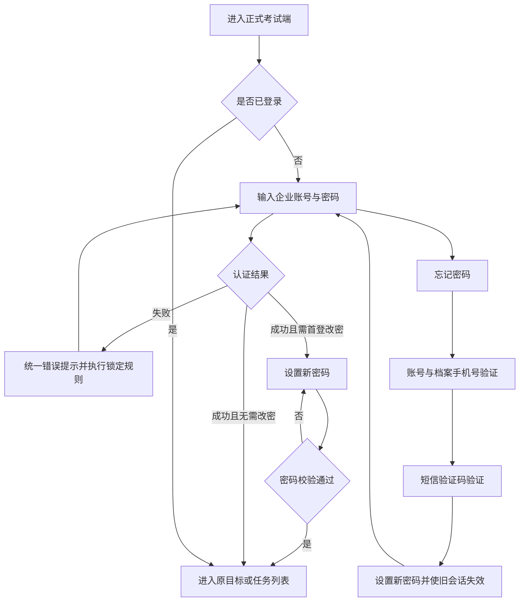
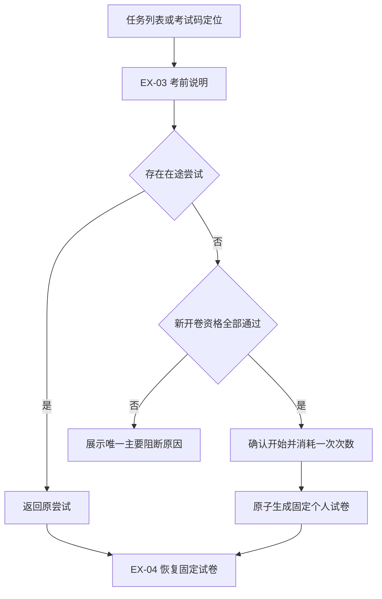
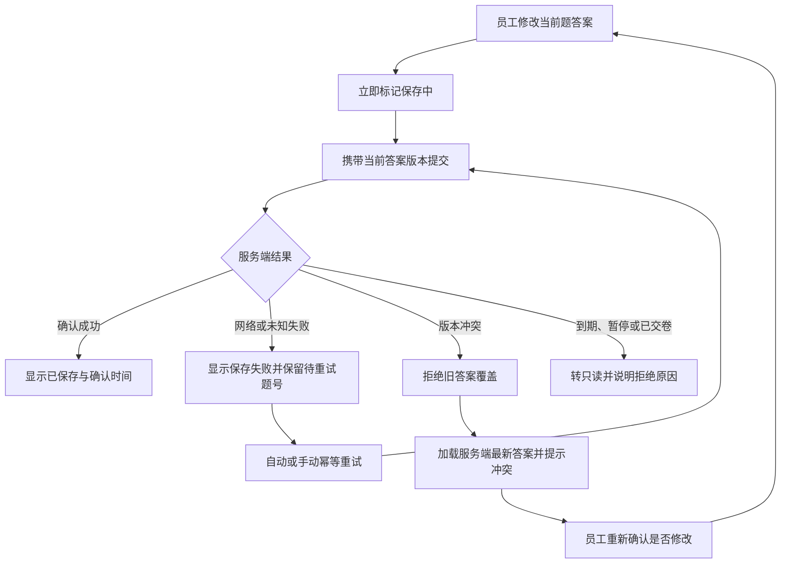
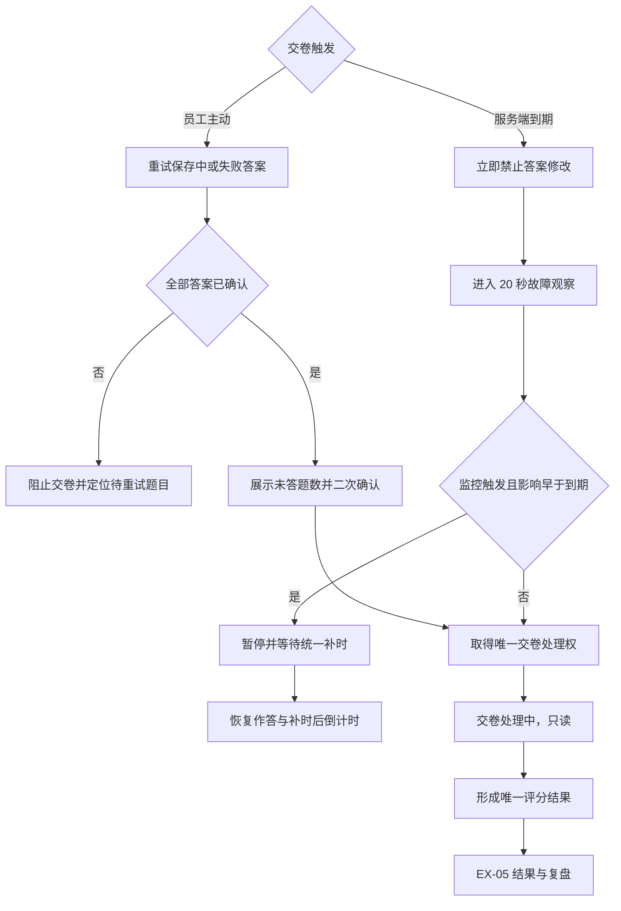
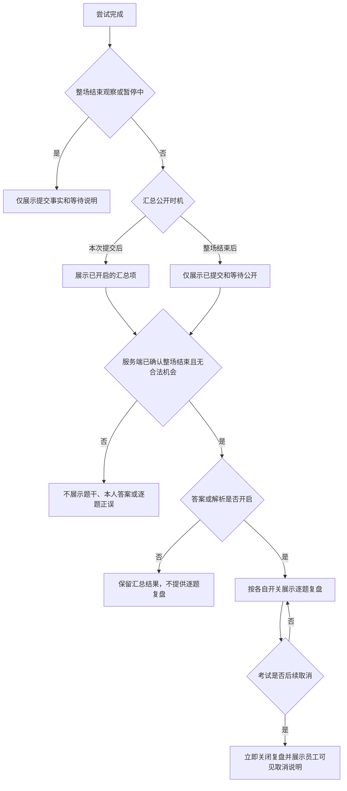

# 企业内部练习与考试系统：桌面 Web 正式考试端 PRD

| 文档属性 | 内容 |
| --- | --- |
| 文档版本 | V1.0 |
| 文档状态 | 第一阶段页面级 PRD |
| 产品端 | 桌面 Web 正式考试端 |
| 默认语言 | 简体中文 |
| 目标角色 | 被分配正式考试的企业员工 |
| 适用范围 | 单一企业内部正式考试 |
| 上游文档 | [PRD 总览](./00-企业内部练习与考试系统-PRD总览.md)、[需求分析基线](../01-需求调研/企业内部练习与考试系统-需求分析文档.md) |

---

## 1. 文档目标与边界

### 1.1 文档目标

本文档把需求基线中的正式考试规则落实为桌面 Web 端可设计、可开发、可测试的页面级需求，明确：

- 登录、任务定位、考前资格、正式作答、交卷和结果查看的页面结构。
- 服务端计时、固定个人试卷、逐题保存、断线恢复、并发开卷、暂停补时和幂等交卷的前台行为。
- 考试生命周期、运行状态、个人参与状态、尝试状态和结果状态在页面中的独立表达。
- 标准答案和解析公开前的脱敏边界，以及员工只能访问本人考试数据的权限边界。
- 每个页面的元素、交互、校验、异常状态、审计观测和验收标准。

### 1.2 产品边界

本端只承担正式考试，不承担日常练习、模拟考试、题库维护、考试创建、人员配置、故障确认、成绩导出或审计管理。

- 正式考试只能在本端作答；员工小程序只展示任务、电脑端地址和考试码。
- 本端只面向企业员工。具有管理员资格的账号只有同时是该考试的应考员工时，才能以员工身份参加考试。
- 第一阶段不包含人脸识别、摄像头监考、屏幕录制、浏览器锁定、手机浏览器考试、个人加时或人工改分。
- 暂停、断网、保存冲突、到期观察和交卷处理均为既有页面的状态，不新增独立页面。
- 本文档只描述产品页面、业务交互和验收行为，不描述系统实现方案或界面稿。

### 1.3 页面清单

| 页面 ID | 页面名称 | 核心职责 |
| --- | --- | --- |
| EX-01 | 登录 / 首登改密 / 找回密码 | 统一账号认证、强制改密、短信找回和账号安全反馈 |
| EX-02 | 任务列表与考试码定位 | 展示本人正式考试任务，通过考试码定位本人可访问考试 |
| EX-03 | 考前说明与资格状态 | 展示考试说明、时间与个人资格，开始新尝试或恢复原尝试 |
| EX-04 | 答题工作台 | 固定试卷作答、逐题保存、恢复、计时、暂停和交卷 |
| EX-05 | 结果与复盘 | 展示允许公开的汇总结果、尝试记录和条件满足后的逐题复盘 |

### 1.4 共享系统约束

本端必须遵循 [PRD 总览](./00-企业内部练习与考试系统-PRD总览.md) 定义的共享系统约束：

| 系统约束 ID | 本端依赖 |
| --- | --- |
| SYS-01 | 统一身份、对象权限与敏感数据隔离 |
| SYS-03 | 发布预检、快照冻结与固定抽卷 |
| SYS-04 | 答案版本、服务端计时、交卷与幂等评分 |
| SYS-05 | 监控暂停、授权确认与统一补时 |
| SYS-07 | 审计、留存、监控与恢复 |

---

## 2. 共享功能清单

### 2.1 权威全局功能引用

本端只引用 [PRD 总览第 4.2 节](./00-企业内部练习与考试系统-PRD总览.md) 已定义的全局功能，不重新定义或扩展其语义。

| 全局功能 ID | 权威名称 | 本端使用边界 |
| --- | --- | --- |
| FR-AUTH-01 | 本地统一登录与会话 | 工号登录、账号锁定、停用撤销会话 |
| FR-AUTH-02 | 初始凭据与首登 | 初始凭据登录后强制改密 |
| FR-AUTH-03 | 手机验证与小程序绑定 | 档案手机号验证、密码找回后旧会话失效 |
| FR-AUTH-06 | 权限与敏感数据隔离 | 服务端校验对象、应考资格和结果可见性 |
| FR-EXM-03 | 人员与发布快照 | 使用发布时人员、题池、规则、分值和策略快照 |
| FR-EXM-04 | 生命周期、冻结与取消 | 展示停止新开卷、收尾、结束和取消行为 |
| FR-EXM-05 | 任务与过程状态 | 生命周期、运行、参与、尝试和结果五域分离 |
| FR-ATT-01 | 开卷资格 | 校验登录、分配、生命周期、运行、通过和次数 |
| FR-ATT-02 | 单一在途尝试与固定试卷 | 并发开始返回原尝试，尝试内题目、顺序和分值固定 |
| FR-ATT-03 | 多次尝试 | 每次新抽卷、恢复不耗次数、通过后停止重考 |
| FR-ANS-01 | 版本化逐题保存 | 服务端确认后才显示已保存，旧版本不能覆盖新版本 |
| FR-ANS-02 | 恢复与服务端计时 | 恢复固定试卷和确认答案，剩余时间以服务端为准 |
| FR-ANS-03 | 手动 / 自动幂等交卷 | 未确认答案阻止手动交卷，到期锁定并产生唯一结果 |
| FR-ANS-04 | 竞态与到期观察 | 保存 / 交卷确定性规则和到期后 20 秒观察窗 |
| FR-SCR-01 | 客观题评分 | 多选完全匹配、未答零分、不扣分、不部分得分 |
| FR-SCR-02 | 官方成绩 | 最高有效分、同分最早、通过后停止重考 |
| FR-SCR-03 | 尝试作废与重算 | 返还次数、原数据留存和官方结果重算 |
| FR-SCR-04 | 结果公开下限 | 汇总按策略，逐题内容仅在整场结束且无合法机会后开放 |
| FR-OPS-01 | 监控触发暂停 | 监控自动生成故障事件并暂停受影响考试 |
| FR-OPS-02 | 授权确认与统一补时 | 确认后由系统计算补时和恢复 |
| FR-OPS-03 | 安全与审计 | 关键动作留痕且敏感信息不进入日志 |
| FR-OPS-04 | 性能、恢复与保留 | 遵循量化性能、恢复、兼容和保留要求 |

### 2.2 页面局部功能 ID

| 页面功能 ID | 页面局部能力 | 依赖的全局功能 |
| --- | --- | --- |
| EX-01-FN-01 | 登录表单、统一失败提示与成功回跳 | FR-AUTH-01、FR-AUTH-06 |
| EX-01-FN-02 | 首登改密表单与密码规则反馈 | FR-AUTH-02 |
| EX-01-FN-03 | 短信找回表单与验证状态 | FR-AUTH-03 |
| EX-01-FN-04 | 兼容性、锁定和会话失效提示 | FR-AUTH-01、FR-OPS-04 |
| EX-02-FN-01 | 本人任务列表、筛选与排序 | FR-EXM-04、FR-EXM-05 |
| EX-02-FN-02 | 考试码输入和本人任务定位 | FR-AUTH-06、FR-EXM-05 |
| EX-02-FN-03 | 五域状态与个人主要操作映射 | FR-EXM-04、FR-EXM-05、FR-ATT-01、FR-ATT-03、FR-SCR-04 |
| EX-03-FN-01 | 考试概要、次数与资格状态展示 | FR-EXM-03 至 FR-EXM-05、FR-ATT-01、FR-ATT-03 |
| EX-03-FN-02 | 开始确认与并发开卷反馈 | FR-ATT-01、FR-ATT-02 |
| EX-03-FN-03 | 原尝试恢复和动作路由 | FR-ATT-02、FR-ANS-02 |
| EX-03-FN-04 | 开卷前兼容性检查 | FR-OPS-04 |
| EX-04-FN-01 | 固定题项和三种题型作答控件 | FR-ATT-02 |
| EX-04-FN-02 | 保存状态、重试与版本冲突反馈 | FR-ANS-01 |
| EX-04-FN-03 | 上下题导航和答题卡 | FR-ATT-02、FR-ANS-01 |
| EX-04-FN-04 | 暂停、离线、恢复和到期观察状态 | FR-ANS-02、FR-ANS-04、FR-OPS-01、FR-OPS-02 |
| EX-04-FN-05 | 交卷确认和交卷处理中状态 | FR-ANS-03、FR-ANS-04 |
| EX-05-FN-01 | 按策略展示汇总结果 | FR-SCR-04 |
| EX-05-FN-02 | 官方成绩和本人尝试列表 | FR-SCR-02、FR-SCR-03 |
| EX-05-FN-03 | 条件满足后的逐题复盘 | FR-SCR-01、FR-SCR-04 |
| EX-05-FN-04 | 重考资格和再次考试入口 | FR-ATT-03、FR-SCR-02、FR-SCR-03 |

### 2.3 页面状态不是页面

| 状态 | 所属页面 | 页面行为 |
| --- | --- | --- |
| 平台暂停 | EX-03、EX-04 | 展示暂停说明；禁止新开卷、答案修改和交卷；在途试卷只读 |
| 员工断网 | EX-04 | 明确提示未连接；计时继续；未确认选择不得显示为已保存 |
| 保存版本冲突 | EX-04 | 拒绝旧版本覆盖，加载服务端最新答案并提示用户重新确认 |
| 到期后 20 秒观察 | EX-04 | 答案只读，不立即评分；等待故障监控判定 |
| 交卷处理中 | EX-04 | 试卷锁定，只展示处理状态；重复操作返回同一状态 |
| 整场结束/披露观察 | EX-02、EX-03、EX-05 | 到达停止新开卷时间后生命周期先进入“收尾中”，即使无在途尝试也等待 20 秒和服务端确认；期间不展示最终结果或逐题内容 |
| 结果尚未公开 | EX-05 | 仅展示提交或等待公开的汇总状态，不展示题干、本人答案或逐题正误 |

---

## 3. 全局业务规则

### 3.1 时间与时区

1. 所有开放时间、停止新开卷时间、开始时间、提交时间和结果公开时间按企业时区展示。
2. 所有资格判断、剩余时间和到期判断以服务端时间为准，浏览器本地时间不得改变考试时长。
3. 新开卷时间区间为“开放开始时间小于或等于服务端当前时间，且服务端当前时间严格早于停止新开卷时间”。
4. 员工在停止新开卷前成功开卷后，获得完整单次考试时长；到达停止新开卷时间不截断在途尝试。
5. 页面倒计时是服务端有效到期时间的展示。页面重新获得焦点、恢复网络或从暂停恢复时，必须重新校准，不以本地累计秒数作为最终依据。
6. 平台故障补时落地后，页面直接使用新的有效停止新开卷时间和有效到期时间，不在前端重复叠加补时时长。
7. 服务端当前时间到达有效停止新开卷时间后，考试生命周期立即显示“收尾中”并启动 20 秒整场结束/披露观察窗，即使当时没有在途尝试也不得直接显示“已结束”。
8. 整场结束/披露观察窗与 EX-04 的单次尝试到期观察窗为两个独立状态，均由服务端时间和监控结论决定，不得用其中一个替代另一个。
9. 只有整场观察通过、运行状态为正常、不存在在途尝试且不存在待处置故障事件时，才由服务端确认“已结束”。如观察期间或结束确认前进入暂停中，保持收尾并等待恢复及待处置故障事件收敛后的服务端最终判定；客户端不自行推进生命周期。

### 3.2 身份与对象权限

1. 未登录用户只能访问 EX-01；登录后只能读取当前员工被分配的考试及本人尝试、答案和允许公开的结果。
2. 考试码只用于定位考试，不提供登录能力，也不扩大应考资格。
3. 无应考分配时，不得返回考试名称、说明、人员、时间、题量或其他业务数据。
4. 员工账号被停用后，当前会话立即失效，所有新业务操作均被拒绝；原进行中尝试按最后确认答案在到期后自动终结。
5. 页面不得信任或允许员工修改服务端生成的成绩、通过状态、尝试次数、开始时间、到期时间或提交状态。

### 3.3 考试与个人状态表达

考试生命周期、运行状态、个人参与状态、尝试状态和结果状态必须独立维护，不得用一个“考试状态”混合表达。页面按自身职责展示相关维度；结果状态只在对应展示项开启且达到汇总公开时机后显示具体结论。

| 维度 | 可见状态 | 主要影响 |
| --- | --- | --- |
| 考试生命周期 | 未开始、开放开卷、收尾中、已结束、已取消 | 到达停止新开卷后先进入收尾；即使无在途尝试也先经过 20 秒整场结束/披露观察，再由服务端确认是否已结束 |
| 运行状态 | 正常、暂停中 | 当前是否允许开卷、保存和交卷 |
| 个人参与状态 | 未参加、考试中、已交卷、已参加无有效交卷、缺考 | 任务列表和详情页的进度表达 |
| 尝试状态 | 进行中、交卷处理中、已完成、已作废、已终止 | 答题和尝试记录行为 |
| 结果状态 | 待定、已通过、未通过、无有效成绩、已取消 | 结果页结论和是否可重考；员工端仅按结果公开策略展示具体结论 |

### 3.4 操作资格优先级

进入考试时按以下顺序决定页面动作：

1. 账号是否有效且已登录。
2. 是否存在该员工的发布时应考分配。
3. 考试是否已取消。
4. 是否存在进行中或交卷处理中的在途尝试。
5. 若存在在途尝试，优先返回该尝试，不再按开放时间或次数新建。
6. 若不存在在途尝试，再校验运行正常、处于开放开卷、尚未通过且有剩余次数。
7. 仅全部通过时允许创建新尝试。

### 3.5 内容公开与脱敏

1. 标准答案、解析、候选题池和任何可推导标准答案的信息不得在允许公开前进入员工可访问内容。
2. 答案公开条件未满足时，EX-05 只展示按策略允许的汇总信息；不展示题干、本人答案、逐题正误或每题得分。整场结束/披露观察期或运行暂停中，进一步只展示已提交事实与等待说明，不返回最终结果或任何逐题内容。
3. 逐题复盘只有在考试已结束、员工无剩余合法作答机会，且管理员开启标准答案或解析展示时才出现。
4. 考试取消后立即关闭逐题复盘，即使取消前曾合法公开；页面只保留取消状态和允许展示的历史汇总说明。
5. 页面不得展示其他员工姓名、试卷、答案、成绩或参考状态。

### 3.6 可用性与兼容性

- 支持桌面 Chrome、Edge 最近两个主版本，最低有效视口为 1280 × 720。
- 不支持的浏览器或低于最低视口时，在 EX-01 或 EX-03 给出明确兼容性阻断说明，不允许开始新尝试；已有在途尝试仍允许登录后恢复，页面持续显示风险提示，以避免阻断已开始考试。
- 答题卡、保存状态、错误状态和当前题不得只依赖颜色，必须同时提供文字或图标状态。
- 核心考试页面达到可操作状态的 P95 不超过 2 秒；开卷和交卷 P95 不超过 3 秒；答案修改至确认保存 P95 不超过 1 秒。

---

## 4. 核心流程

### 4.1 FL-AUTH：登录、首登改密与找回

### 4.2 FL-ATT：定位、开始与恢复尝试

### 4.3 FL-SAVE：逐题保存与版本冲突

### 4.4 FL-SUB：手动、超时与幂等交卷

### 4.5 FL-VIS：成绩与复盘公开

---

## 5. EX-01 登录 / 首登改密 / 找回密码

### 5.1 页面目标

完成企业员工身份认证，在不泄露账号或手机号是否存在的前提下处理首次强制改密、登录锁定和短信找回，并在成功后返回原目标考试或进入任务列表。

### 5.2 角色、入口与前置条件

| 项目 | 规则 |
| --- | --- |
| 角色 | 未登录企业员工；登录后被强制改密的企业员工 |
| 入口 | 正式考试端地址、带考试定位信息的地址、会话失效跳转、员工主动退出后 |
| 前置条件 | 企业已为员工建档并创建本地统一账号 |
| 成功去向 | 有合法原目标时返回原目标；否则进入 EX-02 |
| 权限边界 | 不允许自助注册，不允许修改角色，不展示账号是否存在 |

### 5.3 模块与元素

| 模块 | 元素 | 展示与交互规则 | 功能 ID |
| --- | --- | --- | --- |
| 登录表单 | 企业账号（工号） | 必填；去除首尾空白；不得通过错误提示确认账号是否存在 | EX-01-FN-01 |
| 登录表单 | 密码 | 必填；默认掩码；允许切换显示与隐藏 | EX-01-FN-01 |
| 登录表单 | 登录按钮 | 字段完整后可操作；提交期间防重复；失败使用统一提示 | EX-01-FN-01 |
| 登录表单 | 忘记密码 | 进入本页找回状态，保留合法考试定位信息 | EX-01-FN-03 |
| 首登改密 | 新密码 | 8-64 个字符，至少满足大写、小写、数字、特殊字符中的三类 | EX-01-FN-02 |
| 首登改密 | 确认新密码 | 必须与新密码完全一致 | EX-01-FN-02 |
| 首登改密 | 密码规则清单 | 实时展示每条规则是否满足，不展示禁止弱口令清单 | EX-01-FN-02 |
| 找回密码 | 企业账号、手机号 | 两者必填；提交后始终使用统一反馈 | EX-01-FN-03 |
| 找回密码 | 发送验证码 | 60 秒内不可重复发送；同一手机号每日最多 5 次 | EX-01-FN-03 |
| 找回密码 | 短信验证码 | 6 位输入区；验证码 5 分钟有效，连续失败 5 次后失效 | EX-01-FN-03 |
| 找回密码 | 新密码、确认密码 | 使用与首登改密相同规则 | EX-01-FN-03 |
| 全局提示 | 浏览器兼容性 | 不受支持浏览器显示阻断说明和受支持版本 | EX-01-FN-04 |

### 5.4 交互与校验

1. 登录失败统一提示“账号或密码错误，或账号暂不可用”，不得区分账号不存在、密码错误或账号停用。
2. 同一账号 15 分钟内连续失败 5 次后锁定 15 分钟。锁定期间继续使用统一提示，可展示距离再次尝试的剩余时间，但不得确认账号有效性。
3. 同一来源达到安全阈值时，页面允许出现最长 5 秒的渐进等待；不得据此锁定同一企业共享网络中的其他账号。
4. 首次登录认证成功后只允许进入改密状态，不得访问 EX-02 至 EX-05。
5. 新密码不得与工号或手机号相同，不得命中常见弱口令；失败时指出未满足的密码规则，不回显密码内容。
6. 找回密码发送验证码时，无论账号与手机号是否匹配，都提示“若信息匹配，验证码将发送至档案手机号”。
7. 验证码成功使用一次、连续失败 5 次或超过 5 分钟后立即失效。
8. 密码重置成功后，所有旧会话失效；提示员工重新登录。若存在进行中尝试，重新登录后按 FR-ANS-02 恢复，不生成新试卷。
9. 从考试码或考试地址进入时，只保留考试定位信息，不保留密码、验证码或手机号。

### 5.5 状态与异常

| 状态 / 异常 | 页面行为 |
| --- | --- |
| 初始密码 | 登录成功后强制进入改密状态，隐藏其他业务入口 |
| 账号锁定 | 登录按钮保持可见；显示通用锁定提示和可再次尝试时间 |
| 账号停用 | 使用统一登录失败提示，不展示停用原因 |
| 验证码发送受限 | 显示可再次发送时间或当日已达上限，不暴露手机号存在性 |
| 短信服务暂不可用 | 保留已填写账号；提示稍后重试，不进入设置密码步骤 |
| 会话在考试中失效 | 返回本页并保留目标考试；登录后恢复唯一在途尝试 |
| 不支持浏览器 | 阻断登录后的正式考试业务，提供 Chrome / Edge 支持范围说明 |

### 5.6 权限与脱敏

- 密码、验证码和访问凭据不得写入页面日志、地址或可复制的错误详情。
- 找回页面不回显完整档案手机号；员工主动输入的手机号在离开输入状态后以脱敏形式展示。
- 未完成认证前不得返回考试任务、考试名称、考试说明或个人参与状态。
- 登录成功也必须在进入具体考试时重新校验应考分配和账号状态。

### 5.7 审计与观测

| 类型 | 记录 / 观测内容 |
| --- | --- |
| 审计 | 登录成功与失败、锁定触发、首登改密、验证码发送与验证结果、密码重置、退出登录 |
| 脱敏要求 | 不记录密码、验证码、访问凭据；手机号只保留必要脱敏摘要 |
| 观测 | 登录成功率、失败原因类别、锁定次数、短信发送结果、重置成功率、认证耗时 |
| 性能 | 登录和恢复能力纳入核心服务可用性监控；连续不可用超过 30 秒按故障口径处理 |

### 5.8 来源规则

- [需求基线第 4.4-4.5 节：员工建档、本地统一身份与账号恢复](../01-需求调研/企业内部练习与考试系统-需求分析文档.md)
- [需求基线第 17.3-17.5 节：可靠性、安全与审计](../01-需求调研/企业内部练习与考试系统-需求分析文档.md)
- SYS-01、SYS-07；FR-AUTH-01、FR-AUTH-02、FR-AUTH-03、FR-AUTH-06、FR-OPS-03、FR-OPS-04；EX-01-FN-01 至 EX-01-FN-04；FL-AUTH。

### 5.9 页面验收

| 验收 ID | 场景 | 通过标准 |
| --- | --- | --- |
| EX-01-AC-01 | 正确账号首次登录 | 强制改密前无法进入任务或考试；改密成功后可进入原目标 |
| EX-01-AC-02 | 连续错误登录 | 第 5 次失败后锁定 15 分钟，提示不泄露账号存在性 |
| EX-01-AC-03 | 短信找回 | 验证码有效期、重发间隔、每日次数、失败次数和一次性使用均符合规则 |
| EX-01-AC-04 | 密码重置后检查旧会话 | 旧会话全部失效；重新登录可恢复原在途尝试 |
| EX-01-AC-05 | 输入不存在账号或不匹配手机号 | 页面反馈与有效账号场景一致，不返回手机号或账号存在性 |
| EX-01-AC-06 | 不支持浏览器 | 明确阻断新考试业务并告知支持范围，不出现不可解释的空白页 |

---

## 6. EX-02 任务列表与考试码定位

### 6.1 页面目标

让员工快速找到本人被分配的正式考试，清楚区分考试阶段、个人进度与当前可执行动作，并通过考试码定位本人有权访问的考试。

### 6.2 角色、入口与前置条件

| 项目 | 规则 |
| --- | --- |
| 角色 | 已登录且账号有效的企业员工 |
| 入口 | EX-01 登录成功、顶层“考试任务”、结果页返回任务、无有效原目标时 |
| 前置条件 | 已完成首登改密；服务端已确认身份 |
| 数据范围 | 仅发布时应考名单包含当前员工的考试 |
| 默认排序 | 在途尝试优先，其次开放可操作、未开始、收尾、已结束、已取消；同组按最近业务时间排序 |

### 6.3 模块与元素

| 模块 | 元素 | 展示与交互规则 | 功能 ID |
| --- | --- | --- | --- |
| 顶部身份区 | 员工姓名、工号、退出 | 姓名与工号仅展示本人；退出前无需中断在途尝试 | EX-02-FN-01 |
| 考试码定位 | 考试码输入 | 去除首尾空白；空值不得提交；不作为授权凭据 | EX-02-FN-02 |
| 考试码定位 | 定位按钮 | 成功进入 EX-03；无资格时使用统一提示且不泄露考试详情 | EX-02-FN-02 |
| 任务筛选 | 全部、待开始、进行中、可重考、已完成 | 筛选为个人可操作视图，不替代底层状态 | EX-02-FN-01 |
| 任务卡 / 行 | 考试名称 | 使用发布版本名称 | EX-02-FN-01 |
| 任务卡 / 行 | 生命周期、运行状态、参与状态、结果可见状态 | 分区展示；暂停不覆盖生命周期；已取消优先显示，其他具体结果只在“是否通过”展示项已开启且到达汇总公开时机后展示 | EX-02-FN-03 |
| 任务卡 / 行 | 开放时间、停止新开卷时间、单次时长 | 按企业时区展示；暂停补时后显示有效时间 | EX-02-FN-03 |
| 任务卡 / 行 | 已使用 / 最大次数 | 已作废尝试不计已使用次数；只有“是否通过”开关已开启且到达汇总公开时机后才显示“已通过，不能重考”，否则显示“本场已无后续参加机会” | EX-02-FN-03 |
| 任务卡 / 行 | 主要操作 | 查看说明、开始考试、继续考试、查看处理中、再次考试、查看结果 | EX-02-FN-03 |
| 任务卡 / 行 | 整场结束观察 | 停止新开卷后立即显示“收尾中/正在确认整场结束状态”；即使无在途尝试也等待 20 秒和服务端确认 | EX-02-FN-03 |
| 任务卡 / 行 | 员工可见取消说明 | 仅已取消任务展示；不返回管理员内部原因 | EX-02-FN-03 |
| 空状态 | 暂无考试任务 | 不引导员工自行注册或联系非授权对象 | EX-02-FN-01 |

### 6.4 操作映射

| 条件 | 主要操作 | 次要说明 |
| --- | --- | --- |
| 未开始且无在途尝试 | 查看说明 | 到开放开始时间前不可开卷 |
| 开放、正常、未参加且有次数 | 开始考试 | 进入 EX-03 后再次校验 |
| 存在进行中尝试 | 继续考试 | 优先恢复原尝试，即使已停止新开卷 |
| 存在交卷处理中尝试 | 查看处理中 | 进入 EX-04 只读处理状态 |
| 已完成，且服务端内部判定仍有合法重考资格 | 再次考试 | 进入 EX-03，创建时重新抽卷；如具体结果未公开，不返回“未通过”结论 |
| 内部资格已阻止后续尝试 | 查看提交记录 / 查看结果 | 不显示再次考试；仅在“是否通过”展示项已开启且到达汇总公开时机后显示“已通过”，否则使用中性无可用参加操作文案 |
| 已结束 | 查看结果 | 不允许创建新尝试 |
| 已取消 | 查看状态 | 显示员工可见取消说明；不提供答案或解析入口 |
| 暂停中且无在途尝试 | 查看说明 | 开始按钮禁用，说明平台暂停 |
| 暂停中且有在途尝试 | 继续查看 | 进入 EX-04 暂停只读状态 |

### 6.5 交互与校验

1. 列表中的状态和主要操作必须以每次加载时的服务端状态为准，不能依据上次页面缓存继续开卷。
2. 点击“开始考试”或“再次考试”只进入 EX-03，不在列表页直接创建尝试。
3. 点击“继续考试”时仍执行在途尝试查询；若尝试已完成，则进入 EX-05，不显示失效作答页。
4. 考试码定位成功的前提是当前员工存在发布时应考分配。输入有效但无资格的考试码，与无效考试码统一提示“未找到可参加的考试”。
5. 从小程序地址带入考试定位信息时，登录成功后自动执行一次定位；失败后保留任务列表，不循环跳转。
6. 页面刷新或多标签打开任务列表不会创建尝试或消耗次数。
7. 已结束或已取消任务继续保留在本人正式考试记录中，但取消考试明确标记“不计入官方结果”。
8. 到达停止新开卷时间后，列表不论有无在途尝试都先显示“收尾中”。前 20 秒整场结束/披露观察期或运行暂停中，不展示最终结果或逐题内容；只有服务端确认观察通过、运行正常、无在途尝试且无待处置故障事件后才显示“已结束”。
9. 内部通过结论已终止重考，但“是否通过”展示项未开启或尚未到公开时机时，列表仍移除重考入口，但只显示中性“本场已无后续参加机会”。

### 6.6 状态与异常

| 状态 / 异常 | 页面行为 |
| --- | --- |
| 列表加载失败 | 保留页面框架，显示重试；不得展示上次账号的数据 |
| 平台暂停 | 受影响考试显示“暂停中”；停止时间使用补时落地后的有效值；不显示最终结果或复盘入口 |
| 账号在页面停留时被停用 | 清除任务内容并跳转 EX-01 通用失效提示 |
| 尝试刚被管理员作废 | 刷新个人次数、参与状态和结果；若仍开放则重新计算“再次考试”资格 |
| 考试刚被取消 | 主要操作改为“查看状态”，移除开始、继续和复盘入口 |
| 整场结束观察中 | 任务保持“收尾中”，显示状态确认中；不显示已结束、最终结果或复盘入口 |
| 无任务 | 展示空状态；考试码定位仍可使用 |

### 6.7 权限与脱敏

- 列表只返回当前员工的应考任务，不支持通过地址参数切换员工。
- 无权限考试码不得返回考试名称、说明、时间或取消原因。
- 对有权的已取消任务只返回员工可见取消说明，管理员内部原因不得进入员工端内容或缓存。
- 列表不返回题库、候选题池、标准答案、解析或其他员工状态。
- 未达到汇总公开时机时，列表不得通过得分、通过标记或排序泄露结果。

### 6.8 审计与观测

| 类型 | 记录 / 观测内容 |
| --- | --- |
| 安全审计 | 无权限考试码定位、伪造考试对象、停用账号继续访问 |
| 业务观测 | 任务加载成功率、考试码定位成功率、各主要操作点击量、状态刷新延迟 |
| 故障观测 | 无法加载任务或无法定位考试连续超过 30 秒时纳入核心流程故障判断 |
| 隐私 | 不在普通操作日志记录员工查看到的考试说明正文或任何答案内容 |

### 6.9 来源规则

- [需求基线第 3.2、12.1 节：三端职责与任务查看](../01-需求调研/企业内部练习与考试系统-需求分析文档.md)
- [需求基线第 11 章：五类状态模型](../01-需求调研/企业内部练习与考试系统-需求分析文档.md)
- SYS-01、SYS-03、SYS-05；FR-AUTH-06、FR-EXM-04、FR-EXM-05、FR-ATT-01、FR-ATT-03、FR-SCR-04、FR-OPS-01、FR-OPS-02；EX-02-FN-01 至 EX-02-FN-03；FL-ATT。

### 6.10 页面验收

| 验收 ID | 场景 | 通过标准 |
| --- | --- | --- |
| EX-02-AC-01 | 员工拥有多种状态任务 | 生命周期、运行、参与和结果维度不混用；结果只按展示开关与公开时机给出具体状态，主要操作与服务端资格一致 |
| EX-02-AC-02 | 使用无效或无权限考试码 | 两者提示一致，员工端内容中不存在考试元数据 |
| EX-02-AC-03 | 小程序地址进入 | 登录后准确定位本人考试；考试码不替代登录或资格校验 |
| EX-02-AC-04 | 停止新开卷后仍有在途尝试 | 任务显示“继续考试”，不生成新尝试 |
| EX-02-AC-05 | 内部结果已达到及格且仍有配置次数 | 只显示查看结果，不显示再次考试；具体通过结论仍按开关与公开时机判定 |
| EX-02-AC-06 | 暂停中的考试 | 无在途员工不可开始；有在途员工可进入暂停只读状态 |
| EX-02-AC-07 | 通过结论未获准公开 | 服务端仍禁止重考，列表只显示“本场已无后续参加机会”，不显示“已通过” |
| EX-02-AC-08 | 停止新开卷时无在途尝试 | 仍先显示收尾中并等待 20 秒整场结束/披露观察；服务端确认前不显示已结束或最终结果 |
| EX-02-AC-09 | 已取消任务 | 显示员工可见取消说明，不返回管理员内部原因 |

---

## 7. EX-03 考前说明与资格状态

### 7.1 页面目标

在任何开卷动作发生前，完整展示考试说明和服务端判定的个人资格，让员工明确开始将消耗一次次数并立即计时；存在在途尝试时优先恢复原尝试。

### 7.2 角色、入口与前置条件

| 项目 | 规则 |
| --- | --- |
| 角色 | 已登录、账号有效且属于发布时应考名单的员工 |
| 入口 | EX-02 任务或考试码定位、EX-05 再次考试 |
| 前置条件 | 已完成首登改密；考试对象权限校验通过 |
| 成功去向 | 新建或恢复成功后进入 EX-04；查看已公开结果进入 EX-05 |
| 关键原则 | 在途尝试恢复优先于开放时间、次数和新开卷资格校验 |

### 7.3 模块与元素

| 模块 | 元素 | 展示与交互规则 | 功能 ID |
| --- | --- | --- | --- |
| 考试概要 | 考试名称、说明 | 名称使用发布快照；说明展示管理员当前有效修订文本 | EX-03-FN-01 |
| 时间信息 | 开放开始、停止新开卷、单次时长 | 按企业时区展示有效时间；明确停止新开卷不截断已开始尝试 | EX-03-FN-01 |
| 试卷概要 | 总题数、总分、及格分 | 只读；不得展示题库、规则或候选题数量。结构化及格分只在“是否通过”展示项已开启且到达汇总公开时机后返回，此前字段不存在 | EX-03-FN-01 |
| 次数信息 | 最大次数、已使用次数、剩余次数 | 作废尝试不计已使用；通过后剩余次数显示为不可再使用 | EX-03-FN-01 |
| 状态区 | 生命周期、运行状态、个人参与、结果 | 分区展示并给出当前可操作结论；具体结果受公开时机和展示项控制 | EX-03-FN-01 |
| 尝试摘要 | 在途尝试序号、开始时间、有效到期时间 | 仅存在在途尝试时展示；不展示答案摘要 | EX-03-FN-03 |
| 整场结束观察 | 收尾中、状态确认中 | 停止新开卷后即使无在途尝试也等待 20 秒和服务端确认；期间不展示最终结果或逐题内容 | EX-03-FN-01 |
| 取消说明 | 取消时间、员工可见取消说明 | 已取消时展示；不返回管理员内部原因 | EX-03-FN-01 |
| 主要按钮 | 开始考试 / 继续考试 / 查看处理中 / 再次考试 / 查看结果 | 同一时点只出现一个主要动作 | EX-03-FN-03 |
| 开始确认 | 次数消耗、立即计时、不可暂停说明 | 员工二次确认后才发起开始；个人网络异常不补时 | EX-03-FN-02 |
| 兼容性检查 | 浏览器和视口提示 | 新尝试不满足支持范围时阻断；在途尝试允许带风险提示恢复 | EX-03-FN-04 |

### 7.4 交互与校验：开始与恢复

1. 页面加载时先查询唯一在途尝试。若存在进行中尝试，主要按钮为“继续考试”；若存在交卷处理中尝试，主要按钮为“查看处理中”。
2. 点击“继续考试”直接返回原尝试，不再次抽题、不重置开始时间、不改变题序、不消耗次数。
3. 点击“开始考试”或“再次考试”前显示确认内容：本次序号、单次时长、剩余次数、开始后立即计时、个人网络或设备问题不补时。
4. 确认开始后，服务端再次按账号、应考分配、取消状态、在途尝试、运行状态、开放窗口、通过状态和剩余次数顺序校验。
5. 同一员工从多个页面、标签或设备并发确认开始时，只能形成一个在途尝试。所有成功结果必须进入同一固定试卷；只消耗一次次数。
6. 若并发请求中其他请求已经创建尝试，本页把结果视为“恢复成功”并进入该尝试，不显示重复创建错误。
7. 若当前服务端时间等于停止新开卷时间，且不存在在途尝试，按钮不可创建新尝试；如存在在途尝试，仍可继续。
8. 新尝试每次从发布时冻结候选池重新随机抽卷；不同尝试可出现部分相同题目，但本页不得提前展示任何题目或候选范围。
9. 服务端时间到达停止新开卷时间后，本页立即显示“收尾中”并启动 20 秒整场结束/披露观察。观察期或暂停中只显示已提交事实与等待说明；服务端确认观察通过、运行正常、无在途尝试且无待处置故障事件后才显示“已结束”。

### 7.5 资格状态与提示

| 资格结果 | 主要行为 | 页面说明 |
| --- | --- | --- |
| 未到开放时间 | 禁止开始 | 展示开放开始时间 |
| 开放且符合全部条件 | 允许开始 | 强调开始即计时并消耗一次次数 |
| 暂停中、无在途尝试 | 禁止开始 | 平台暂停，新开卷将在恢复后重新开放 |
| 暂停中、有在途尝试 | 允许进入只读 | 进入 EX-04 查看最后确认数据，不能作答或交卷 |
| 已停止新开卷、无在途尝试 | 禁止开始 | 立即显示“收尾中，正在确认整场结束状态”；至少等待 20 秒和服务端确认，不显示“个人考试已超时”或“已结束” |
| 已停止新开卷、有在途尝试 | 允许继续 | 员工仍获得完整单次时长 |
| 次数已用完 | 禁止开始 | 展示已使用 / 最大次数 |
| 内部资格已因达到及格而终止重考 | 禁止重考 | 只有“是否通过”展示项已开启且到达汇总公开时机后才显示“已通过”；否则只显示“本场已无后续参加机会，结果按考试设置公布” |
| 已结束 | 禁止开始 | 可按策略查看结果 |
| 已取消 | 禁止开始和继续 | 标记结果无官方效力并展示员工可见取消说明，不提供复盘 |
| 尝试已作废且仍可重考 | 允许再次考试 | 次数已经返还，但开放时间不延长 |

### 7.6 状态与异常

| 状态 / 异常 | 页面行为 |
| --- | --- |
| 开卷处理中 | 禁用重复确认；超过正常等待仍可重试，重试必须返回原结果 |
| 抽卷或创建未完成 | 不进入 EX-04，不消耗次数，不留下半成品尝试；允许重试 |
| 状态在确认弹窗期间变化 | 关闭确认并展示服务端最新资格原因 |
| 考试在页面停留时取消 | 移除开始与继续按钮，展示已取消 |
| 整场结束观察中 | 保持收尾中，显示状态确认中；不展示最终结果、逐题内容或已结束结论 |
| 账号在确认时停用 | 清除考试内容并跳转 EX-01，不创建尝试 |
| 视口不满足但存在在途尝试 | 允许继续，持续显示兼容性风险；不得重建试卷 |

### 7.7 权限与脱敏

- 本页只展示当前员工被分配考试的发布信息和个人资格。
- 不展示组卷规则、题库名称、候选题数、题目版本、标准答案或其他应考人员。
- 结果未公开时，不通过“是否通过”按钮文案或默认跳转泄露结果。
- “是否通过”展示项未开启或未到汇总公开时机时，员工可访问内容中不得存在结构化及格分，避免与已公开总分或得分组合推导通过结论。
- 已取消时只返回员工可见取消说明，管理员内部原因不得进入员工端内容或缓存。
- 页面展示的次数、时间和资格均为只读服务端结论，前端参数不得改变。

### 7.8 审计与观测

| 类型 | 记录 / 观测内容 |
| --- | --- |
| 审计 | 开卷成功与拒绝、恢复在途尝试、并发请求归并、对象权限拒绝 |
| 开卷记录 | 员工、考试、尝试序号、服务端开始时间、有效到期时间、终端来源摘要 |
| 观测 | 开卷 P95、重复开卷归并次数、资格拒绝原因分布、半成品尝试数量必须为 0 |
| 故障 | 开卷或恢复能力连续不可用超过 30 秒，进入 SYS-05 故障判断 |

### 7.9 来源规则

- [需求基线第 10.4、11、12 章：发布冻结、状态和开卷](../01-需求调研/企业内部练习与考试系统-需求分析文档.md)
- [需求基线第 15.2 节：多次尝试与通过后停止重考](../01-需求调研/企业内部练习与考试系统-需求分析文档.md)
- SYS-01、SYS-03、SYS-04、SYS-05、SYS-07；FR-AUTH-06、FR-EXM-03、FR-EXM-04、FR-EXM-05、FR-ATT-01、FR-ATT-02、FR-ATT-03、FR-ANS-02、FR-SCR-02、FR-SCR-04、FR-OPS-01、FR-OPS-02、FR-OPS-04；EX-03-FN-01 至 EX-03-FN-04；FL-ATT。

### 7.10 页面验收

| 验收 ID | 场景 | 通过标准 |
| --- | --- | --- |
| EX-03-AC-01 | 同一员工并发确认开始 | 只生成一个尝试、一份试卷，只消耗一次次数，全部成功结果指向同一尝试 |
| EX-03-AC-02 | 停止新开卷前一分钟开始 | 员工获得完整单次时长，停止时间后仍能继续原尝试 |
| EX-03-AC-03 | 服务端时间等于停止新开卷时间 | 无在途时拒绝新建；有在途时返回原尝试 |
| EX-03-AC-04 | 内部结果已达到及格且仍有剩余次数 | 页面明确禁止重考；未开启“是否通过”或未到汇总公开时机时，只显示中性无后续参加机会文案 |
| EX-03-AC-05 | 平台暂停 | 无在途尝试禁止开始；有在途尝试进入 EX-04 暂停只读状态 |
| EX-03-AC-06 | 创建过程中失败 | 不生成半成品、不消耗次数；重试可正常创建唯一尝试 |
| EX-03-AC-07 | 停止新开卷时无在途尝试 | 页面先显示收尾中并等待 20 秒整场结束/披露观察；服务端确认前不显示已结束或最终结果 |
| EX-03-AC-08 | 已取消考试 | 显示员工可见取消说明，不返回管理员内部原因 |
| EX-03-AC-09 | “是否通过”未开启或未到汇总公开时机 | 页面内容和员工可访问数据均不包含结构化及格分 |

---

## 8. EX-04 答题工作台

### 8.1 页面目标

在一次尝试内稳定展示固定个人试卷，确保每次答案修改及时获得服务端确认，并在刷新、断网、换浏览器、平台暂停、到期或并发操作后保持试卷、答案和时间语义一致。

### 8.2 角色、入口与前置条件

| 项目 | 规则 |
| --- | --- |
| 角色 | 已登录、账号有效且拥有该考试唯一在途尝试的员工 |
| 入口 | EX-03 新建或恢复尝试、登录后恢复原目标 |
| 前置条件 | 个人试卷已原子生成并固定 |
| 离开方式 | 交卷完成进入 EX-05；尝试作废、考试取消或会话失效时按状态退出 |
| 关键边界 | 不提供练习反馈；作答期间不返回标准答案、解析或逐题正误 |

### 8.3 模块与元素

| 模块 | 元素 | 展示与交互规则 | 功能 ID |
| --- | --- | --- | --- |
| 顶部考试栏 | 考试名称、尝试序号 | 使用固定考试和尝试数据 | EX-04-FN-01 |
| 顶部考试栏 | 当前题号 / 总题数 | 题序在尝试内固定，最多 100 题 | EX-04-FN-01 |
| 顶部考试栏 | 剩余时间 | 按服务端有效到期时间倒计时；暂停时显示“计时已暂停” | EX-04-FN-04 |
| 保存总览 | 全部已保存 / 存在保存中 / 存在保存失败 | 汇总所有题的确认状态，不能用本地选择冒充已保存 | EX-04-FN-02 |
| 题目区 | 题型、题干、分值 | 使用个人试卷冻结内容；不展示难度、题库、分类或知识点 | EX-04-FN-01 |
| 选项区 | 单选控件 | 选择一个选项后立即保存；重新选择产生新答案版本 | EX-04-FN-01、EX-04-FN-02 |
| 选项区 | 多选控件 | 可选择或取消 A-D；每次集合变化立即保存；评分不在本页展示 | EX-04-FN-01、EX-04-FN-02 |
| 选项区 | 判断控件 | 统一展示“正确 / 错误”；选择后立即保存 | EX-04-FN-01、EX-04-FN-02 |
| 题目保存状态 | 保存中、已保存、保存失败 | 已保存必须包含服务端确认；失败提供重试 | EX-04-FN-02 |
| 导航 | 上一题、下一题 | 切题不等待保存完成，但保存状态跟随原题保留 | EX-04-FN-03 |
| 答题卡 | 题号与状态 | 当前、已答、未答、保存中、保存失败同时使用文字或图标表达 | EX-04-FN-03 |
| 交卷区 | 提交试卷 | 正常、未到期、非暂停且无未确认答案时可进入确认 | EX-04-FN-05 |
| 暂停层 | 暂停说明、最后确认时间 | 试卷保持可见但全部只读；不得覆盖题目内容 | EX-04-FN-04 |
| 尝试作废提示 | 已作废、员工可见作废说明、返回资格页 | 在途尝试被作废后立即全卷只读，展示员工可见说明并退出答题；不返回管理员内部原因 | EX-04-FN-04 |
| 考试取消提示 | 已取消、员工可见取消说明、返回资格页 | 作答中考试取消后立即全卷只读并退出答题；不返回管理员内部原因 | EX-04-FN-04 |
| 到期观察 | 20 秒观察状态 | 倒计时归零后只读，等待平台故障判定；不是新页面 | EX-04-FN-04 |
| 交卷处理 | 处理中状态 | 全卷只读；安全关闭说明；重复交卷返回同一状态 | EX-04-FN-05 |

### 8.4 固定试卷与恢复

1. 首次进入时加载该尝试固定的题目版本、题序、A-D 选项顺序、每题分值和服务端确认答案。
2. 后台在尝试期间修订或停用题目，不改变本页任何题目内容、题序、选项或评分依据。
3. 刷新、关闭浏览器、退出后重登、换受支持浏览器或换设备后，必须恢复同一尝试和同一试卷，不重新随机。
4. 恢复时只使用每道题最后一个服务端确认答案。未获得成功确认的本地选择必须标记为未保存，不得无提示覆盖服务端答案。
5. 恢复时按服务端当前时间计算剩余时间；若已到期，直接进入到期观察或查询交卷处理结果，不短暂开放编辑。
6. 多标签或多设备同时打开时允许读取同一试卷，但写入遵循答案版本冲突规则；不创建第二个在途尝试。

### 8.5 交互与校验：逐题保存

1. 每次答案集合发生变化后立即将当前题标记为“保存中”，并提交本次答案版本。
2. 只有服务端确认持久化后，当前题才显示“已保存”；同时更新服务端答案版本和确认时间。
3. 保存失败时，当前题显示“保存失败”，答题卡同步显示异常标记，并提供“重试保存”。页面可在网络恢复后自动发起幂等重试，但不得隐藏失败状态。
4. 员工可以在某题保存中时切换题目；原题保存状态继续独立更新。手动交卷前必须处理所有保存中和保存失败题目。
5. 较旧答案版本不得覆盖较新服务端版本。发生冲突时：
   - 当前题立即停止自动重试；
   - 展示“其他页面已更新本题答案”；
   - 加载并展示服务端最新确认答案；
   - 员工若仍要修改，必须基于最新版本重新操作并生成新版本。
6. 仅服务端受理时间早于有效到期时间、尝试仍为进行中且考试运行正常的保存才可能成功。
7. 页面不得批量等待到最终交卷时才保存全部答案。

### 8.6 导航与答题卡

| 状态 | 题目区 | 答题卡表达 |
| --- | --- | --- |
| 当前未答 | 可编辑 | “当前、未答” |
| 当前已确认 | 可编辑 | “当前、已答、已保存” |
| 保存中 | 可继续浏览 | “保存中”图标和文字 |
| 保存失败 | 可编辑并重试 | “保存失败”图标、文字和可定位入口 |
| 暂停中 | 只读 | 保留已答 / 未答，顶部统一“暂停中” |
| 已到期观察 | 只读 | 保留最终确认状态，统一“到期确认中” |
| 交卷处理中 | 只读 | 保留最终确认状态，统一“交卷处理中” |

点击答题卡题号直接切换到对应题。上一题在第一题禁用，下一题在最后一题禁用；到最后一题不自动交卷。

### 8.7 手动交卷

1. 点击“提交试卷”后，系统先自动重试所有保存中和保存失败答案。
2. 任一题仍未获得服务端确认时，阻止交卷，显示待处理题号并允许逐题定位。不得提供“忽略失败并交卷”。
3. 全部待保存操作完成后，展示二次确认，至少包含已答题数、未答题数、提交后不可修改和本次尝试序号。
4. 员工确认后，首个取得处理权的动作锁定试卷；从此所有保存均拒绝。
5. 重复点击、刷新或其他标签同时交卷，只能返回同一交卷处理状态或同一结果。
6. 交卷处理期间允许员工安全关闭页面；再次进入时仍显示同一处理状态，完成后进入 EX-05。

### 8.8 到期、观察窗与自动交卷

1. 服务端当前时间达到有效到期时间时，立即把全部答案控件、重试保存和手动交卷置为不可操作。
2. 页面进入 20 秒到期观察状态，明确说明“答题时间已到，正在确认平台运行状态”。该状态不得显示为已提交，也不得取得交卷处理权。
3. 观察期间只以到期前服务端已确认答案作为当前有效答案，不接受新的本地选择。
4. 若监控在观察窗内触发，且确认实际影响早于到期时间，页面转为“暂停中”；补时落地并恢复正常后，加载新的有效到期时间并重新开放作答。
5. 未触发故障时，观察窗结束进入唯一交卷处理；正常运行下，到有效到期时间后 60 秒内形成结果。
6. 员工关闭页面不会取消观察或自动交卷；后续进入时查询同一状态。

### 8.9 平台暂停与个人异常

| 场景 | 页面行为 | 是否补时 |
| --- | --- | --- |
| 平台监控触发暂停 | 立即只读，暂停开卷、保存和交卷；展示最后确认答案 | 按确认故障事件统一补时 |
| 平台服务恢复但补时未确认 | 继续暂停只读，不提前恢复操作 | 继续计入统一暂停区间 |
| 补时确认并恢复 | 重新加载有效到期时间、服务端答案和运行状态 | 已包含在有效到期时间中 |
| 员工断网 | 显示离线；计时继续；未确认答案标记失败或待重试 | 不补时 |
| 浏览器关闭、崩溃或设备休眠 | 重进后恢复服务端确认数据；按服务端时间继续 | 不补时 |
| 账号会话过期 | 跳转 EX-01；登录后恢复原尝试 | 不补时 |
| 账号被停用 | 终止页面操作并退出；尝试到期后按最后确认答案自动交卷 | 不补时 |

### 8.10 状态与异常：竞态与终结

| 场景 | 确定性页面结果 |
| --- | --- |
| 最后一刻保存与到期并发 | 仅到期前被服务端受理并确认的答案显示为最终已保存 |
| 保存与手动交卷并发 | 交卷锁定前已确认答案进入结果；锁定后保存提示“试卷已提交” |
| 手动与超时交卷并发 | 两端均显示同一交卷处理中或同一结果，不生成两个结果 |
| 评分暂未完成 | 保持交卷处理中，可安全关闭；不得重新开放作答 |
| 尝试在作答中被作废 | 立即全卷只读，提示“本次尝试已失效”并展示员工可见作废说明；员工确认后退出答题并返回 EX-03 重新计算资格 |
| 考试在作答中取消 | 立即全卷只读，提示“考试已取消”并展示员工可见取消说明；员工确认后返回 EX-03，不得进入复盘 |

### 8.11 权限与脱敏

- 本页只加载当前员工唯一在途尝试；修改地址中的考试、尝试或题项标识不得访问其他对象。
- 作答期间任何员工可访问内容均不得包含标准答案、解析、每题得分、逐题正误或候选题池。
- 答案、时间、题序、分值、状态和版本的最终结论由服务端产生，页面只负责展示和提交员工选择。
- 暂停只读状态仍只能展示该员工最后确认答案，不展示其他终端的来源信息。
- 作废和取消提示只返回对应的员工可见说明，管理员内部原因不得进入页面数据、缓存或观测日志。

### 8.12 审计与观测

| 类型 | 记录 / 观测内容 |
| --- | --- |
| 审计 | 开卷、恢复、手动交卷、自动交卷、终结原因、对象权限拒绝、尝试作废或考试取消后的访问 |
| 答案记录 | 每题保留最新有效答案版本和确认时间；不要求把每次保存复制到管理审计日志 |
| 观测 | 页面可操作 P95、保存 P95、保存失败率、版本冲突数、恢复成功率、未确认答案数 |
| 自动交卷 | 到期观察开始、故障触发、处理权取得、唯一结果形成和 60 秒收敛情况 |
| 安全 | 不在普通日志记录员工答案原文、标准答案、密码或访问凭据 |

### 8.13 来源规则

- [需求基线第 5.4、12-14 章：不变量、固定试卷、保存、恢复、交卷与暂停](../01-需求调研/企业内部练习与考试系统-需求分析文档.md)
- [需求基线第 17.2-17.5 节：性能、可靠性、安全和审计](../01-需求调研/企业内部练习与考试系统-需求分析文档.md)
- SYS-01、SYS-03、SYS-04、SYS-05、SYS-07；FR-AUTH-06、FR-ATT-02、FR-ANS-01、FR-ANS-02、FR-ANS-03、FR-ANS-04、FR-OPS-01、FR-OPS-02、FR-OPS-03、FR-OPS-04；EX-04-FN-01 至 EX-04-FN-05；FL-SAVE、FL-SUB。

### 8.14 页面验收

| 验收 ID | 场景 | 通过标准 |
| --- | --- | --- |
| EX-04-AC-01 | 刷新、关闭、重登、换浏览器或断网恢复 | 试卷、题序、选项、分值、已确认答案和服务端剩余时间一致 |
| EX-04-AC-02 | 多标签对同一题乱序保存 | 旧版本不覆盖新版本，冲突标签加载服务端最新答案并明确提示 |
| EX-04-AC-03 | 保存失败后切题和提交 | 原题持续显示失败；手动交卷被阻止并可定位待重试题目 |
| EX-04-AC-04 | 到期前最后一次保存 | 只有服务端到期前确认的答案进入评分，到期后所有修改拒绝 |
| EX-04-AC-05 | 到期后无平台故障 | 进入 20 秒观察且只读，随后只生成一次交卷和一份结果 |
| EX-04-AC-06 | 到期前 5 秒发生平台故障 | 观察窗不交卷；确认暂停后补时，恢复后按新到期时间继续 |
| EX-04-AC-07 | 手动与自动交卷并发 | 首个处理权决定终结原因，所有入口显示同一状态和结果 |
| EX-04-AC-08 | 暂停期间作答或交卷 | 所有写操作拒绝，只读展示最后确认答案；恢复后不重复加补时 |
| EX-04-AC-09 | 500 人持续作答 | 页面、保存、失败率达到需求基线性能指标，成功确认答案零丢失 |
| EX-04-AC-10 | 进行中尝试被作废 | 立即只读，展示员工可见作废说明并退出答题；员工端不返回管理员内部原因 |
| EX-04-AC-11 | 作答中考试取消 | 立即只读，展示员工可见取消说明并退出答题；不开放结果复盘 |

---

## 9. EX-05 结果与复盘

### 9.1 页面目标

在不提前泄露题目和答案的前提下，向员工展示本人每次尝试、允许公开的官方成绩与通过结论、以及当前重考资格；只有满足服务端已确认整场结束与公开策略时才开放逐题复盘。

### 9.2 角色、入口与前置条件

| 项目 | 规则 |
| --- | --- |
| 角色 | 已登录、账号有效且属于该考试应考名单的员工 |
| 入口 | EX-04 评分完成、EX-02 查看结果、EX-03 查看结果 |
| 前置条件 | 至少存在任务；有结果时按当前有效尝试重新计算 |
| 数据范围 | 当前员工该场考试的全部尝试和允许公开的官方结果 |
| 关键边界 | 答案公开前不展示题干、本人答案、逐题正误或每题得分 |

### 9.3 模块与元素

| 模块 | 元素 | 展示与交互规则 | 功能 ID |
| --- | --- | --- | --- |
| 考试状态 | 考试名称、生命周期、结果可见状态 | 已取消优先显示；其他具体结果状态只在“是否通过”开关已开启且达到汇总公开时机后显示，否则只显示中性“待公布/已有提交记录/当前无可用参加操作” | EX-05-FN-01 |
| 官方结果 | 官方得分、是否通过 | 只在对应展示项已开启且达到公开时机时显示 | EX-05-FN-01、EX-05-FN-02 |
| 官方结果 | 正确题数、错误题数 | 分别受展示项控制；未公开时不以占位数泄露 | EX-05-FN-01 |
| 官方结果 | 官方尝试 | 仅在官方总分展示项已开启且到达汇总公开时机后，标识最高有效分对应尝试，同分取最早达到者；公开前不显示标识且不按得分排序 | EX-05-FN-02 |
| 等待公开 | 已提交、公开时机说明 | 汇总尚未公开时显示，不展示任何题项内容 | EX-05-FN-01 |
| 尝试列表 | 尝试序号、状态、有效性、开始和提交时间 | 展示本人全部尝试；已作废和已终止明确标记 | EX-05-FN-02 |
| 尝试列表 | 员工可见作废说明 | 仅已作废尝试展示；不返回管理员内部原因 | EX-05-FN-02 |
| 尝试列表 | 每次得分与通过结论 | 仅在该汇总项达到公开时机时显示 | EX-05-FN-01、EX-05-FN-02 |
| 整场结束观察 | 收尾中、状态确认中、暂停中 | 观察期或暂停中仅展示已提交事实和等待说明，不返回最终结果或逐题内容 | EX-05-FN-01 |
| 结果锁定 | 异常处理中、中性等待说明 | 观察窗严重一致性异常后只显示“结果锁定，异常处理中，请等待企业通知”；不返回官方结果、逐题内容或内部故障原因，最终取消后改显员工可见取消说明 | EX-05-FN-01 |
| 取消说明 | 取消时间、员工可见取消说明 | 已取消时展示；不返回管理员内部原因 | EX-05-FN-01 |
| 次数与操作 | 已使用 / 最大次数、剩余次数 | 作废不计次数；通过后未用次数失效 | EX-05-FN-04 |
| 次数与操作 | 再次考试 | 仅服务端内部判定当前具备合法重考资格（开放、正常、内部结果未通过、有剩余次数且无在途尝试）时显示；“未通过”未获准公开时不返回或展示该具体结果值 | EX-05-FN-04 |
| 逐题复盘 | 题号、题型、题干、分值 | 仅复盘公开条件满足且答案或解析至少一项开启时出现 | EX-05-FN-03 |
| 逐题复盘 | 本人答案、逐题正误、每题得分 | 与题干一起延后到复盘公开条件满足后展示 | EX-05-FN-03 |
| 逐题复盘 | 标准答案 | 仅管理员开启标准答案且复盘条件满足时展示 | EX-05-FN-03 |
| 逐题复盘 | 解析 | 仅管理员开启解析且复盘条件满足时展示 | EX-05-FN-03 |

### 9.4 交互与校验：汇总结果公开矩阵

| 配置与当前状态 | 页面展示 |
| --- | --- |
| 处于停止新开卷后 20 秒整场结束/披露观察 | 只展示“收尾中，正在确认结果公开状态”和已提交事实；不展示最终官方结果或逐题内容 |
| 考试运行暂停中 | 只展示暂停、等待恢复和已提交事实；不展示最终官方结果或逐题内容 |
| 观察窗严重一致性异常、结果已锁定 | 只展示“结果锁定，异常处理中，请等待企业通知”和已提交事实；不展示官方结果、逐题内容或内部原因，整场取消后显示员工可见取消说明 |
| 配置“本次提交后”，尝试已完成 | 立即展示管理员开启的总分、是否通过、正确题数、错误题数 |
| 配置“整场考试结束后”，整场未结束 | 只展示“已提交，结果将在整场结束后公布”及提交时间 |
| 配置“整场考试结束后”，整场已结束 | 展示管理员开启的汇总项 |
| 某汇总项未开启 | 不展示该项名称、数值或可推导占位信息 |
| 尝试尚在交卷处理中 | 返回 EX-04 处理状态，不在结果页伪造结果 |
| 考试已取消 | 显示“已取消，结果无官方效力”、取消时间和员工可见取消说明，不展示标准答案或解析 |

汇总结果公开不等于逐题复盘公开。即使成绩配置为本次提交后显示，在整场结束前也不得显示题干、本人答案、逐题正误、每题得分、标准答案或解析。

### 9.5 官方成绩、多次尝试与重考

1. 官方成绩取当前所有未作废已完成尝试中的最高分；同分时取最早达到该分数的尝试。
2. 尝试列表按尝试序号展示全部尝试，包括已完成、已作废和因整场取消而终止的尝试，不删除历史。
3. 已作废尝试标记“不计次数、不计官方成绩”；页面不得改写原尝试答题和原评分事实。
4. 作废官方尝试后，服务端重新计算剩余有效尝试对应的官方成绩和结果状态。内部结果可以在已通过、未通过、待定或无有效成绩间变化；页面只按各展示项和公开时机显示获准内容。
5. 员工任一有效尝试达到及格分后，服务端结果为“已通过”，即使仍有配置次数也不得显示再次考试。页面只有在“是否通过”开关已开启且达到汇总公开时机后才显示“已通过”；否则仅移除重考入口并显示中性“本场已无后续参加机会”。
6. 只有服务端内部判定尚未达到及格、考试开放、运行正常、有剩余次数且不存在在途尝试时，才显示“再次考试”。具体“未通过”结果未获准公开时不返回该值；点击后进入 EX-03，再次确认并重新抽卷。
7. 返还次数不延长停止新开卷时间；已停止新开卷后不得因作废返还而重考。
8. “缺考”是参与状态，不得在结果区域显示为“未通过”或 0 分。

### 9.6 逐题复盘公开

逐题复盘必须同时满足：

1. 考试生命周期由服务端确认为“已结束”：已越过有效停止新开卷时间、20 秒整场结束/披露观察已通过、运行状态正常、所有在途尝试已终结且不存在待处置故障事件。
2. 当前员工不存在剩余合法作答机会。
3. 考试未取消。
4. 管理员至少开启标准答案或解析中的一项。

满足后：

- 复盘以每次尝试固定的题目版本、题序、本人最终确认答案和题项得分展示，不读取题库当前版本。
- 标准答案与解析分别按各自开关展示；关闭项不得出现在员工可访问内容中。
- 多选题明确按完全匹配计分；少选、多选、错选均为 0 分。未答题显示“未作答，0 分”。
- 已作废尝试仍可在本人尝试历史中标记，但不默认开放其逐题内容；只有当前公开策略允许且员工主动选择该尝试时展示。
- 考试取消后立即关闭已开放复盘，页面保留“此前内容可能已按当时策略披露”的审计事实，但不继续提供内容。

### 9.7 状态与异常

| 状态 / 异常 | 页面行为 |
| --- | --- |
| 结果计算中 | 返回 EX-04 交卷处理中状态；不显示临时分数 |
| 汇总尚未公开 | 显示等待公开和提交事实；隐藏所有受控汇总值与题项内容 |
| 整场结束观察中 | 显示收尾与状态确认中；只保留已提交事实，隐藏最终官方结果和全部题项内容 |
| 考试暂停中 | 显示暂停与等待恢复；只保留已提交事实，隐藏最终官方结果和全部题项内容 |
| 结果锁定/异常处理中 | 只显示中性等待说明和已提交事实，隐藏官方结果和全部题项内容；最终取消后转为员工可见取消说明 |
| 汇总已公开但复盘未开放 | 展示允许的汇总；不渲染题目列表 |
| 内部结果已达到及格 | 始终移除重考入口；只有“是否通过”开关已开启且达到汇总公开时机后才强调官方通过结论，否则显示“本场已无后续参加机会” |
| 尝试被作废 | 标记失效、显示员工可见作废说明，并即时刷新官方结果与剩余次数 |
| 内部结果无有效成绩 | 只有“是否通过”展示项已开启且到达汇总公开时机后，才将得分和是否通过留空并显示“无有效成绩”；公开前只显示中性结果可见状态 |
| 缺考 | 得分和是否通过留空，显示“缺考”参与状态 |
| 考试取消 | 所有结果标记无官方效力，显示员工可见取消说明，关闭复盘和重考 |
| 加载失败 | 不保留上一账号结果；显示重试，不降级泄露缓存题项 |

### 9.8 权限与脱敏

- 员工只能查看本人尝试与结果；伪造考试、员工或尝试标识必须被拒绝并记录安全事件。
- 汇总未公开时，员工可访问内容不得包含隐藏字段或可由排序、样式、下载内容推导出的值。
- 复盘未公开时，不展示题干、选项、本人答案、逐题正误、每题得分、标准答案或解析。
- 标准答案关闭时，即使解析开启，也不得额外返回独立标准答案字段；解析按管理员明确配置承担其已获授权的展示风险。
- 作废和取消只返回各自的员工可见说明；管理员内部原因不得进入员工端响应、页面缓存或观测数据。
- 结果锁定时只返回中性处理状态，不返回已冻结结果、任何逐题字段或可推导故障的内部信息。
- 页面不提供成绩修改、申诉改分、个人加时或其他员工数据入口。

### 9.9 审计与观测

| 类型 | 记录 / 观测内容 |
| --- | --- |
| 审计 | 结果首次公开、标准答案首次披露、解析首次披露、取消后访问拒绝、对象权限拒绝 |
| 成绩重算 | 尝试作废后官方成绩和结果状态变化，保留变化时间与原因摘要 |
| 观测 | 结果加载成功率、公开策略命中情况、复盘访问量、被拒绝的提前访问次数 |
| 一致性 | 页面官方成绩、尝试列表有效性和后台官方口径必须一致 |

### 9.10 来源规则

- [需求基线第 11.4-11.6、15-16 章：参与、结果、多次尝试、公开和统计口径](../01-需求调研/企业内部练习与考试系统-需求分析文档.md)
- [需求基线第 18.5-18.6 节：正式考试、安全与结果验收](../01-需求调研/企业内部练习与考试系统-需求分析文档.md)
- SYS-01、SYS-03、SYS-04、SYS-05、SYS-07；FR-AUTH-06、FR-EXM-04、FR-EXM-05、FR-ATT-03、FR-SCR-01、FR-SCR-02、FR-SCR-03、FR-SCR-04、FR-OPS-03；EX-05-FN-01 至 EX-05-FN-04；FL-VIS。

### 9.11 页面验收

| 验收 ID | 场景 | 通过标准 |
| --- | --- | --- |
| EX-05-AC-01 | 配置提交后显示汇总 | 完成后只展示开启的汇总项；整场结束前无题干、本人答案或逐题正误 |
| EX-05-AC-02 | 配置整场结束后显示汇总 | 整场结束前只显示已提交与等待公开，结束后才展示开启项 |
| EX-05-AC-03 | 整场结束但答案和解析均关闭 | 继续只展示汇总，不出现逐题复盘入口或题项内容 |
| EX-05-AC-04 | 整场结束且允许复盘 | 仅按各自开关展示标准答案和解析，题目使用尝试冻结版本 |
| EX-05-AC-05 | 多次有效尝试 | 官方成绩取最高分，同分取最早达到者；公开前尝试列表只显示序号、状态和时间，不显示官方尝试标识且不按得分排序 |
| EX-05-AC-06 | 员工通过后仍有剩余次数 | 始终不显示再次考试；只有“是否通过”开关已开启且达到汇总公开时机后，任务和结果才显示“已通过”，否则显示中性无后续参加机会文案 |
| EX-05-AC-07 | 管理员作废官方尝试 | 原尝试标记作废，次数返还一次，官方结果立即从剩余尝试重算 |
| EX-05-AC-08 | 考试结束后取消 | 立即关闭复盘，所有结果标记无官方效力，不再提供答案或解析 |
| EX-05-AC-09 | 伪造他人尝试访问 | 拒绝且不泄露任何目标数据，记录对象级权限拒绝 |
| EX-05-AC-10 | 停止新开卷时无在途尝试 | 仍先显示收尾中并等待 20 秒整场结束/披露观察；观察、暂停或存在待处置故障事件时不返回最终结果或逐题内容，服务端确认后才显示已结束 |
| EX-05-AC-11 | 尝试作废或考试取消 | 页面分别显示对应的员工可见说明，不返回管理员内部原因 |
| EX-05-AC-12 | `OUT-01` 观察窗严重一致性故障 | 页面显示“结果锁定/异常处理中”中性状态，不返回官方结果或逐题内容；整场取消后改显员工可见取消说明 |

---

## 10. 跨页面导航与状态收敛

### 10.1 路由规则

| 当前事实 | 目标页面 |
| --- | --- |
| 未登录或会话失效 | EX-01；认证成功后回到合法原目标 |
| 已登录，无特定考试目标 | EX-02 |
| 已定位本人考试，无在途尝试 | EX-03 |
| 存在进行中尝试 | EX-04，恢复固定试卷 |
| 存在交卷处理中尝试 | EX-04，展示只读处理状态 |
| 尝试已完成 | EX-05，按公开策略展示 |
| 处于整场结束/披露观察或运行暂停中 | EX-03 或 EX-05 的等待状态；不展示最终结果或逐题内容 |
| 考试已取消 | EX-03 或 EX-05 的取消状态，不进入 EX-04 作答 |

### 10.2 刷新与多端一致性

1. 任一页面刷新后必须根据服务端事实重新路由，不能仅恢复前端页面状态。
2. EX-03 与 EX-04 同时打开时，如 EX-04 已存在进行中尝试，EX-03 的开始请求只能返回该尝试。
3. EX-04 与 EX-05 同时打开时，交卷完成后 EX-04 转结果，EX-05 刷新同一结果；不得出现两份评分。
4. 管理员取消考试、作废尝试或平台触发暂停后，员工当前页面在下次状态同步时必须进入对应只读或失效状态。
5. 员工退出登录不终止尝试、不停止计时、不触发交卷；重新登录后恢复服务端状态。
6. 到达停止新开卷时间后，所有页面以服务端返回的“收尾中/整场结束观察中”为准；即使无在途尝试也不得在 20 秒观察和服务端确认前自行转为已结束。

---

## 11. 整体验收清单

| 验收主题 | 必须通过的页面行为 |
| --- | --- |
| 身份 | 首登强制改密、短信找回限时限次、旧会话失效、无账号存在性泄露 |
| 对象权限 | 考试码不授权、只能查看本人任务/尝试/结果、伪造对象被拒绝 |
| 开卷幂等 | 500 人集中开卷时单员工仍只有一个在途尝试和一份固定试卷 |
| 固定试卷 | 刷新、重登、换浏览器、断网后题目版本、顺序、分值保持一致 |
| 答案可靠 | 成功确认答案零丢失；旧版本不覆盖新版本；保存失败不冒充已保存 |
| 服务端计时 | 本机改时、休眠、刷新不改变到期时间；停止新开卷不截断在途尝试 |
| 手动交卷 | 未确认答案阻止交卷；确认后试卷锁定；重复提交返回同一状态 |
| 自动交卷 | 到期立即只读，经过 20 秒观察后收敛；正常运行 60 秒内形成唯一结果 |
| 平台暂停 | 暂停期间只读且不交卷，恢复后使用统一补时后的到期时间，不重复加时 |
| 整场结束观察 | 停止新开卷后无论有无在途尝试都先进入收尾中；前 20 秒或暂停中不展示最终结果/逐题内容，服务端确认后才显示已结束 |
| 多次尝试 | 上次终结后才能重考；新尝试重新抽卷；最高有效分为官方成绩 |
| 通过停止 | 任一有效尝试通过后，列表、详情和结果页均不再提供重考 |
| 通过结论脱敏 | 只有“是否通过”开关已开启且到达汇总公开时机后显示“已通过”；否则只显示“本场已无后续参加机会/当前无可用参加操作”，服务端仍禁止重考 |
| 结果脱敏 | 公开前只显示序号、尝试状态和时间，不显示官方尝试标识、不按得分排序，也不展示题干、本人答案、逐题正误、标准答案或解析 |
| 结果异常锁定 | 观察窗严重一致性异常时只显示中性异常处理状态，锁定官方结果和逐题披露；处置取消后显示员工可见取消说明 |
| 取消与作废说明 | EX-02/03/05 显示员工可见取消说明；EX-05 显示员工可见作废说明，进行中作废由 EX-04 只读展示并退出答题；任何员工端不返回管理员内部原因 |
| 复盘公开 | 仅整场结束、无合法机会且配置开启时展示；考试取消后立即关闭 |
| 兼容与性能 | 受支持浏览器和视口通过；页面、保存、开卷、交卷达到需求基线 P95 |

---

## 12. 需求追踪矩阵

| 需求主题 | 权威全局功能 | 页面局部功能 | 流程 | 页面 | 系统约束 |
| --- | --- | --- | --- | --- | --- |
| 统一账号、首登改密与找回 | FR-AUTH-01、FR-AUTH-02、FR-AUTH-03、FR-AUTH-06 | EX-01-FN-01 至 EX-01-FN-04 | FL-AUTH | EX-01 | SYS-01、SYS-07 |
| 任务与考试码定位 | FR-AUTH-06、FR-EXM-04、FR-EXM-05、FR-ATT-01、FR-ATT-03、FR-SCR-04 | EX-02-FN-01 至 EX-02-FN-03 | FL-ATT | EX-02 | SYS-01、SYS-03 |
| 资格校验、并发开卷与恢复 | FR-AUTH-06、FR-EXM-03、FR-EXM-04、FR-EXM-05、FR-ATT-01、FR-ATT-02、FR-ATT-03、FR-ANS-02 | EX-03-FN-01 至 EX-03-FN-04 | FL-ATT | EX-03 | SYS-01、SYS-03、SYS-04、SYS-05 |
| 固定试卷与逐题保存 | FR-ATT-02、FR-ANS-01、FR-ANS-02、FR-ANS-04、FR-OPS-01、FR-OPS-02 | EX-04-FN-01 至 EX-04-FN-04 | FL-SAVE | EX-04 | SYS-03、SYS-04、SYS-05 |
| 手动、自动和幂等交卷 | FR-ANS-03、FR-ANS-04、FR-OPS-01、FR-OPS-02 | EX-04-FN-04、EX-04-FN-05 | FL-SUB | EX-04 | SYS-04、SYS-05、SYS-07 |
| 成绩、多次尝试与复盘 | FR-EXM-04、FR-EXM-05、FR-ATT-03、FR-SCR-01、FR-SCR-02、FR-SCR-03、FR-SCR-04 | EX-05-FN-01 至 EX-05-FN-04 | FL-VIS | EX-05 | SYS-01、SYS-03、SYS-04、SYS-05、SYS-07 |

本端验收除本章矩阵外，还必须满足 [需求分析基线第 18 章](../01-需求调研/企业内部练习与考试系统-需求分析文档.md) 中 `ACC-02`、`ACC-03`、`ATT-01` 至 `ATT-05`、`TIM-01` 至 `TIM-03`、`SUB-01`、`SCR-01` 至 `SCR-03`、`VIS-01`、`VIS-02`、`OUT-01`、`OUT-02`、`CAN-01`、`SEC-01`、`SEC-02`、`SEC-04`、`PERF-01` 至 `PERF-03`、`DR-01` 和 `CMP-01`。
