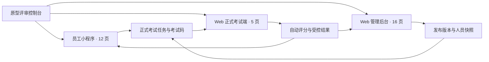

# 企业内部练习与考试系统原型设计方案

> **归档说明：** 本可点击 HTML 原型已归档至 [`archive/prototype/`](../../archive/prototype/)，仅供历史参考。当前权威设计源为 [Figma 设计稿](https://www.figma.com/design/0ScFyhj29qcWwstQZosPNd/%E4%BC%81%E4%B8%9A%E5%86%85%E9%83%A8%E7%BB%83%E4%B9%A0%E4%B8%8E%E8%80%83%E8%AF%95%E7%B3%BB%E7%BB%9F---%E4%BA%A7%E5%93%81%E5%8E%9F%E5%9E%8B?node-id=0-1) 与 [`docs/03-研发对接/`](../03-研发对接/00-Figma设计源说明.md)。研发实现请勿参照归档原型中的代码或截图。

## 文档信息

| 项目 | 内容 |
| --- | --- |
| 产品名称 | 企业内部练习与考试系统 |
| 原型范围 | 员工小程序、Web 正式考试端、Web 管理后台完整三端 |
| 原型级别 | 面向产品与研发评审的可点击中高保真原型 |
| 版本 | V1.0 |
| 创建日期 | 2026-08-11 |
| 原型入口 | [Figma 设计稿](https://www.figma.com/design/0ScFyhj29qcWwstQZosPNd/%E4%BC%81%E4%B8%9A%E5%86%85%E9%83%A8%E7%BB%83%E4%B9%A0%E4%B8%8E%E8%80%83%E8%AF%95%E7%B3%BB%E7%BB%9F---%E4%BA%A7%E5%93%81%E5%8E%9F%E5%9E%8B?node-id=0-1)（旧可点击原型见 `archive/prototype/`） |
| 设计语言 | 简体中文、中性企业工作台风格 |

### 参考基线

- [需求分析文档](../01-需求调研/企业内部练习与考试系统-需求分析文档.md)
- [PRD 总览](./00-企业内部练习与考试系统-PRD总览.md)
- [员工小程序 PRD](./01-员工小程序-PRD.md)
- [Web 正式考试端 PRD](./02-Web正式考试端-PRD.md)
- [Web 管理后台 PRD](./03-Web管理后台-PRD.md)

规则冲突时依次以需求分析文档、PRD 总览的全局规则、端级 PRD 页面细节为准。原型不新增业务规则。

## 1. 设计目标

原型用于在开发前验证以下内容：

- 三端信息架构、导航和跨端跳转是否完整。
- 员工能否完成练习、模拟和正式考试相关任务。
- 管理员能否完成建档、导题、发布、监控、成绩和审计闭环。
- 固定试卷、服务端时间、逐题保存、故障暂停和结果公开边界是否被正确表达。
- 加载、空、失败、无权限、冻结、取消和结果锁定等异常状态是否有明确反馈。

本原型不连接后端，不解析真实 Excel，不发送短信，不持久化业务数据，也不作为生产前端或最终视觉稿。

## 2. 整体信息架构

### 2.1 原型评审控制台

评审控制台位于产品画布之外，包含：

- 三端切换。
- 33 个页面的直接入口。
- 页面状态预设切换与重置。
- 八条端到端流程入口。
- 当前页面对应的 FR、流程和验收编号。
- 隐藏评审工具后的纯产品视图。

原型路由为 `/mini/:pageId`、`/exam/:pageId`、`/admin/:pageId`；`scenario` 查询参数用于复现确定状态。

## 3. 页面地图

### 3.1 员工小程序

主画布为 `375×812`，并以 `320px` 宽度检查压力布局。底部一级入口为首页、学习、考试、我的；沉浸式答题页不显示底栏。

| 页面 | 名称 | 关键内容 | 重点状态 |
| --- | --- | --- | --- |
| MP-01 | 身份激活与绑定 | 登录、改密、短信验证、绑定与找回 | 锁定、停用、绑定冲突 |
| MP-02 | 首页 | 学习入口、进行中会话和正式任务提醒 | 双会话恢复、空页、模块失败、取消 |
| MP-03 | 练习中心与配置 | 题库、模式、范围和题量 | 顺序、随机、专项、恢复、题量不足 |
| MP-04 | 练习答题 | 逐题提交、即时反馈和离开确认 | 未答、失败、正确、错误、恢复、完成 |
| MP-05 | 错题本 | 待练题、错题历史和筛选 | 全部练习、空错题、停用历史、失效 |
| MP-06 | 模拟配置 | 题库、题量、时长和在途模拟 | 新建、恢复、放弃、题量不足 |
| MP-07 | 模拟答题 | 固定试卷、保存、计时、提交或放弃 | 保存失败、离线、冲突、自动交卷 |
| MP-08 | 模拟结果 | 成绩、错题和解析 | 生成中、完整结果、加载失败 |
| MP-09 | 正式考试任务 | 本人考试任务列表与状态筛选 | 收尾、暂停、锁定、取消、空页 |
| MP-10 | 正式考试任务详情 | 规则、地址、考试码与结果入口 | 未开始、开放、恢复、观察、待公布 |
| MP-11 | 学习记录 | 练习、模拟、正式考试记录及受控结果 | 仅汇总、逐题公开、作废重算、锁定 |
| MP-12 | 账号安全 | 账号摘要、改密与解绑 | 验证、失败、会话失效 |

小程序不提供正式考试开卷和答题能力，只提供电脑端地址、考试码及受控结果入口。

### 3.2 Web 正式考试端

主画布为 `1440×900`，最低验证尺寸为 `1280×720`。

| 页面 | 名称 | 关键内容 | 重点状态 |
| --- | --- | --- | --- |
| EX-01 | 登录与账号恢复 | 登录、首登改密、短信找回 | 锁定、会话失效、不支持浏览器 |
| EX-02 | 任务列表与考试码定位 | 本人任务、筛选与考试码 | 开放、在途、暂停、收尾、取消 |
| EX-03 | 考前说明与资格 | 说明、时段、次数和唯一主操作 | 开始、恢复、资格变化、兼容阻断 |
| EX-04 | 答题工作台 | 题目、答题卡、服务端时间、保存和交卷 | 离线、失败、冲突、暂停、到期观察 |
| EX-05 | 结果与复盘 | 汇总、尝试、重考和受控逐题内容 | 待公布、仅汇总、完整复盘、锁定、取消 |

EX-04 的“尝试到期观察”和整场“停止新开卷后的结束观察”使用不同名称与文案，不能混用。

### 3.3 Web 管理后台

后台采用紧凑工作台布局，不增加泛化首页或装饰性仪表盘。

| 页面 | 名称 | 页面定位 | 重点状态 |
| --- | --- | --- | --- |
| AD-01 | 登录 | 管理员登录和首登安全流程 | 锁定、停用、撤权、会话过期 |
| AD-02 | 部门 | 部门树、详情、移动和停用 | 重名、成环、停用受阻、并发变化 |
| AD-03 | 员工与员工导入 | 员工表、建档、导入和初始凭据 | 部分建档、停用、凭据仅一次 |
| AD-04 | 账号与管理员资格 | 重置、解绑、管理员和异常处置授权 | 最后一名有效授权人保护 |
| AD-05 | 题库设置 | 题库状态与练习、模拟开关 | 三开关独立、停用影响提示 |
| AD-06 | 分类、知识点与题目 | 目录树、筛选和题目表 | 空目录、题库只读、版本已变 |
| AD-07 | 单题与版本 | 题目编辑和版本轨 | 题型校验、历史只读、版本冲突 |
| AD-08 | 导题任务 | 模板、上传和任务列表 | 校验中、待确认、失败、取消、过期 |
| AD-09 | 校验预览 | 错误、重复、冲突和待建层级 | 部分导入、预览失效、幂等确认 |
| AD-10 | 考试列表 | 草稿、已发布、取消和参与快照 | 生命周期与运行状态分列、收尾观察 |
| AD-11 | 五步配置向导 | 基础、规则、人员、公开策略、复核 | 校验错误、发布后只读 |
| AD-12 | 发布预检与冻结 | 检查项、问题定位和冻结确认 | 失败、依据变化、平台暂停、发布中 |
| AD-13 | 过程监控与异常 | 状态、人数、员工明细和故障处置 | 故障五态、结果锁定、整场取消 |
| AD-14 | 成绩统计与导出 | 参与/结果指标、成绩表和导出任务 | 非最终、重算、锁定、过期 |
| AD-15 | 尝试详情与作废 | 固定试卷、时间线和作废 | 进行中、处理、完成、作废、终止 |
| AD-16 | 审计日志 | 高级查询、详情和事件链 | 完整性告警、对象过期、权限撤销 |

后台一级导航为组织与员工、题库、考试、审计；AD-07、AD-09、AD-11 至 AD-15 只从业务上下文进入。

## 4. 八条端到端评审流程

| 流程 | 名称 | 页面路径 |
| --- | --- | --- |
| E2E-01 | 员工建档与激活 | AD-03 → AD-04 → MP-01 → MP-02 |
| E2E-02 | 题库与批量导题 | AD-05 → AD-08 → AD-09 → AD-06 |
| E2E-03 | 日常练习 | MP-03 → MP-04 → MP-05 → MP-11 |
| E2E-04 | 自助模拟考试 | MP-06 → MP-07 → MP-08 → MP-11 |
| E2E-05 | 正式考试发布 | AD-10 → AD-11 → AD-12 → AD-13 |
| E2E-06 | 正式作答与评分 | MP-09 → MP-10 → EX-02 → EX-03 → EX-04 → EX-05 |
| E2E-07 | 平台故障暂停与恢复 | EX-04 → AD-13 → EX-05 → MP-11 |
| E2E-08 | 作废、重算与导出 | AD-15 → AD-14 → MP-11 → EX-05 → AD-16 |

流程切换只载入确定性假数据，不写入业务数据库。

## 5. 关键交互原则

### 5.1 答题与保存

- 员工选择答案后先显示“保存中”，服务端模拟确认后才显示“已保存”。
- 保存失败持续显示并阻止手动交卷；版本冲突使用服务端最新答案，不让旧答案覆盖。
- 刷新、重登和断网恢复场景保持固定试卷、题序、已确认答案及模拟服务端剩余时间一致。
- 暂停和到期观察期间页面只读，不能通过禁用按钮以外的入口继续写入。

### 5.2 结果公开

- 汇总公开时机未到时，只显示中性“等待公布”，不返回得分、通过结论、官方尝试标识或及格分。
- 答案和解析必须同时满足整场结束、员工无剩余合法机会及对应开关开放。
- 结果锁定期间不在 DOM 中保留官方成绩、题干、本人答案、正误或解析。
- 取消后只展示员工可见说明，不展示管理员内部原因。

### 5.3 平台故障

- 故障事件只能由监控模拟生成，管理员不能新建、编辑、删除或手工关闭。
- 只有具备考试异常处置授权的管理员可以确认或驳回提案。
- 驳回后保持暂停并进入系统复核；确认后由系统合并区间、计算补时并恢复。
- 严重一致性故障锁定结果、统计和导出，只保留双原因取消整场操作。

## 6. 共享组件与视觉规范

共享组件包括三端外壳、页面头、状态横幅、五域状态、服务端时间、题目、保存状态、答题卡、步骤向导、规则行、版本轨、导入预览、故障时间线、结果锁定和异步导出任务。

| 项目 | 规范 |
| --- | --- |
| 主操作 | 青绿色，单页只保留一个明确主操作 |
| 信息状态 | 蓝色图标、文字和浅色背景共同表达 |
| 警告状态 | 琥珀色，用于暂停、观察和数据过期 |
| 危险状态 | 红色，仅用于取消、作废、锁定和不可逆确认 |
| 圆角 | 不超过 8px |
| 字体 | 系统中文字体；字号不随视口宽度缩放 |
| 表格 | 密集、可扫描；状态域分列，不用一个标签混合表达 |
| 可访问性 | 键盘焦点可见；状态不只依赖颜色；图标按钮具有名称 |

> **生产视觉以 Figma 设计令牌为准：** 主色已更新为 navy `#1B4B8A`，详见 [研发对接 · 视觉与组件规范](../03-研发对接/01-员工小程序-视觉与组件规范.md)。

## 7. 原型模拟边界

- 表单校验、二次确认、页面跳转和状态反馈可直接操作。
- 导题任务、逐题保存、倒计时、故障提案和导出任务使用可控延迟或状态预设。
- 原型刷新后恢复当前路由对应的预设场景，不承诺业务数据持久化。
- 不调用真实短信、账号、考试、评分、文件或审计接口。
- 不实现真实 `.xlsx` 解析；1000 行导入结果使用固定样例数据演示。

## 8. 原型验收清单

- [x] 33 个页面均可通过评审导航或业务上下文访问。
- [x] 八条 E2E 流程均可完整点击且无死路。
- [x] 小程序在 `375×812` 与 `320px` 下无文本溢出或控件遮挡。
- [x] 考试端和后台在 `1440×900` 与 `1280×720` 下保持可操作。
- [x] 保存失败、断线、暂停、两类观察窗、取消和结果锁定均有独立状态。
- [x] 未公开结果不能从页面内容、排序、标识或隐藏节点推导。
- [x] 题量不足、规则重叠、部分导入、预览失效和导出过期均可演示。
- [x] 类型检查、Lint、单元测试、生产构建和 Playwright 测试全部通过。
- [x] 关键页面截图已生成并人工检查布局。

## 9. 关键页面截图

旧版可点击原型的截图已随 `prototype/` 归档至 [`archive/prototype/artifacts/screenshots/`](../../archive/prototype/artifacts/screenshots/)。当前视觉参考请使用 [Figma 设计稿](https://www.figma.com/design/0ScFyhj29qcWwstQZosPNd/%E4%BC%81%E4%B8%9A%E5%86%85%E9%83%A8%E7%BB%83%E4%B9%A0%E4%B8%8E%E8%80%83%E8%AF%95%E7%B3%BB%E7%BB%9F---%E4%BA%A7%E5%93%81%E5%8E%9F%E5%9E%8B?node-id=0-1)。
