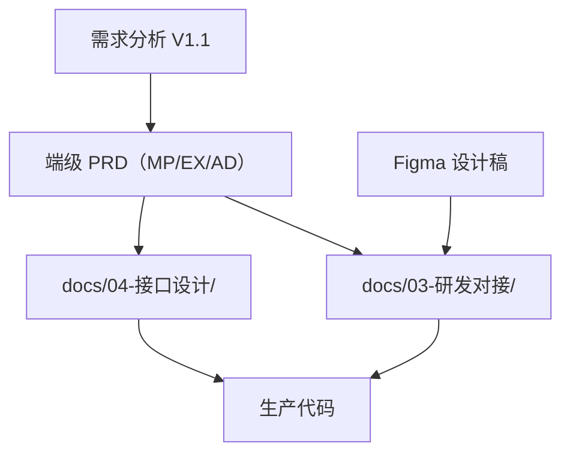

# Figma 设计源说明

| 文档属性 | 内容 |
| --- | --- |
| 文档版本 | V1.0 |
| 编制日期 | 2026-08-30 |
| 目标读者 | 产品、设计、研发、测试 |
| 设计源 | [企业内部练习与考试系统 — 产品原型（Figma）](https://www.figma.com/design/0ScFyhj29qcWwstQZosPNd/%E4%BC%81%E4%B8%9A%E5%86%85%E9%83%A8%E7%BB%83%E4%B9%A0%E4%B8%8E%E8%80%83%E8%AF%95%E7%B3%BB%E7%BB%9F---%E4%BA%A7%E5%93%81%E5%8E%9F%E5%9E%8B?node-id=0-1) |

---

## 1. 文档层级与冲突处理

研发实现时按以下顺序查阅文档：

| 层级 | 路径 | 职责 |
| --- | --- | --- |
| 需求基线 | [需求分析文档](../01-需求调研/企业内部练习与考试系统-需求分析文档.md) | 业务规则、MVP 范围、验收项 |
| 产品需求 | [PRD 总览](../02-方案设计/00-企业内部练习与考试系统-PRD总览.md) 及三份端级 PRD | 页面 ID、功能行为、状态机、验收 |
| 接口规格 | [docs/04-接口设计/](../04-接口设计/) | REST 端点、OpenAPI、FR/页面映射 |
| 视觉与工程约束 | **本目录** + Figma | 视觉稿、设计令牌、组件变体、逐屏研发标注 |

**冲突处理：**

- **业务语义**（能否作答、权限、状态流转、数据口径）→ 以需求分析 / PRD 为准。
- **视觉与交互细节**（颜色、间距、组件状态、页面布局）→ 以 Figma 与本目录为准。
- 旧版 [原型设计方案](../02-方案设计/原型设计方案.md) 中的「青绿色主色」已被 Figma navy 主色取代，以 [视觉与组件规范](./01-员工小程序-视觉与组件规范.md) 为准。

---

## 2. Figma 文件信息

| 属性 | 值 |
| --- | --- |
| fileKey | `0ScFyhj29qcWwstQZosPNd` |
| Dev Mode | 文件已开启 Dev Mode（`m=dev`），可直接查看标注与规格 |

### 2.1 三端 Figma 页面

| 端 | Figma 页面 | nodeId | 直链 |
| --- | --- | --- | --- |
| 员工小程序 | `01 员工小程序` | `0:1` | [打开](https://www.figma.com/design/0ScFyhj29qcWwstQZosPNd/%E4%BC%81%E4%B8%9A%E5%86%85%E9%83%A8%E7%BB%83%E4%B9%A0%E4%B8%8E%E8%80%83%E8%AF%95%E7%B3%BB%E7%BB%9F---%E4%BA%A7%E5%93%81%E5%8E%9F%E5%9E%8B?node-id=0-1&m=dev) |
| Web 正式考试端 | `02 正式考试端` | `1:4` | [打开](https://www.figma.com/design/0ScFyhj29qcWwstQZosPNd/%E4%BC%81%E4%B8%9A%E5%86%85%E9%83%A8%E7%BB%83%E4%B9%A0%E4%B8%8E%E8%80%83%E8%AF%95%E7%B3%BB%E7%BB%9F---%E4%BA%A7%E5%93%81%E5%8E%9F%E5%9E%8B?node-id=1-4&m=dev) |
| Web 管理后台 | `03 管理后台` | `1:5` | [打开](https://www.figma.com/design/0ScFyhj29qcWwstQZosPNd/%E4%BC%81%E4%B8%9A%E5%86%85%E9%83%A8%E7%BB%83%E4%B9%A0%E4%B8%8E%E8%80%83%E8%AF%95%E7%B3%BB%E7%BB%9F---%E4%BA%A7%E5%93%81%E5%8E%9F%E5%9E%8B?node-id=1-5&m=dev) |

每页均含 `研发标注 · XX` 全局约束帧、`标注/XX` 逐屏标注帧，以及 `00 组件（非交付）` 共享组件库（位于小程序页）。

### 2.2 各端设计稿完成度

| 端 | Figma 页面 | 状态 | 对接文档 |
| --- | --- | --- | --- |
| 员工小程序 | `01 员工小程序` | 已完成（50 屏） | [视觉规范](./01-员工小程序-视觉与组件规范.md)、[标注索引](./01-员工小程序-屏幕标注索引.md) |
| Web 正式考试端 | `02 正式考试端` | 已完成（24 屏） | [视觉规范](./02-Web正式考试端-视觉与组件规范.md)、[标注索引](./02-Web正式考试端-屏幕标注索引.md) |
| Web 管理后台 | `03 管理后台` | 已完成（28 屏） | [视觉规范](./03-Web管理后台-视觉与组件规范.md)、[标注索引](./03-Web管理后台-屏幕标注索引.md) |

---

## 3. 命名对照：Figma `M-XX` ↔ PRD `MP-XX`

Figma 使用 `M-` 前缀表示小程序屏幕帧；PRD 使用 `MP-` 前缀表示 MVP 页面 ID。Figma 将 PRD 中的多个状态/变体拆为独立屏幕帧，并补充 PRD 未单独列出的辅助屏（如加载中、半层弹窗等）。

### 3.1 身份与安全

| Figma 屏幕 | PRD 页面 | 说明 |
| --- | --- | --- |
| M-01 登录(工号) | MP-01 | 工号密码登录 |
| M-01b 登录失败锁定 | MP-01 | 连续失败锁定态 |
| M-02 首次强制改密 | MP-01 | 首登改密，不可跳过 |
| M-03 短信找回密码 | MP-01 / MP-12 | 未登录找回密码 |
| M-04 首次身份绑定 | MP-01 | 绑定引导 |
| M-04b 绑定-手机验证 | MP-01 | 短信验证码 |
| M-04c 绑定完成 | MP-01 | 绑定成功 |
| M-改密-已登录 | MP-12 | 已登录改密 |
| M-我的 | MP-11 | 个人中心入口 |
| M-17 解绑小程序 | MP-12 | 解绑确认 |
| M-关于 | MP-11 | 关于页 |

### 3.2 练习

| Figma 屏幕 | PRD 页面 | 说明 |
| --- | --- | --- |
| M-练习加载中 | MP-02 / MP-03 | 骨架屏加载态 |
| M-05 练习首页 | MP-02 / MP-03 | 练习中心主屏（Figma 合并首页与练习配置入口） |
| M-05b 切换练习冲突 | MP-03 | 会话冲突弹窗 |
| M-06 随机练习配置 | MP-03 | 随机练习题量配置 |
| M-06b 题量不足 | MP-03 | 随机练习题量不足 |
| M-专项配置 | MP-03 | 专项练习知识点筛选 |
| M-无开放题库 | MP-03 | 无可用题库空态 |
| M-07 练习答题 | MP-04 | 单选题练习（答对态） |
| M-07c 练习答错 | MP-04 | 答错反馈态 |
| M-07b 答题卡半层 | MP-04 / MP-07 | 答题卡半层（练习/模拟共用组件） |
| M-顺序练习中 | MP-04 | 顺序练习进行中 |
| M-判断题练习 | MP-04 | 判断题题型变体 |
| M-多选题练习 | MP-04 | 多选题题型变体 |
| M-结束练习确认 | MP-04 | 离开/结束确认 |
| M-16 本轮已完成 | MP-04 | 本轮练习完成 |
| M-15 错题本 | MP-05 | 错题列表 |
| M-错题本空态 | MP-05 | 错题本空态 |

### 3.3 模拟考试

| Figma 屏幕 | PRD 页面 | 说明 |
| --- | --- | --- |
| M-08 模拟配置 | MP-06 | 模拟考试配置 |
| M-08c 模拟Tab首页 | MP-06 | 模拟 Tab 入口页 |
| M-模拟题量不足 | MP-06 | 题量不足 |
| M-模拟进行中恢复 | MP-06 / MP-07 | 恢复进行中模拟 |
| M-09 模拟作答 | MP-07 | 模拟答题主屏 |
| M-模拟交卷确认 | MP-07 | 手动交卷确认 |
| M-18 模拟放弃确认 | MP-07 | 放弃模拟确认 |
| M-模拟超时 | MP-07 | 超时自动交卷 |
| M-10 模拟结果 | MP-08 | 模拟成绩汇总 |
| M-模拟复盘 | MP-08 | 逐题复盘 |
| M-已放弃详情 | MP-08 | 放弃记录详情 |

### 3.4 正式考试任务

| Figma 屏幕 | PRD 页面 | 说明 |
| --- | --- | --- |
| M-11 正式考试任务列表 | MP-09 | 任务列表 |
| M-11b 任务空态 | MP-09 | 无任务空态 |
| M-11c 任务-可恢复 | MP-09 | 可恢复进行中态 |
| M-11d 任务-已取消 | MP-09 | 已取消态 |
| M-11e 任务-已结束 | MP-09 | 已结束态 |
| M-12 任务详情 | MP-10 | 规则摘要、考试码、电脑端地址 |
| M-12b 详情-次数用尽 | MP-10 | 尝试次数用尽 |
| M-13 正式成绩已公布 | MP-10 / MP-11 | 成绩已公开 |
| M-13b 未公布 | MP-10 | 等待公布 |
| M-13c 成绩-不展示通过 | MP-10 | 不展示通过结论 |

### 3.5 学习记录

| Figma 屏幕 | PRD 页面 | 说明 |
| --- | --- | --- |
| M-14 学习记录 | MP-11 | 记录分栏入口 |
| M-14b 练习记录 | MP-11 | 练习历史 |
| M-14c 模拟记录 | MP-11 | 模拟历史 |

### 3.6 Web 正式考试端：Figma `E-XX` ↔ PRD `EX-XX`

| Figma 屏幕 | PRD 页面 | 说明 |
| --- | --- | --- |
| E-01 登录 | EX-01 | 工号密码登录 |
| E-02 首次强制改密 | EX-01 | 首登改密 |
| E-10 短信找回 | EX-01 | 短信找回密码 |
| E-03 任务门户 | EX-02 | 本人正式考试任务列表 |
| E-11 考试码定位 | EX-02 | 考试码定位场次 |
| E-04 开卷前确认 | EX-03 | 考前说明与开卷确认 |
| E-04b 恢复在途尝试优先于新建 | EX-03 | 恢复优先于新建 |
| E-04c 暂停中不可开卷 | EX-03 | 平台暂停不可开卷 |
| E-资格失败-未到时间 | EX-03 | 未到开考时间 |
| E-资格失败-次数用尽 | EX-03 | 尝试次数用尽 |
| E-资格失败-未分配 | EX-03 | 未分配该考试 |
| E-05 作答页 | EX-04 | 答题工作台主屏 |
| E-05b 多选作答 | EX-04 | 多选题变体 |
| E-05c 判断作答 | EX-04 | 判断题变体 |
| E-05d 保存失败可重试 | EX-04 | 保存失败态 |
| E-05e 最后1分钟红倒计时 | EX-04 | 倒计时警告态 |
| E-06 平台故障暂停 | EX-04 | 平台暂停只读 |
| E-12 到期观察窗 20s 不可编辑 | EX-04 | 到期观察窗 |
| E-07 交卷确认 | EX-04 / EX-05 | 手动交卷确认 |
| E-07b 有未确认保存阻止交卷 | EX-04 | 未保存阻止交卷 |
| E-08 交卷处理中 | EX-04 / EX-05 | 交卷处理中 |
| E-09 结果 | EX-05 | 结果汇总 |
| E-09b 结果已公布+复盘 | EX-05 | 已公布逐题复盘 |
| E-09c 场次已取消失去效力 | EX-05 | 取消后失效 |

### 3.7 Web 管理后台：Figma `A-XX` ↔ PRD `AD-XX`

| Figma 屏幕 | PRD 页面 | 说明 |
| --- | --- | --- |
| A-01 管理员登录 | AD-01 | 管理员登录 |
| A-总览 | — | Figma 辅助导航页，PRD 无对应 MVP 页 |
| A-02 部门树 | AD-02 | 部门管理 |
| A-03 员工列表 | AD-03 | 员工列表 |
| A-04 员工Excel建档 | AD-03 | 批量建档 |
| A-05 重置密码 | AD-04 | 重置员工密码 |
| A-06 管理员与异常处置授权 | AD-04 | 管理员与异常处置授权 |
| A-07 题库列表 | AD-05 | 题库设置 |
| A-08 题目列表 | AD-06 | 分类、知识点与题目 |
| A-09 题目新建修订 | AD-07 | 单题编辑 |
| A-25 题目版本历史只读 | AD-07 | 版本历史 |
| A-10 Excel导题 | AD-08 / AD-09 | 导题与预览 |
| A-11 导题任务历史 | AD-08 | 导题任务列表 |
| A-27 导题错误报告 | AD-09 | 导入错误报告 |
| A-12 考试列表 | AD-10 | 考试列表 |
| A-13 创建考试 | AD-11 | 五步配置向导 |
| A-14 原子组卷规则表 | AD-11 | 组卷规则 |
| A-15 应考人员 | AD-11 | 应考人员配置 |
| A-16 发布预检查 | AD-12 | 发布预检与冻结 |
| A-17 已发布考试只读 | AD-10 / AD-12 | 已发布只读 |
| A-18 过程监控 | AD-13 | 过程监控 |
| A-22 取消整场 | AD-13 | 取消整场 |
| A-23 平台故障处置 | AD-13 | 故障确认/驳回 |
| A-19 成绩主表 | AD-14 | 成绩统计 |
| A-20 成绩导出双Sheet | AD-14 | 异步导出 |
| A-21 作废尝试 | AD-15 | 作废尝试 |
| A-26 尝试明细抽屉 | AD-15 | 尝试明细 |
| A-24 审计日志 | AD-16 | 审计查询 |

---

## 4. 配套文档索引

| 文档 | 内容 |
| --- | --- |
| [01-员工小程序-视觉与组件规范.md](./01-员工小程序-视觉与组件规范.md) | 共享设计令牌、小程序组件变体 |
| [01-员工小程序-屏幕标注索引.md](./01-员工小程序-屏幕标注索引.md) | 50 屏目录、15 条标注 |
| [02-Web正式考试端-视觉与组件规范.md](./02-Web正式考试端-视觉与组件规范.md) | 考试端布局与特有规范 |
| [02-Web正式考试端-屏幕标注索引.md](./02-Web正式考试端-屏幕标注索引.md) | 24 屏目录、9 条标注 |
| [03-Web管理后台-视觉与组件规范.md](./03-Web管理后台-视觉与组件规范.md) | 后台布局、AdminSidebar、表格规范 |
| [03-Web管理后台-屏幕标注索引.md](./03-Web管理后台-屏幕标注索引.md) | 28 屏目录、13 条标注 |
| [员工小程序 PRD](../02-方案设计/01-员工小程序-PRD.md) | MP-01 ~ MP-12 |
| [Web 正式考试端 PRD](../02-方案设计/02-Web正式考试端-PRD.md) | EX-01 ~ EX-05 |
| [Web 管理后台 PRD](../02-方案设计/03-Web管理后台-PRD.md) | AD-01 ~ AD-16 |

---

## 5. 研发使用说明

1. **打开 Figma Dev Mode**，按端进入对应页面（§2.1 nodeId）。
2. **先读** `研发标注 · XX` 全局约束，再读目标屏幕旁的 `标注/XX` 帧（若存在），最后读 PRD 对应章节。
3. **组件实现**参照 `01 员工小程序` 页中 `00 组件（非交付）` 变体，详见各端视觉与组件规范。
4. **小程序**禁止实现正式考试作答入口；**考试端**仅承担正式作答；**管理后台**禁止改分改答案。
5. 不得从已归档 [`archive/prototype/`](../../archive/prototype/) 补图或补规范。
