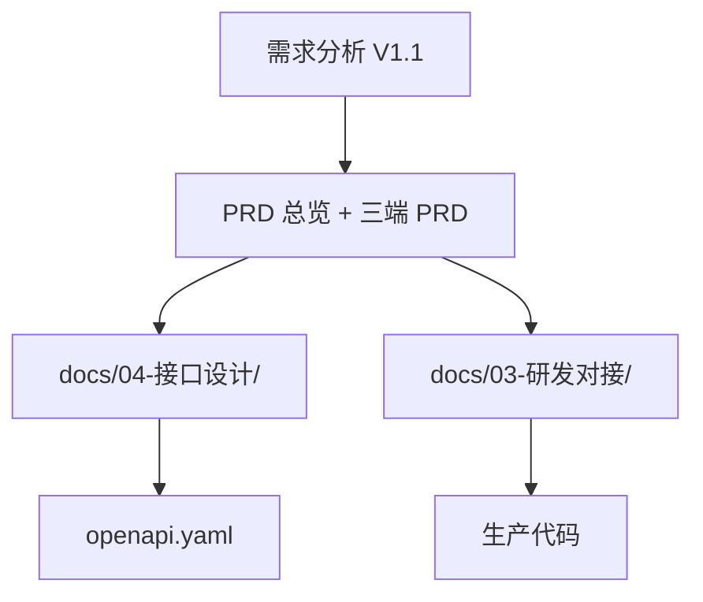

# API 设计说明

| 文档属性 | 内容 |
| --- | --- |
| 文档版本 | V1.0 |
| 编制日期 | 2026-08-30 |
| 目标读者 | 后端、前端、测试、运维 |
| 需求基线 | [需求分析 V1.1](../01-需求调研/企业内部练习与考试系统-需求分析文档.md) |
| 产品基线 | [PRD 总览](../02-方案设计/00-企业内部练习与考试系统-PRD总览.md) |
| 机器可读规格 | [openapi.yaml](./openapi.yaml) |

---

## 1. 文档目的与层级

本目录定义 MVP 全部 HTTP 接口规格，实现 [需求分析 §19.4](../01-需求调研/企业内部练习与考试系统-需求分析文档.md) 要求的六项约束：

1. **幂等开卷**
2. **版本化保存**
3. **幂等交卷**
4. **服务端时间**
5. **对象级权限**
6. **结果脱敏**

文档层级：



| 文件 | 职责 |
| --- | --- |
| 本文件 | 全局约定、错误码、幂等、时间、权限、脱敏 |
| [01~07 分域文档](./01-认证与会话.md) | 端点行为、状态机、异常语义 |
| [08-接口与页面映射表](./08-接口与页面映射表.md) | FR/SYS ↔ 端点 ↔ 页面 ↔ Figma |
| [openapi.yaml](./openapi.yaml) | OpenAPI 3.1，供 Postman / 代码生成 |

---

## 2. 基础约定

### 2.1 协议与格式

| 项 | 约定 |
| --- | --- |
| 风格 | REST + JSON |
| Base URL | `/api/v1` |
| 请求体 | `Content-Type: application/json`（文件上传除外） |
| 文件上传 | `multipart/form-data` |
| 字符编码 | UTF-8 |
| 资源 ID | opaque string（如 CUID），工号等业务键单独字段 |

### 2.2 时间

- 请求与响应中的时间点一律 **ISO 8601 UTC**（例：`2026-08-30T12:00:00Z`）。
- 前端展示按企业时区转换并标明时区；**资格判定、剩余时间、到期交卷仅认服务端时间**。
- 每个成功/错误响应的 `meta.serverNow` 提供当前服务端 UTC 时间，供客户端校准倒计时。

### 2.3 分页

查询参数：

| 参数 | 类型 | 默认 | 说明 |
| --- | --- | --- | --- |
| `page` | integer | 1 | 1-based 页码 |
| `pageSize` | integer | 20 | 每页条数，最大 100 |

分页响应结构（嵌套于 `data`）：

```json
{
  "items": [],
  "total": 0,
  "page": 1,
  "pageSize": 20
}
```

### 2.4 统一响应信封

**成功：**

```json
{
  "data": { },
  "meta": {
    "serverNow": "2026-08-30T12:00:00Z",
    "requestId": "req_abc123"
  }
}
```

**错误：**

```json
{
  "error": {
    "code": "ATTEMPT_ALREADY_IN_PROGRESS",
    "message": "已有进行中的尝试",
    "details": { }
  },
  "meta": {
    "serverNow": "2026-08-30T12:00:00Z",
    "requestId": "req_abc123"
  }
}
```

HTTP 状态码与业务错误码配合使用：4xx/5xx 表示传输或授权层失败；`error.code` 表示可展示或可重试的业务语义。

---

## 3. 认证与会话

### 3.1 登录与会话

| 端点 | 说明 |
| --- | --- |
| `POST /auth/login` | 工号 + 密码登录 |
| `POST /auth/logout` | 注销当前会话 |
| `GET /auth/session` | 查询当前会话与权限摘要 |

会话载体（实现二选一，OpenAPI 中均定义）：

- **Cookie：** `Set-Cookie: session=<token>; HttpOnly; Secure; SameSite=Strict`
- **Bearer：** `Authorization: Bearer <token>`

### 3.2 首登与安全

- 系统生成的一次性临时密码只在受控交付接口出现一次（见 [02-组织与员工](./02-组织与员工.md)）。
- 首登或重置后 `mustChangePassword=true`，在改密完成前除 `POST /auth/change-password` 与 `GET /auth/session` 外均返回 `403 AUTH_PASSWORD_CHANGE_REQUIRED`。
- 连续登录失败触发账号锁定，返回 `403 AUTH_ACCOUNT_LOCKED`。

### 3.3 小程序绑定

- 短信验证码限时限次；绑定一对一。
- 密码找回或解绑成功后，该员工全部旧会话立即失效。

### 3.4 账号停用

- 停用后立即拒绝新业务请求（返回 `403 AUTH_ACCOUNT_DISABLED`）。
- 进行中正式考试尝试不在接口层特殊放行，由服务端按需求基线后台收敛至交卷/评分完成。

---

## 4. 幂等与并发

### 4.1 Idempotency-Key 请求头

| 场景 | 键作用域 | 保留期 |
| --- | --- | --- |
| 正式/模拟开卷 | 同一员工 + 考试/模拟 + 键 | ≥ 24h |
| 手动/自动交卷 | 同一尝试 + 键 | ≥ 24h |
| 导入确认 | 同一任务 + 键 | ≥ 7d |

请求头：`Idempotency-Key: <client-generated-uuid>`

重复请求且 payload 一致时，返回与原请求相同的 HTTP 状态与 body（含原 `requestId` 可不同）。

### 4.2 答案版本化保存

正式考试与模拟考试均使用单调递增的 `answerVersion`（客户端维护，从 1 起）：

- 服务端持久化成功后返回 `confirmedVersion`。
- 旧版本请求返回 `409 ANS_VERSION_CONFLICT`，不得覆盖新版本。
- 尝试终结后一切保存请求返回 `409 ANS_ATTEMPT_TERMINATED`。

### 4.3 终结权竞争

模拟放弃、手动提交、超时提交、正式手动/自动交卷共用**唯一终结权**语义：先取得处理权的请求决定终态；后续重复或竞争请求返回同一终态，不得产生第二份结果。

### 4.4 导入确认

`POST /import/tasks/{id}/confirm` 需携带预览校验产生的 `confirmToken` 与 `Idempotency-Key`。预览依据变化时 `confirmToken` 失效，返回 `409 IMP_PREVIEW_STALE`。

---

## 5. 对象级权限

所有接口必须校验 **角色 + 资源归属 + 业务资格 + 结果可见性**（FR-AUTH-06）。

| 角色 | 数据范围 |
| --- | --- |
| 员工 | 仅本人任务、会话、尝试、答案、允许公开的结果 |
| 管理员 | 单企业全部管理数据 |
| 异常处置授权管理员 | 管理员范围 + 故障提案确认/驳回 |

禁止提供的管理能力（接口层不得存在）：

- 修改员工答案、题项得分、通过状态
- 修改个人到期时间或单独加时
- 编辑故障事件事实字段或手工关闭未复核的开放区间

越权访问返回 `403 SEC_FORBIDDEN` 并写安全审计；不通过响应体泄露他人数据。

---

## 6. 结果脱敏（FR-SCR-04）

员工端响应在公开下限前**不得包含**：

- 标准答案、解析
- 他人考试/成绩数据
- 未公开时机下的及格分或等价阈值
- 未公开时机下的「是否通过」结论（可用中性文案如「本场已无后续参加机会」）

| 视图 | 字段策略 |
| --- | --- |
| 员工-考试中 | 仅题干、选项、本人未确认/已确认答案状态 |
| 员工-结果汇总 | 按 `ResultVisibility` 返回已公开的汇总项 |
| 员工-逐题复盘 | 仅当 `perItemReviewAllowed=true` 时返回答案与解析 |
| 管理端 | 完整数据只读；作废/取消等写操作独立端点 |

`ResultVisibility` 结构见 [openapi.yaml](./openapi.yaml) `components/schemas/ResultVisibility`。

---

## 7. 五类正式考试状态

接口响应中分列五个状态域（PRD §6），不得合并或派生混合枚举：

| 状态域 | 枚举值 |
| --- | --- |
| 生命周期 `lifecycle` | `draft`, `notStarted`, `openForAttempt`, `closing`, `ended`, `cancelled` |
| 运行 `runStatus` | `normal`, `paused` |
| 参与 `participationStatus` | `notJoined`, `inExam`, `submitted`, `joinedNoValidSubmit`, `absent` |
| 尝试 `attemptStatus` | `inProgress`, `submitting`, `completed`, `voided`, `terminated` |
| 结果 `resultStatus` | `pending`, `passed`, `failed`, `noValidScore`, `cancelled` |

`attentionFlag`（异常尝试关注标记）与 `resultLocked`（结果锁定）为独立布尔字段，不是第六种状态值。

---

## 8. HTTP 状态码

| HTTP | 典型场景 |
| --- | --- |
| 200 | 成功（含幂等重复） |
| 201 | 资源创建 |
| 204 | 无 body 的成功（如注销） |
| 400 | 参数/格式错误 |
| 401 | 未登录或会话失效 |
| 403 | 无权限、账号锁定/停用、须改密 |
| 404 | 资源不存在或无权得知存在 |
| 409 | 版本冲突、状态冲突、预览过期 |
| 422 | 业务规则拒绝（可导入行不足、题池不够等） |
| 429 | 短信/登录限流 |
| 500 | 未预期服务端错误 |

---

## 9. 业务错误码目录

错误码前缀与域文档对应；完整列表见各分域文档及 OpenAPI `ErrorCode` 枚举。

| 前缀 | 域 | 示例 |
| --- | --- | --- |
| `AUTH_*` | 认证与会话 | `AUTH_INVALID_CREDENTIALS`, `AUTH_ACCOUNT_LOCKED` |
| `ORG_*` | 组织与员工 | `ORG_DEPARTMENT_HAS_CHILDREN`, `ORG_DUPLICATE_EMPLOYEE_NO` |
| `QST_*` | 题库 | `QST_BANK_DISABLED`, `QST_CATEGORY_NAME_DUPLICATE` |
| `IMP_*` | 导题 | `IMP_FILE_TOO_LARGE`, `IMP_PREVIEW_STALE` |
| `PRA_*` | 练习 | `PRA_SESSION_ALREADY_ACTIVE` |
| `SIM_*` | 模拟 | `SIM_ATTEMPT_ALREADY_ACTIVE`, `SIM_ALREADY_TERMINATED` |
| `EXM_*` | 考试配置 | `EXM_NOT_PUBLISHABLE`, `EXM_ALREADY_CANCELLED` |
| `ATT_*` | 开卷资格 | `ATTEMPT_ALREADY_IN_PROGRESS`, `ATT_NO_REMAINING_OPPORTUNITY` |
| `ANS_*` | 作答保存 | `ANS_VERSION_CONFLICT`, `ANS_UNCONFIRMED_ANSWERS` |
| `SCR_*` | 评分结果 | `SCR_SUBMIT_IN_PROGRESS` |
| `REP_*` | 统计导出 | `REP_EXPORT_NOT_READY` |
| `OPS_*` | 故障运维 | `OPS_PROPOSAL_STALE`, `OPS_NOT_AUTHORIZED` |
| `SEC_*` | 安全 | `SEC_FORBIDDEN` |

---

## 10. 长任务与异步

| 任务类型 | 创建 | 查询 | 文件有效期 |
| --- | --- | --- | --- |
| Excel 导题 | `POST /import/tasks` | `GET /import/tasks/{id}` | 任务文件按保留策略 |
| 成绩导出 | `POST /admin/exams/{id}/exports` | `GET /admin/exports/{jobId}` | 下载链接 24h |
| 批量凭据包 | 员工导入/建档触发 | `GET /employees/credential-batches/{id}/download` | 24h 且仅可下载一次 |

任务状态枚举：`pending`, `processing`, `completed`, `failed`, `cancelled`, `expired`。

---

## 11. 分域文档索引

| 文档 | FR / SYS | Tag |
| --- | --- | --- |
| [01-认证与会话](./01-认证与会话.md) | FR-AUTH-01~06, SYS-01 | Auth |
| [02-组织与员工](./02-组织与员工.md) | FR-AUTH-04~05 | Organization |
| [03-题库与导题](./03-题库与导题.md) | FR-QST, FR-IMP, SYS-02 | QuestionBank, Import |
| [04-练习与模拟](./04-练习与模拟.md) | FR-PRA, FR-SIM, SYS-04 | Practice, MockExam |
| [05-正式考试与作答](./05-正式考试与作答.md) | FR-EXM, FR-ATT, FR-ANS, SYS-03/04 | Exam, Attempt, Answer |
| [06-成绩统计与导出](./06-成绩统计与导出.md) | FR-SCR, FR-REP, SYS-06 | Score, Report |
| [07-运维故障与审计](./07-运维故障与审计.md) | FR-OPS, SYS-05/07 | Outage, Audit |
| [08-接口与页面映射表](./08-接口与页面映射表.md) | 全量映射 | — |

---

## 12. OpenAPI 扩展字段

每个 operation 可标注：

| 扩展 | 说明 | 示例 |
| --- | --- | --- |
| `x-fr-ids` | 关联功能 ID | `["FR-ATT-02"]` |
| `x-page-ids` | 关联页面 ID | `["EX-04"]` |
| `x-sys-ids` | 关联系统行为 | `["SYS-04"]` |

命名对照：`M-XX` ↔ `MP-XX`，`E-XX` ↔ `EX-XX`，`A-XX` ↔ `AD-XX`（见 [Figma 设计源说明](../03-研发对接/00-Figma设计源说明.md)）。
