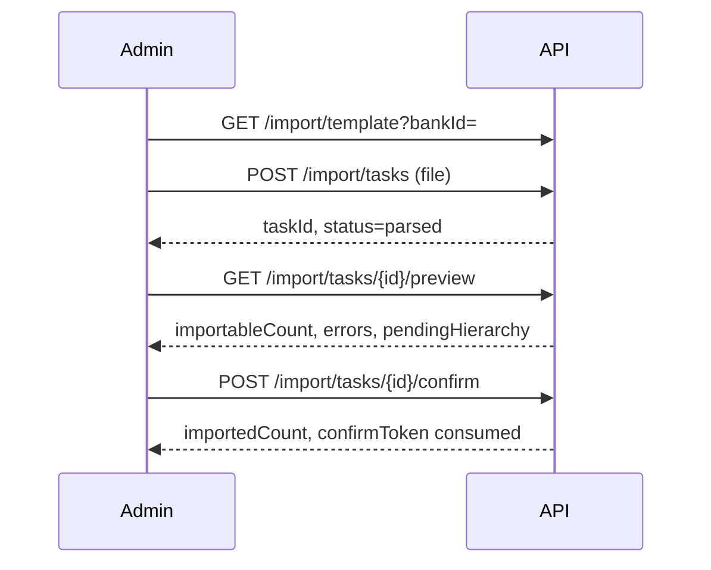

# 题库与导题 API

| 文档属性 | 内容 |
| --- | --- |
| 覆盖功能 | FR-QST-01~04, FR-IMP-01~05 |
| 系统行为 | SYS-02 |
| OpenAPI Tag | `QuestionBank`, `Import` |
| 全局约定 | [00-API设计说明](./00-API设计说明.md) |

---

## 1. 端点一览

### 1.1 题库与题目（管理员）

| 方法 | 路径 | FR | 页面 |
| --- | --- | --- | --- |
| GET | `/question-banks` | FR-QST-01 | AD-05 |
| POST | `/question-banks` | FR-QST-01 | AD-05 |
| PATCH | `/question-banks/{id}` | FR-QST-01 | AD-05 |
| GET | `/question-banks/{bankId}/categories` | FR-QST-02 | AD-06 |
| POST | `/question-banks/{bankId}/categories` | FR-QST-02 | AD-06 |
| PATCH | `/categories/{id}` | FR-QST-02 | AD-06 |
| GET | `/categories/{categoryId}/knowledge-points` | FR-QST-02 | AD-06 |
| POST | `/categories/{categoryId}/knowledge-points` | FR-QST-02 | AD-06 |
| PATCH | `/knowledge-points/{id}` | FR-QST-02 | AD-06 |
| GET | `/question-banks/{bankId}/questions` | FR-QST-03 | AD-06 |
| POST | `/question-banks/{bankId}/questions` | FR-QST-03~04 | AD-07 |
| GET | `/questions/{id}` | FR-QST-03 | AD-07 |
| PATCH | `/questions/{id}` | FR-QST-03 | AD-07 |
| GET | `/questions/{id}/versions` | FR-QST-03 | AD-07 |
| POST | `/questions/{id}/versions` | FR-QST-03~04 | AD-07 |
| GET | `/question-versions/{versionId}` | FR-QST-03 | AD-07 |

### 1.2 Excel 导题

| 方法 | 路径 | FR | 页面 |
| --- | --- | --- | --- |
| GET | `/import/template` | FR-IMP-01 | AD-08 |
| POST | `/import/tasks` | FR-IMP-01~02 | AD-08 |
| GET | `/import/tasks` | FR-IMP-05 | AD-08 |
| GET | `/import/tasks/{id}` | FR-IMP-05 | AD-08, AD-09 |
| GET | `/import/tasks/{id}/preview` | FR-IMP-03 | AD-09 |
| POST | `/import/tasks/{id}/confirm` | FR-IMP-04 | AD-09 |
| POST | `/import/tasks/{id}/cancel` | FR-IMP-05 | AD-08 |
| POST | `/import/tasks/{id}/revalidate` | FR-IMP-05 | AD-09 |
| GET | `/import/tasks/{id}/errors` | FR-IMP-02 | AD-09 |

---

## 2. 题库与开放策略

**QuestionBank：**

```json
{
  "id": "bank_xxx",
  "name": "安全合规题库",
  "status": "active",
  "practiceEnabled": true,
  "mockEnabled": true,
  "questionCount": 1200,
  "categoryCount": 15
}
```

| 字段 | 说明 |
| --- | --- |
| `status` | `active` / `disabled`；停用后不可用于新练习、模拟、发布 |
| `practiceEnabled` | 员工练习入口是否可选 |
| `mockEnabled` | 员工模拟入口是否可选 |

---

## 3. 分类与知识点

- 分类在同一题库内名称唯一；知识点在同一分类内名称唯一。
- 题目必属一个分类；知识点可选。
- 改名不影响历史快照中的名称（快照存发布时名称）。

---

## 4. 题目与版本（FR-QST-03~04）

修改题目内容**必须** `POST /questions/{id}/versions` 创建新版本，不得原地覆盖。

**创建版本请求：**

```json
{
  "type": "singleChoice",
  "stem": "题干纯文本",
  "options": [
    { "key": "A", "text": "选项A" },
    { "key": "B", "text": "选项B" }
  ],
  "standardAnswer": ["A"],
  "explanation": "解析纯文本",
  "categoryId": "cat_xxx",
  "knowledgePointId": null,
  "difficulty": "medium",
  "defaultScore": 2
}
```

**题型 `type`：** `singleChoice` | `multipleChoice` | `trueFalse` | `essay`（解答题，无选项，`standardAnswer` 为参考答案文本；练习/考试按去空白后精确比对，人工阅卷尚未开放）。

**QuestionVersion（管理端完整视图）：**

```json
{
  "id": "qv_xxx",
  "questionId": "q_xxx",
  "versionNo": 3,
  "type": "singleChoice",
  "stem": "...",
  "options": [],
  "standardAnswer": ["A"],
  "explanation": "...",
  "status": "active",
  "createdAt": "2026-08-30T12:00:00Z"
}
```

停用题目版本不影响已被引用的历史快照。

---

## 5. Excel 导题流程



### 5.1 POST /import/tasks

`multipart/form-data`：`file` + `questionBankId`。

**限制（FR-IMP-01）：** 固定 `.xlsx`、单题库、≤1000 行、≤10MB。

文件级错误整任务拒绝（`IMP_FILE_INVALID`）；行级错误不阻止合法行进入预览。

### 5.2 GET /import/tasks/{id}/preview

**响应 `data`：**

```json
{
  "taskId": "imp_xxx",
  "status": "awaitingConfirm",
  "confirmToken": "ct_xxx",
  "importableCount": 850,
  "errorCount": 150,
  "pendingHierarchy": {
    "categories": ["新分类A"],
    "knowledgePoints": [{ "category": "Existing", "name": "新知识点" }]
  },
  "previewExpiresAt": "2026-08-30T18:00:00Z"
}
```

可导入行 + 错误行 + 待建层级计数守恒（FR-IMP-03）。

### 5.3 POST /import/tasks/{id}/confirm

**请求头：** `Idempotency-Key`

**请求体：**

```json
{
  "confirmToken": "ct_xxx",
  "confirmPendingHierarchy": true
}
```

确认前服务端**重新校验**最新题库状态（FR-IMP-04）；预览过期返回 `IMP_PREVIEW_STALE`。

事务全成全败；重复确认返回原入库结果。

### 5.4 任务状态

`uploaded` → `parsing` → `parsed` → `awaitingConfirm` → `importing` → `completed` | `failed` | `cancelled` | `expired`

预览依据变化时整体转为 `needsRevalidation`，需 `POST /import/tasks/{id}/revalidate`。

---

## 6. 错误码

| code | 说明 |
| --- | --- |
| `QST_BANK_DISABLED` | 题库已停用 |
| `QST_CATEGORY_NAME_DUPLICATE` | 分类重名 |
| `QST_KNOWLEDGE_POINT_DUPLICATE` | 知识点重名 |
| `IMP_FILE_TOO_LARGE` | 超过 10MB |
| `IMP_ROW_LIMIT_EXCEEDED` | 超过 1000 行 |
| `IMP_FILE_INVALID` | 文件格式/模板错误 |
| `IMP_PREVIEW_STALE` | 预览或 confirmToken 失效 |
| `IMP_TASK_NOT_CONFIRMED` | 任务状态不允许确认 |
