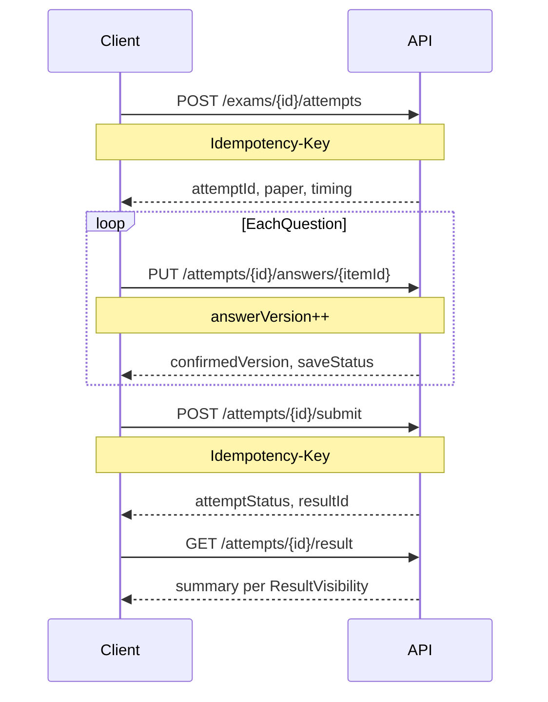

# 正式考试与作答 API

| 文档属性 | 内容 |
| --- | --- |
| 覆盖功能 | FR-EXM-01~05, FR-ATT-01~03, FR-ANS-01~04 |
| 系统行为 | SYS-03, SYS-04 |
| OpenAPI Tag | `Exam`, `Attempt`, `Answer` |
| 全局约定 | [00-API设计说明](./00-API设计说明.md) |

---

## 1. 端点一览

### 1.1 管理端

| 方法 | 路径 | FR | 页面 |
| --- | --- | --- | --- |
| GET | `/admin/exams` | FR-EXM-01 | AD-10 |
| POST | `/admin/exams` | FR-EXM-01 | AD-10, AD-11 |
| GET | `/admin/exams/{id}` | FR-EXM-01 | AD-11 |
| PATCH | `/admin/exams/{id}` | FR-EXM-01 | AD-11 |
| PUT | `/admin/exams/{id}/wizard/basic` | FR-EXM-01 | AD-11 |
| PUT | `/admin/exams/{id}/wizard/rules` | FR-EXM-01 | AD-11 |
| PUT | `/admin/exams/{id}/wizard/assignees` | FR-EXM-01 | AD-11 |
| PUT | `/admin/exams/{id}/wizard/visibility` | FR-EXM-01 | AD-11 |
| PUT | `/admin/exams/{id}/wizard/review` | FR-EXM-01 | AD-11 |
| POST | `/admin/exams/{id}/preflight` | FR-EXM-02 | AD-12 |
| POST | `/admin/exams/{id}/publish` | FR-EXM-03 | AD-12 |
| POST | `/admin/exams/{id}/cancel` | FR-EXM-04 | AD-10, AD-13 |
| GET | `/admin/exams/{id}/monitor` | FR-EXM-05, FR-REP-01 | AD-13 |

### 1.2 员工端

| 方法 | 路径 | FR | 页面 |
| --- | --- | --- | --- |
| GET | `/exams/tasks` | FR-EXM-05 | MP-09, EX-02 |
| GET | `/exams/{id}` | FR-EXM-05, FR-SCR-04 | MP-10, EX-03 |
| POST | `/exams/{id}/attempts` | FR-ATT-01~03 | EX-03, EX-04 |
| GET | `/attempts/{id}` | FR-ANS-02 | EX-04 |
| GET | `/attempts/{id}/paper` | FR-ATT-02 | EX-04 |
| PUT | `/attempts/{id}/answers/{itemId}` | FR-ANS-01 | EX-04 |
| POST | `/attempts/{id}/submit` | FR-ANS-03~04 | EX-04 |
| GET | `/attempts/{id}/result` | FR-SCR-04 | EX-05, MP-11 |
| GET | `/exams/records` | FR-EXM-05 | MP-11 |

---

## 2. 考试配置（管理端）

### 2.1 五步向导

| 步骤 | 路径 | 内容 |
| --- | --- | --- |
| basic | `/wizard/basic` | 名称、说明、开放/停止时间 |
| rules | `/wizard/rules` | 时长、次数、及格分、规则行（原子组卷） |
| assignees | `/wizard/assignees` | 应考人员范围 |
| visibility | `/wizard/visibility` | 结果公开策略 |
| review | `/wizard/review` | 摘要只读确认 |

草稿状态 `lifecycle=draft` 可编辑；发布后仅说明文本可改（FR-EXM-04）。

### 2.2 POST /admin/exams/{id}/preflight

发布预检（FR-EXM-02）：规则不重叠、题池充足、总分自动汇总、人员非空。

**响应：**

```json
{
  "passed": false,
  "issues": [
    {
      "code": "EXM_INSUFFICIENT_POOL",
      "ruleLineIndex": 2,
      "required": 10,
      "available": 7
    }
  ]
}
```

### 2.3 POST /admin/exams/{id}/publish

原子发布：冻结规则、题池、人员、分值、公开策略（FR-EXM-03）；记录 `publishedAt`（UTC）。

### 2.4 POST /admin/exams/{id}/cancel

取消考试（不可逆）；需员工可见说明与内部原因。

**效果：** 立即停止新开卷；进行中尝试转 `terminated`；已交卷处理中的继续幂等收敛。

---

## 3. 员工任务与详情

### 3.1 GET /exams/tasks

本人被分配的正式考试列表；含五域状态摘要与 `examCode`（考试码）。

### 3.2 GET /exams/{id}

任务详情：规则摘要、时段、剩余次数、电脑端地址、考试码、受控结果入口。

**脱敏：** 未公开通过结论时不返回 `passingScore`；使用 `retakeAllowed` 中性字段而非 `passed`（FR-SCR-04）。

---

## 4. 开卷与固定试卷（FR-ATT）

### POST /exams/{id}/attempts

**请求头：** `Idempotency-Key`

**前置校验（FR-ATT-01）：** 登录、分配、生命周期、运行状态、通过状态、剩余次数、无在途尝试。

**成功响应：**

```json
{
  "attemptId": "att_xxx",
  "attemptNumber": 2,
  "attemptStatus": "inProgress",
  "paper": {
    "attemptId": "att_xxx",
    "items": []
  },
  "timing": {
    "startedAt": "2026-08-30T12:00:00Z",
    "expiresAt": "2026-08-30T13:30:00Z",
    "remainingSeconds": 5400,
    "serverNow": "2026-08-30T12:00:00Z"
  }
}
```

**幂等：** 同一员工+考试+在途尝试存在时，返回原 `attemptId` 与原固定试卷（FR-ATT-02）。

**抽卷：** 每次**新**尝试重新抽卷；恢复进行中尝试不消耗次数（FR-ATT-03）。

---

## 5. 恢复与计时（FR-ANS-02）

### GET /attempts/{id}

返回尝试状态、固定试卷摘要、已确认答案列表、`timing`（含 `serverNow`）。

客户端倒计时必须基于 `expiresAt - serverNow` 定期校准。

---

## 6. 版本化保存（FR-ANS-01）

### PUT /attempts/{id}/answers/{itemId}

**请求：**

```json
{
  "answer": ["A", "C"],
  "answerVersion": 3
}
```

**成功响应：**

```json
{
  "itemId": "item_5",
  "confirmedVersion": 3,
  "saveStatus": "saved",
  "confirmedAt": "2026-08-30T12:05:01Z"
}
```

| saveStatus | 含义 |
| --- | --- |
| `saving` | 处理中（极少返回） |
| `saved` | 服务端已持久化 |
| `failed` | 本次失败，可幂等重试 |

旧版本 → `409 ANS_VERSION_CONFLICT`。尝试非 `inProgress` → `409 ANS_ATTEMPT_TERMINATED`。

---

## 7. 交卷（FR-ANS-03~04）

### POST /attempts/{id}/submit

**请求头：** `Idempotency-Key`

**请求：**

```json
{
  "reason": "manual"
}
```

`reason`：`manual` | `timeout`（timeout 通常由服务端到期任务触发，客户端查询结果）。

**手动交卷约束：** 存在 `saveStatus=failed` 或未确认答案时返回 `409 ANS_UNCONFIRMED_ANSWERS`，附 `pendingItemIds`。

**幂等：** 重复提交返回同一 `attemptStatus`（`submitting` 或 `completed`）与同一结果引用。

### 竞态与观察窗

- 尝试到期后 20s **故障观察窗**：期间交卷/保存按需求基线确定性规则处理
- 整场结束观察窗 20s：影响生命周期进入 `ended` 与缺考结算

---

## 8. 核心时序



---

## 9. 过程监控

### GET /admin/exams/{id}/monitor

双维度统计：参与状态与结果状态分列；人数守恒（FR-REP-01）。

附加 `attentionAttempts` 列表（异常关注标记，非第六种状态）。

---

## 10. 错误码

| code | 说明 |
| --- | --- |
| `EXM_NOT_PUBLISHABLE` | 预检未通过 |
| `EXM_ALREADY_CANCELLED` | 考试已取消 |
| `EXM_ALREADY_PUBLISHED` | 不可重复发布 |
| `ATTEMPT_ALREADY_IN_PROGRESS` | 返回原尝试（200 幂等）或冲突说明 |
| `ATT_NO_REMAINING_OPPORTUNITY` | 无剩余次数或已通过 |
| `ATT_EXAM_NOT_OPEN` | 未在开卷窗口 |
| `ATT_EXAM_PAUSED` | 考试暂停中 |
| `ANS_VERSION_CONFLICT` | 答案版本过旧 |
| `ANS_UNCONFIRMED_ANSWERS` | 手动交卷 blocked |
| `ANS_ATTEMPT_TERMINATED` | 尝试已终结 |
| `SCR_SUBMIT_IN_PROGRESS` | 交卷处理中，请轮询 |
